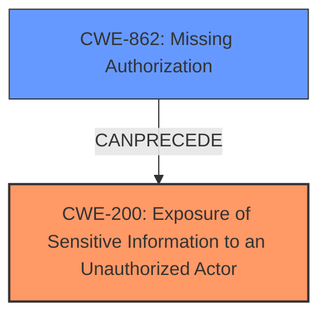

# Analysis Report for CVE-2025-2252

# Vulnerability Analysis Report: CVE-2025-2252

## Description

The Easy Digital Downloads eCommerce Payments and Subscriptions made easy plugin for WordPress is vulnerable to **Sensitive Information Exposure** in all versions up to, and including, 3.3.6.1 via the edd_ajax_get_download_title() function. This makes it possible for unauthenticated attackers to extract private post titles of downloads. The impact here is minimal.

## Vulnerability Description Key Phrases

- **Weakness:** Sensitive Information Exposure
- **Impact:** extract private post titles of downloads
- **Attacker:** unauthenticated attackers
- **Product:** Easy Digital Downloads eCommerce Payments and Subscriptions made easy plugin for WordPress
- **Version:** up to and including 3.3.6.1
- **Component:** edd_ajax_get_download_title() function

## Analysis (with Relationship Data)

# Summary
| CWE ID | CWE Name | Confidence | CWE Abstraction Level | CWE Vulnerability Mapping Label | CWE-Vulnerability Mapping Notes |
|---|---|---|---|---|---|
| CWE-200 | Exposure of Sensitive Information to an Unauthorized Actor | 0.75 | Class | Allowed | The **weakness** is **Sensitive Information Exposure** |
| CWE-862 | Missing Authorization | 0.60 | Class | Allowed-with-Review | Authorization is **missing** |

## Evidence and Confidence

*   **Confidence Score:** 0.70
*   **Evidence Strength:** MEDIUM

## Relationship Analysis
The primary relationship influencing the decision is the direct matching of the vulnerability description to CWE-200, which describes the exposure of sensitive information to unauthorized actors. CWE-862 is also considered as a contributing factor since the exposure happens due to a **missing** authorization check. While CWE-862 is a class-level CWE, it accurately reflects that there is **missing** authorization. CWE-200 is a class-level CWE and could have more specific children, but the description directly matches the vulnerability.



## Vulnerability Chain
The vulnerability chain starts with **missing** authorization (CWE-862), which leads to the exposure of sensitive information (CWE-200). The **root cause** is the **lack** of proper authorization checks, and the impact is the disclosure of private post titles.

## Summary of Analysis
The analysis indicates that the Easy Digital Downloads plugin is vulnerable to **Sensitive Information Exposure** because it **fails** to properly authorize access to private post titles, allowing unauthenticated attackers to extract this information.

CWE-200 (Exposure of Sensitive Information to an Unauthorized Actor) is the primary CWE because the vulnerability description explicitly states "**Sensitive Information Exposure**". The description of CWE-200, "The product exposes sensitive information to an actor that is not explicitly authorized to have access to that information," directly matches the vulnerability.

CWE-862 (Missing Authorization) is a secondary CWE because the exposure of information occurs due to the **lack** of an authorization check. The description of CWE-862, "The product does not perform an authorization check when an actor attempts to access a resource or perform an action," aligns with the vulnerability, as unauthenticated attackers can access private post titles without proper authorization.

The retriever results also support these selections. CWE-200 and CWE-862 are among the top CWEs suggested.

Other CWEs Considered:
- CWE-306 (Missing Authentication for Critical Function): While authentication is related to authorization, the vulnerability description focuses more on the authorization aspect after a user (or lack thereof) is accessing a specific function.
- CWE-359 (Exposure of Private Personal Information to an Unauthorized Actor): This is more specific than CWE-200, but the description doesn't explicitly state the information is private or personal, just sensitive.
- CWE-639 (Authorization Bypass Through User-Controlled Key): Not applicable as there's no mention of key modification for authorization bypass.


## CWE Relationship Analysis

Current CWEs represent these abstraction levels: .


### Vulnerability Chain Analysis

**Chain starting from CWE-359:**
- 359 (Exposure of Private Personal Information to an Unauthorized Actor) - ROOT


**Chain starting from CWE-862:**
- 862 (Missing Authorization) - ROOT


### CWE Relationship Diagram

```mermaid
graph TD
    classDef primary fill:#f96,stroke:#333,stroke-width:2px
    classDef secondary fill:#69f,stroke:#333
    classDef tertiary fill:#9e9,stroke:#333
```


*Report generated on 2025-07-14 10:32:39*
