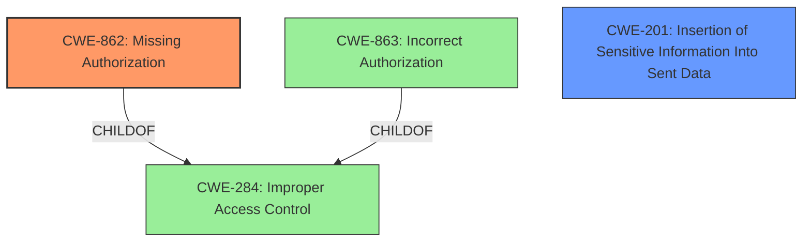

# Raw Analyzer Response for CVE-2025-22612

# Summary
| CWE ID | CWE Name | Confidence | CWE Abstraction Level | CWE Vulnerability Mapping Label | CWE-Vulnerability Mapping Notes |
|---|---|---|---|---|---|
| CWE-862 | Missing Authorization | 1.0 | Base | Allowed | Primary CWE |
| CWE-200 | Insertion of Sensitive Information Into Sent Data | 0.7 | Base | Allowed | Secondary Candidate |

## Evidence and Confidence

*   **Confidence Score:** 0.9
*   **Evidence Strength:** HIGH

## Relationship Analysis
The primary relationship that influenced the decision was the parent-child relationship between CWE-284 (Improper Access Control), CWE-863 (Incorrect Authorization), and CWE-862 (Missing Authorization). Since the vulnerability description explicitly states "**missing authorization**", a more specific CWE, CWE-862, was chosen over its parent, CWE-284. CWE-201 (Insertion of Sensitive Information Into Sent Data) was considered due to the fact the private key information was disclosed.

## Vulnerability Chain
The vulnerability chain starts with **missing authorization**, allowing an authenticated user to retrieve private keys in plaintext, which can lead to remote command execution.
  - Root Cause: CWE-862 Missing Authorization
  - Impact: Retrieval of sensitive information (private keys)
  - Impact: Remote Command Execution

## Summary of Analysis
The primary CWE selected is CWE-862 (Missing Authorization). The vulnerability description clearly states that the issue is due to "**missing authorization**", allowing an authenticated user to retrieve private keys. This aligns perfectly with the definition of CWE-862, which focuses on the absence of an authorization check.

The selection of CWE-862 is based on direct evidence from the vulnerability description and the detailed analysis in the "CVE Reference Links Content Summary". The "Authentication vs Authorization vs Access Control Guidance" also supports this decision, emphasizing that when there's no role or privilege check after login, CWE-862 is the appropriate choice.

CWE-201 (Insertion of Sensitive Information Into Sent Data) was considered because the private keys are exposed in plaintext. The vulnerability description mentions that an authenticated user can retrieve any existing private keys on a coolify instance in plain text. This matches the description of CWE-201 where sensitive information is inserted into sent data.

The selected CWEs are at the optimal level of specificity because they directly reflect the root cause and a key impact of the vulnerability.

Relevant CWE Information:

# Enhanced Context (25 CWEs)
The following CWEs were identified as potentially relevant to this vulnerability:

## CWE-284: Improper Access Control
**Abstraction Level**: Pillar
**Similarity Score**: 0.80
**Source**: alternate_terms

**Description**:
The software does not restrict or incorrectly restricts access to resources (data, files, actions, etc.) to only the intended actors.

**Mapping Guidance**:
- Usage: Discouraged
- Rationale: This is a very general CWE that should only be used if a more specific CWE is not available.

## CWE-863: Incorrect Authorization
**Abstraction Level**: Class
**Similarity Score**: 0.443
**Source**: sparse

**Description**:
The product performs an authorization check when an actor attempts to access a resource or perform an action, but it does not correctly perform the check.

**Mapping Guidance**:
- Usage: Allowed-with-Review
- Rationale: This CWE entry is a Class and might have Base-level children that would be more appropriate

## CWE-306: Missing Authentication for Critical Function
**Abstraction Level**: Base
**Similarity Score**: 0.418
**Source**: sparse

**Description**:
The product does not perform any authentication for functionality that requires a provable user identity or consumes a significant amount of resources.

**Mapping Guidance**:
- Usage: Allowed
- Rationale: This CWE entry is at the Base level of abstraction, which is a preferred level of abstraction for mapping to the root causes of vulnerabilities.

## CWE-321: Use of Hard-coded Cryptographic Key
**Abstraction Level**: Variant
**Similarity Score**: 0.415
**Source**: sparse

**Description**:
The product uses a hard-coded cryptographic key for authentication, session management, or other security purposes.

**Mapping Guidance**:
- Usage: Allowed
- Rationale: This CWE entry is at the Variant level of abstraction, which is a preferred level of abstraction for mapping to the root causes of vulnerabilities.

## CWE-295: Improper Certificate Validation
**Abstraction Level**: Base
**Similarity Score**: 0.413
**Source**: sparse

**Description**:
The product does not properly validate the authenticity or integrity of a certificate, which could allow an attacker to bypass security checks or conduct man-in-the-middle attacks.

**Mapping Guidance**:
- Usage: Allowed
- Rationale: This CWE entry is at the Base level of abstraction, which is a preferred level of abstraction for mapping to the root causes of vulnerabilities.

## CWE-201: Insertion of Sensitive Information Into Sent Data
**Abstraction Level**: Base
**Similarity Score**: 0.412
**Source**: sparse

**Description**:
The product inserts sensitive information into data that is sent to other components or systems, potentially exposing it to unauthorized parties.

**Mapping Guidance**:
- Usage: Allowed
- Rationale: This CWE entry is at the Base level of abstraction, which is a preferred level of abstraction for mapping to the root causes of vulnerabilities.

## CWE-269: Improper Privilege Management
**Abstraction Level**: Class
**Similarity Score**: 0.410
**Source**: sparse

**Description**:
The product does not properly manage user privileges, potentially allowing unauthorized users to perform privileged actions or access sensitive resources.

**Mapping Guidance**:
- Usage: Discouraged
- Rationale: This CWE entry is a Class and might have Base-level children that would be more appropriate

## CWE-923: Improper Restriction of Communication Channel to Intended Endpoints
**Abstraction Level**: Class
**Similarity Score**: 0.410
**Source**: sparse

**Description**:
The product does not properly restrict communication channels to only the intended endpoints, potentially allowing unauthorized parties to intercept or manipulate data in transit.

**Mapping Guidance**:
- Usage: Allowed-with-Review
- Rationale: This CWE entry is a Class and might have Base-level children that would be more appropriate

## CWE-1394: Use of Default Cryptographic Key
**Abstraction Level**: Base
**Similarity Score**: 0.414
**Source**: dense

**Description**:
The product uses a default cryptographic key for authentication, session management, or other security purposes, potentially allowing unauthorized parties to bypass security checks.

**Mapping Guidance**:
- Usage: Allowed
- Rationale: This CWE entry is at the Base level of abstraction, which is a preferred level of abstraction for mapping to the root causes of vulnerabilities.

## CWE-322: Key Exchange without Entity Authentication
**Abstraction Level**: Base
**Similarity Score**: 0.002
**Source**: graph

**Description**:
The product does not properly authenticate the identity of the other party during key exchange, potentially allowing an attacker to impersonate a legitimate user or server.

**Mapping Guidance**:
- Usage: Allowed
- Rationale: This CWE entry is at the Base level of abstraction, which is a preferred level of abstraction for mapping to the root causes of vulnerabilities.

## CWE-350: Reliance on Reverse DNS Resolution for a Security-Critical Action
**Abstraction Level**: Variant

**Description**:
The application relies on reverse DNS resolution to make security-critical decisions, which is unreliable and can be spoofed by an attacker.

**Mapping Guidance**:
- Usage: Allowed
- Rationale: This CWE entry is at the Variant level of abstraction, which is a preferred level of abstraction for mapping to the root causes of vulnerabilities.

CWEs Considered but Not Used:

*   CWE-284 (Improper Access Control): This is a high-level CWE, and CWE-862 provides a more specific description of the vulnerability.
*   CWE-863 (Incorrect Authorization): The issue is not that authorization is performed incorrectly, but that it is missing altogether.
*   CWE-306 (Missing Authentication for Critical Function): The vulnerability description specifies that the user is authenticated, but lacks authorization to retrieve the keys.
*   CWE-321 (