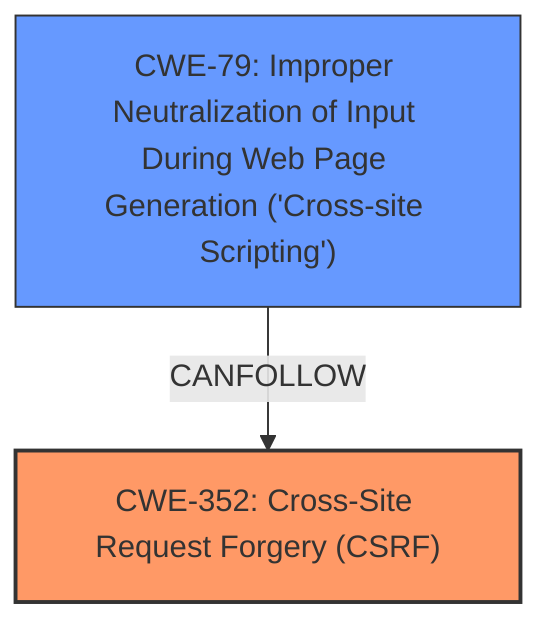

# Analysis Report for CVE-2025-22688

# Vulnerability Analysis Report: CVE-2025-22688

## Description

**Cross-Site Request Forgery** (CSRF) vulnerability in Ederson Peka Unlimited Page Sidebars allows Stored XSS. This issue affects Unlimited Page Sidebars from n/a through 0.2.6.

## Vulnerability Description Key Phrases

- **Rootcause:** Cross-Site Request Forgery
- **Weakness:** cross-site scripting, Stored XSS
- **Product:** Ederson Peka Unlimited Page Sidebars
- **Version:** n/a through 0.2.6

## Analysis (with Relationship Data)

# Summary
| CWE ID | CWE Name | Confidence | CWE Abstraction Level | CWE Vulnerability Mapping Label | CWE-Vulnerability Mapping Notes |
|---|---|---|---|---|---|
| **CWE-352** | Cross-Site Request Forgery (CSRF) | 1.0 | Compound | Primary | Allowed |
| **CWE-79** | Improper Neutralization of Input During Web Page Generation ('Cross-site Scripting') | 1.0 | Base | Secondary | Allowed |

## Evidence and Confidence

*   **Confidence Score:** 1.0
*   **Evidence Strength:** HIGH

## Relationship Analysis
The vulnerability description clearly indicates a **Cross-Site Request Forgery** (CSRF) vulnerability that leads to Stored XSS. Therefore, the primary weakness is CSRF (CWE-352), and the resulting impact is Stored XSS (CWE-79). CWE-352 is a compound weakness that can lead to various impacts, including XSS. CWE-79 is a base weakness that describes the improper neutralization of input, which is the direct cause of the XSS.



## Vulnerability Chain
The vulnerability chain starts with the **Cross-Site Request Forgery (CSRF)** vulnerability (CWE-352), which then allows an attacker to inject malicious scripts into the application. These scripts are then stored and executed when other users view the affected content, resulting in Stored XSS (CWE-79).

*   **Root Cause:** CWE-352 (**Cross-Site Request Forgery**) - The application does not properly verify the origin of requests.
*   **Weakness:** CWE-79 (**Improper Neutralization of Input During Web Page Generation ('Cross-site Scripting')**) - The application fails to neutralize user-controllable input before placing it in a web page.
*   **Impact:** Stored XSS, leading to potential account compromise, data theft, or other malicious activities.

## Summary of Analysis
The analysis clearly indicates that the primary vulnerability is **Cross-Site Request Forgery (CSRF)**, which allows for the injection of malicious scripts that result in Stored XSS. The evidence is strong, as the vulnerability description explicitly mentions both CSRF and Stored XSS. The relationship between CWE-352 and CWE-79 is a clear chain, where the CSRF vulnerability enables the XSS attack.

The selection of CWE-352 and CWE-79 is based on the vulnerability description, which mentions "**Cross-Site Request Forgery**" and "**Stored XSS**". The description key phrases also highlight these as the **rootcause** and **weakness**, respectively. The retriever results also list CWE-79 and CWE-352 as top candidates.

The selected CWEs are at the optimal level of specificity, as they directly represent the identified vulnerabilities. CWE-352 is a compound weakness, which is appropriate for representing a CSRF vulnerability. CWE-79 is a base weakness, which accurately describes the improper neutralization of input that leads to XSS.

CWEs considered but not used:

*   CWE-89 (Improper Neutralization of Special Elements used in an SQL Command ('SQL Injection')): While SQL injection is a common web vulnerability, there's no evidence in the description to suggest its presence.
*   CWE-601 (URL Redirection to Untrusted Site ('Open Redirect')): This CWE is not relevant to the described vulnerability.
*   CWE-918 (Server-Side Request Forgery (SSRF)): This CWE is not relevant to the described vulnerability.
*   CWE-434 (Unrestricted Upload of File with Dangerous Type): This CWE is not relevant to the described vulnerability.
*   CWE-425 (Direct Request ('Forced Browsing')): This CWE is not relevant to the described vulnerability.


## CWE Relationship Analysis

Current CWEs represent these abstraction levels: .


### Vulnerability Chain Analysis

**Chain starting from CWE-89:**
- 89 (Improper Neutralization of Special Elements used in an SQL Command ('SQL Injection')) - ROOT


**Chain starting from CWE-601:**
- 601 (URL Redirection to Untrusted Site ('Open Redirect')) - ROOT


### CWE Relationship Diagram

```mermaid
graph TD
    classDef primary fill:#f96,stroke:#333,stroke-width:2px
    classDef secondary fill:#69f,stroke:#333
    classDef tertiary fill:#9e9,stroke:#333
```


*Report generated on 2025-07-14 10:37:10*
