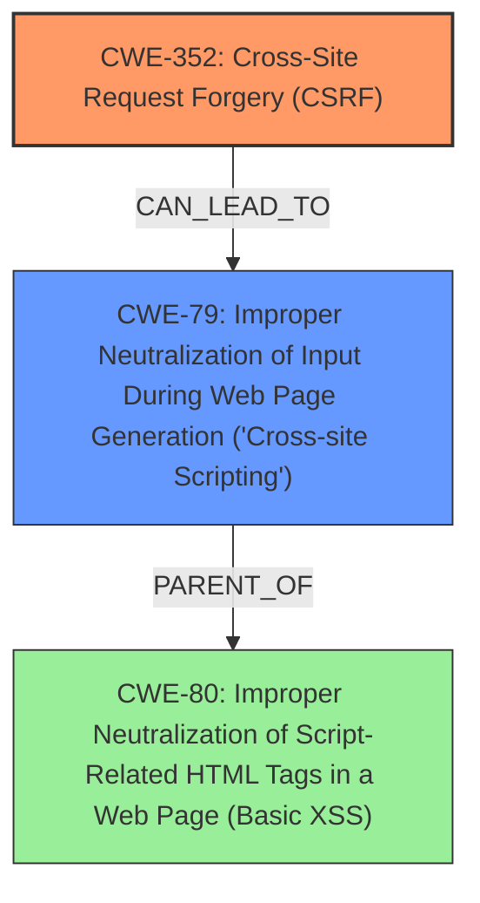

# Raw Analyzer Response for CVE-2025-22690

# Summary
| CWE ID | CWE Name | Confidence | CWE Abstraction Level | CWE Vulnerability Mapping Label | CWE-Vulnerability Mapping Notes |
|---|---|---|---|---|---|
| CWE-352 | Cross-Site Request Forgery (CSRF) | 1.0 | Compound | Primary | Allowed |
| CWE-79 | Improper Neutralization of Input During Web Page Generation ('Cross-site Scripting') | 1.0 | Base | Secondary | Allowed |

## Evidence and Confidence

*   **Confidence Score:** 1.0
*   **Evidence Strength:** HIGH

## Relationship Analysis
The primary weakness is **Cross-Site Request Forgery (CSRF)**, a Compound CWE. The vulnerability description also mentions **Cross-site Scripting (XSS)**, which can be a consequence of successful CSRF exploitation if the forged request modifies data that is later displayed without proper output encoding, leading to XSS. CWE-79 is a base CWE and a parent of more specific XSS variants like CWE-80. While CWE-80 is listed in the retriever results, the description doesn't provide enough detail to select it over the broader CWE-79.

## Vulnerability Chain
The vulnerability chain starts with **Cross-Site Request Forgery (CSRF)** due to a **lack of proper CSRF protection**. This allows an attacker to force a user to perform unwanted actions. If the forged request modifies data that's later displayed without proper encoding, it leads to **Cross-site Scripting (XSS)**.

CWE-352 (Root Cause) -> CWE-79 (Impact)

## Summary of Analysis
Based on the provided evidence, the primary vulnerability is CWE-352 **Cross-Site Request Forgery (CSRF)**, stemming from a **lack of proper CSRF protection**. The secondary vulnerability is CWE-79 **Improper Neutralization of Input During Web Page Generation ('Cross-site Scripting')**, which could occur as a result of the CSRF if the forged request leads to data being stored and displayed without proper sanitization.

The vulnerability description and the CVE Reference Links Content Summary both highlight the **lack of CSRF protection** as the root cause, providing strong evidence for CWE-352. The description also mentions **Stored XSS**, indicating that the impact includes the potential for XSS, which aligns with CWE-79.

The retriever results also suggest CWE-79 as a highly relevant weakness.

The selection of CWE-352 and CWE-79 is based on the available evidence. The level of specificity is appropriate, with CWE-352 being a Compound weakness that accurately represents the **lack of CSRF protection**, and CWE-79 being a Base weakness that captures the potential for XSS.

Relevant CWE Information:
# Enhanced Context (25 CWEs)
The following CWEs were identified as potentially relevant to this vulnerability:

## CWE-425: Direct Request ('Forced Browsing')
**Abstraction Level**: Base
**Similarity Score**: 0.76
**Source**: dense

**Description**:
The web application does not adequately enforce appropriate authorization on all restricted URLs, scripts, or files.

**Mapping Guidance**:
- Usage: Allowed
- Rationale: This CWE entry is at the Base level of abstraction, which is a preferred level of abstraction for mapping to the root causes of vulnerabilities.
- *Not Used*: Not the primary issue, though access control issues may be related.

## CWE-79: Improper Neutralization of Input During Web Page Generation ('Cross-site Scripting')
**Abstraction Level**: Base
**Similarity Score**: 0.75
**Source**: dense

**Description**:
The product does not neutralize or incorrectly neutralizes user-controllable input before it is placed in output that is used as a web page that is served to other users.

**Mapping Guidance**:
- Usage: Allowed
- Rationale: This CWE entry is at the Base level of abstraction, which is a preferred level of abstraction for mapping to the root causes of vulnerabilities.
- *Used*: **XSS** is a consequence of the CSRF.

## CWE-352: Cross-Site Request Forgery (CSRF)
**Abstraction Level**: Compound
**Similarity Score**: 0.75
**Source**: dense

**Description**:
The web application does not, or can not, sufficiently verify whether a well-formed, valid, consistent request was intentionally provided by the user who submitted the request.

**Mapping Guidance**:
- Usage: Allowed
- Rationale: This is a well-known Composite of multiple weaknesses that must all occur simultaneously, although it is attack-oriented in nature.
- *Used*: This is the **root cause** of the vulnerability.

## CWE-472: External Control of Assumed-Immutable Web Parameter
**Abstraction Level**: Base
**Similarity Score**: 0.74
**Source**: dense

**Description**:
The web application does not sufficiently verify inputs that are assumed to be immutable but are actually externally controllable, such as hidden form fields.

**Mapping Guidance**:
- Usage: Allowed
- Rationale: This CWE entry is at the Base level of abstraction, which is a preferred level of abstraction for mapping to the root causes of vulnerabilities.
- *Not Used*: While related, it is not the core issue.

## CWE-116: Improper Encoding or Escaping of Output
**Abstraction Level**: Class
**Similarity Score**: 0.74
**Source**: dense

**Description**:
The product prepares a structured message for communication with another component, but encoding or escaping of the data is either missing or done incorrectly. As a result, the intended structure of the message is not preserved.

**Mapping Guidance**:
- Usage: Allowed-with-Review
- Rationale: This CWE entry is a Class and might have Base-level children that would be more appropriate
- *Not Used*: Related to XSS, but CWE-79 is more direct.

## CWE-80: Improper Neutralization of Script-Related HTML Tags in a Web Page (Basic XSS)
**Abstraction Level**: Variant
**Similarity Score**: 0.74
**Source**: dense

**Description**:
The product receives input from an upstream component, but it does not neutralize or incorrectly neutralizes special characters such as "<", ">", and "&" that could be interpreted as web-scripting elements when they are sent to a downstream component that processes web pages.

**Mapping Guidance**:
- Usage: Allowed
- Rationale: This CWE entry is at the Variant level of abstraction, which is a preferred level of abstraction for mapping to the root causes of vulnerabilities.
- *Not Used*: Possibly related to **XSS**, but CWE-79 is a more general classification.

## CWE-918: Server-Side Request Forgery (SSRF)
**Abstraction Level**: Base
**Similarity Score**: 0.74
**Source**: dense

**Description**:
The web server receives a URL or similar request from an upstream component and retrieves the contents of this URL, but it does not sufficiently ensure that the request is being sent to the expected destination.

**Mapping Guidance**:
- Usage: Allowed
- Rationale: This CWE entry is at the Base level of abstraction, which is a preferred level of abstraction for mapping to the root causes of vulnerabilities.
- *Not Used*: Not directly related to the vulnerability.

## CWE-346: Origin Validation Error
**Abstraction Level**: Class
**Similarity Score**: 0.73
**Source**: dense

**Description**:
The product does not properly verify that the source of data or communication is valid.

**Mapping Guidance**:
- Usage: Allowed-with-Review
- Rationale: This CWE entry is a Class and might have Base-level children that would be more appropriate
- *Not Used*: Less specific than CWE-352.

## CWE-639: Authorization Bypass Through User-Controlled Key
**Abstraction Level**: Base
**Similarity Score**: 0.73
**Source**: dense

**Description**:
The system's authorization functionality does not prevent one user from gaining access to another user's data or record by modifying the key value identifying the data.

**Mapping Guidance**:
- Usage: Allowed
- Rationale: This CWE entry is at the Base level of abstraction, which is a preferred level of abstraction for mapping to the root causes of vulnerabilities.
- *Not Used*: While access control is mentioned, it's a consequence of CSRF, not the primary issue.

## CWE-