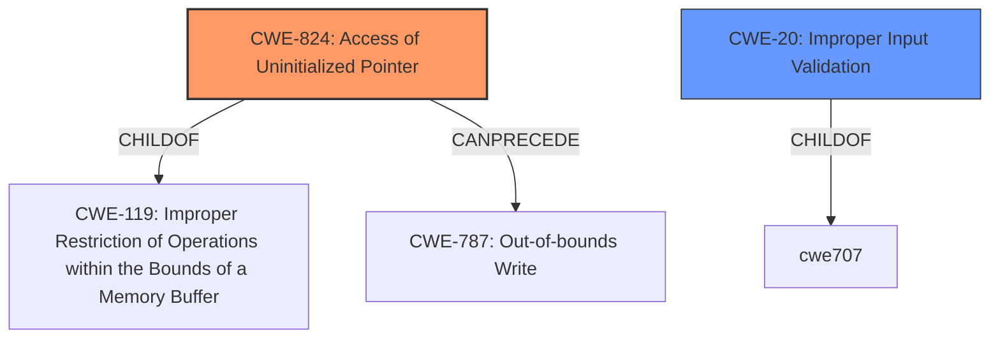

# Raw Analyzer Response for CVE-2025-2286

# Summary
| CWE ID | CWE Name | Confidence | CWE Abstraction Level | CWE Vulnerability Mapping Label | CWE-Vulnerability Mapping Notes |
|---|---|---|---|---|---|
| CWE-824 | Access of Uninitialized Pointer | 0.9 | Base | Primary | Allowed |
| CWE-20 | Improper Input Validation | 0.8 | Class | Secondary | Discouraged |

## Evidence and Confidence

*   **Confidence Score:** 0.85
*   **Evidence Strength:** HIGH

## Relationship Analysis
The primary weakness is **CWE-824 Access of Uninitialized Pointer**, which is a Base level CWE. **CWE-20 Improper Input Validation** is included as a secondary weakness. CWE-824 is a child of CWE-119 and can precede **CWE-787 Out-of-bounds Write**. The selection of CWE-824 is based on the clear root cause identified in the vulnerability description.

## Vulnerability Chain
The vulnerability chain starts with the **uninitialized pointer** (CWE-824), which is then triggered by **improper validation of user-supplied data** (CWE-20). This leads to potential out-of-bounds write (CWE-787) which allows for arbitrary code execution and information disclosure.

## Summary of Analysis
The primary focus is on the **uninitialized pointer**, which is the root cause of the vulnerability. The vulnerability description explicitly states, "A local code execution vulnerability exists in the Rockwell Automation Arena due to an **uninitialized pointer**." This aligns directly with the definition of CWE-824. The vulnerability is triggered by a malicious DOE file opened by a legitimate user, indicating **improper validation of user-supplied data** (CWE-20) which could be a secondary contributing factor. The selection of CWE-824 is at the optimal level of specificity as it directly reflects the root cause.

Relevant CWE Information:

# Enhanced Context (25 CWEs)
The following CWEs were identified as potentially relevant to this vulnerability:

## CWE-824: Access of Uninitialized Pointer
**Abstraction Level**: Base
**Similarity Score**: 0.76
**Source**: dense

**Description**:
The product accesses or uses a pointer that has not been initialized.

**Mapping Guidance**:
- Usage: Allowed
- Rationale: This CWE entry is at the Base level of abstraction, which is a preferred level of abstraction for mapping to the root causes of vulnerabilities.

## CWE-20: Improper Input Validation
**Abstraction Level**: class
**Similarity Score**: 2.92
**Source**: graph

**Description**:
CWE-20: Improper Input Validation

**Mapping Guidance**:
- Usage: Discouraged
- Rationale: CWE-20 is commonly misused in low-information vulnerability reports when lower-level CWEs could be used instead, or when more details about the vulnerability are available [REF-1287]. It is not useful for trend analysis. It is also a level-1 Class (i.e., a child of a Pillar).

# Detailed Analysis of CWE Choices:

## Primary CWE: CWE-824 - Access of Uninitialized Pointer

*   **Explanation:** The vulnerability description explicitly mentions "**uninitialized pointer**" as the root cause. This directly corresponds to the definition of CWE-824, which states, "The product accesses or uses a pointer that has not been initialized."
*   **Security Implications:** Accessing an **uninitialized pointer** can lead to unpredictable behavior, including crashes, information disclosure, or arbitrary code execution, as the pointer might point to an arbitrary memory location.
*   **Relationship Analysis:** CWE-824 is a Base level CWE, providing a specific description of the weakness. It's a child of CWE-119 (Improper Restriction of Operations within the Bounds of a Memory Buffer). It can precede CWE-787 (Out-of-bounds Write).
*   **Mapping Guidance:** The usage is ALLOWED, and the rationale is that it is at the Base level of abstraction.
*   **Confidence:** 0.9

## Secondary CWE: CWE-20 - Improper Input Validation

*   **Explanation:** The vulnerability description mentions "**improper validation of user-supplied data**" as a contributing factor. The malicious DOE file opened by a legitimate user suggests a failure in validating the input.
*   **Security Implications:** **Improper Input Validation** allows attackers to supply malicious input that can trigger other vulnerabilities such as buffer overflows, code injection, or denial-of-service attacks.
*   **Relationship Analysis:** CWE-20 is a Class level CWE. It's a child of CWE-707 (Improper Neutralization of Special Elements Required in Output When Using a Structurally Significant Syntax).
*   **Mapping Guidance:** The usage is DISCOURAGED because more specific CWEs might be available. However, in this case, it highlights the potential for additional weaknesses related to input handling.
*   **Confidence:** 0.8

## CWEs Considered but Not Used:

*   **CWE-787: Out-of-bounds Write:** While the impact includes arbitrary code execution, the root cause is the **uninitialized pointer** and **improper input validation**. CWE-787 would be a consequence of exploiting the initial weakness.
*   **CWE-908: Use of Uninitialized Resource:** This is similar to CWE-824, but CWE-824 specifically mentions a pointer, which aligns more closely with the vulnerability description.
*   **CWE-457: Use of Uninitialized Variable:** This is a variant of using an uninitialized resource, but CWE-824 is more specific to pointers.
*   **CWE-665: Improper Initialization:** This is a more general class, while CWE-824 specifies the problem is with an **uninitialized pointer**.
*   **CWE-1284: Improper Validation of Specified Quantity in Input:** This CWE is more specific than just **improper input validation** in general. However, there is no mention of quantity so is less applicable.