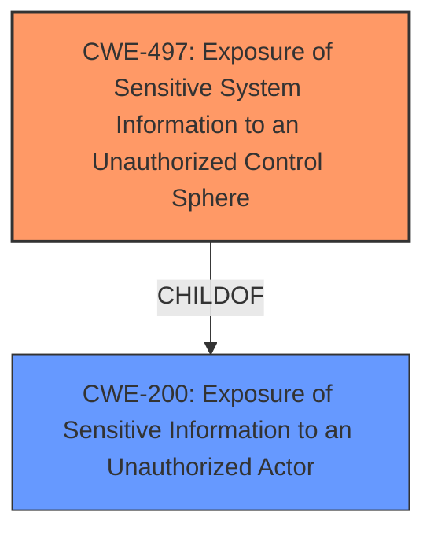

# Analysis Report for CVE-2025-22895

# Vulnerability Analysis Report: CVE-2025-22895

## Description

Exposure of sensitive information to an unauthorized actor for some Edge Orchestrator software for Intel(R) Tiber Edge Platform may allow an authenticated user to potentially enable information disclosure via local access.

## Vulnerability Description Key Phrases

- **Weakness:** exposure of sensitive information
- **Impact:** ['Exposure of sensitive information to an unauthorized actor', 'enable information disclosure']
- **Vector:** local access
- **Attacker:** authenticated user
- **Product:** Edge Orchestrator software

## Analysis (with Relationship Data)

# Summary

| CWE ID | CWE Name | Confidence | CWE Abstraction Level | CWE Vulnerability Mapping Label | CWE-Vulnerability Mapping Notes |
|---|---|---|---|---|---|
| CWE-497 | Exposure of Sensitive System Information to an Unauthorized Control Sphere | 0.8 | Base | Allowed | Primary CWE |
| CWE-200 | Exposure of Sensitive Information to an Unauthorized Actor | 0.6 | Class | Discouraged | Secondary Candidate |

## Evidence and Confidence

*   **Confidence Score:** 0.7
*   **Evidence Strength:** MEDIUM

## Relationship Analysis

The primary CWE, CWE-497 [Exposure of Sensitive System Information to an Unauthorized Control Sphere], is a Base level CWE. CWE-497 is related to CWE-200 [Exposure of Sensitive Information to an Unauthorized Actor], which is a Class level CWE and a parent of CWE-497. Since the vulnerability specifically involves system information and the description specifies local access, CWE-497 is more appropriate.



## Vulnerability Chain

The vulnerability chain starts with the **exposure of sensitive system information**, leading to the **impact** of information disclosure to an unauthorized actor.

## Summary of Analysis

The initial analysis focused on identifying the root cause of the vulnerability. The **weakness** is the **exposure of sensitive information**, which leads to the **impact** of information disclosure. The retriever results listed CWE-200 [Exposure of Sensitive Information to an Unauthorized Actor] as the top candidate, but it is a Class-level CWE and is generally discouraged unless a more specific CWE is not available. CWE-497 [Exposure of Sensitive System Information to an Unauthorized Control Sphere] is a Base level CWE and is more specific, as it involves the **exposure of sensitive system information**. Given the nature of the vulnerability, which involves the Edge Orchestrator software, it is reasonable to assume that the exposed information is system-related. The evidence clearly states "Exposure of sensitive information", which aligns with the characteristics of CWE-497. Therefore, CWE-497 is the primary CWE.

Relevant CWE Information:

# Enhanced Context (25 CWEs)
The following CWEs were identified as potentially relevant to this vulnerability:

## CWE-497: Exposure of Sensitive System Information to an Unauthorized Control Sphere
**Abstraction Level**: Base
**Similarity Score**: 0.82
**Source**: dense

**Description**:
The product does not properly prevent sensitive system-level information from being accessed by unauthorized actors who do not have the same level of access to the underlying system as the product does.

**Mapping Guidance**:
- Usage: Allowed
- Rationale: This CWE entry is at the Base level of abstraction, which is a preferred level of abstraction for mapping to the root causes of vulnerabilities.

## CWE-200: Exposure of Sensitive Information to an Unauthorized Actor
**Abstraction Level**: Class
**Similarity Score**: 0.78
**Source**: dense

**Description**:
The product exposes sensitive information to an actor that is not explicitly authorized to have access to that information.

**Mapping Guidance**:
- Usage: Discouraged
- Rationale: CWE-200 is commonly misused to represent the loss of confidentiality in a vulnerability, but confidentiality loss is a technical impact - not a root cause error. As of CWE 4.9, over 400 CWE entries can lead to a loss of confidentiality. Other options are often available. [REF-1287].


## CWE Relationship Analysis

Current CWEs represent these abstraction levels: .


### Vulnerability Chain Analysis

**Chain starting from CWE-200:**
- 200 (Exposure of Sensitive Information to an Unauthorized Actor) - ROOT


**Chain starting from CWE-497:**
- 497 (Exposure of Sensitive System Information to an Unauthorized Control Sphere) - ROOT


### CWE Relationship Diagram

```mermaid
graph TD
    classDef primary fill:#f96,stroke:#333,stroke-width:2px
    classDef secondary fill:#69f,stroke:#333
    classDef tertiary fill:#9e9,stroke:#333
```


*Report generated on 2025-07-14 10:43:28*
