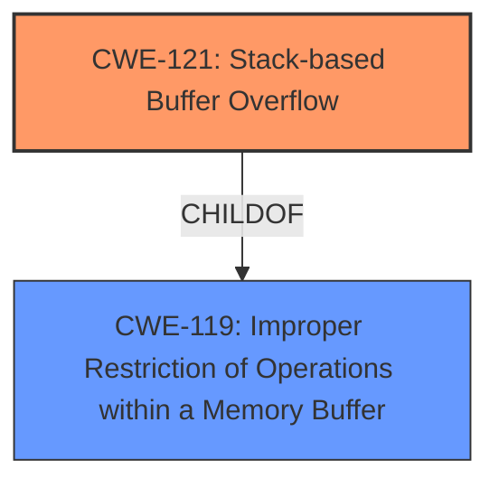

# Analysis Report for CVE-2025-22904

# Vulnerability Analysis Report: CVE-2025-22904

## Description

RE11S v1.11 was discovered to contain a **stack overflow** via the pptpUserName parameter in the setWAN function.

## Vulnerability Description Key Phrases

- **Weakness:** stack overflow
- **Product:** RE11S
- **Version:** v1.11
- **Component:** setWAN function

## Analysis (with Relationship Data)

# Summary
| CWE ID | CWE Name | Confidence | CWE Abstraction Level | CWE Vulnerability Mapping Label | CWE-Vulnerability Mapping Notes |
|---|---|---|---|---|---|
| CWE-121 | Stack-based Buffer Overflow | 1.0 | Variant |  Primary CWE | Allowed |
| CWE-119 | Improper Restriction of Operations within a Memory Buffer | 0.7 | Class | Secondary Candidate | Allowed-with-Review |

## Evidence and Confidence

*   **Confidence Score:** 0.9
*   **Evidence Strength:** HIGH

## Relationship Analysis
The primary weakness identified is a stack-based buffer overflow (CWE-121). This is a specific type of buffer overflow, and thus a child of the more general CWE-119 (Improper Restriction of Operations within a Memory Buffer). The vulnerability arises because the `sprintf` function does not perform adequate bounds checking, leading to the overflow.



## Vulnerability Chain
The vulnerability chain starts with the lack of proper bounds checking in the `sprintf` function when handling the `pptpUserName` parameter. This leads to a stack-based buffer overflow, which can potentially allow an attacker to execute arbitrary code.

Root Cause: **Lack of bounds checking** -> Stack-based buffer overflow (CWE-121) -> Potential arbitrary code execution.

## Summary of Analysis
The primary vulnerability is a **stack overflow** in the `setWAN` function due to the `pptpUserName` parameter. The `sprintf` function is used without proper bounds checking, leading to the overflow. The evidence is strong as the vulnerability description and the CVE reference link explicitly mention the stack overflow and the use of `sprintf`.

CWE-121 (Stack-based Buffer Overflow) is the most specific and appropriate CWE because the overflow occurs on the stack.

CWE-119 (Improper Restriction of Operations within a Memory Buffer) is a broader category and could be considered as a secondary CWE, as CWE-121 is a specific type of CWE-119.

I am confident in this assessment due to the clear description of the vulnerability and the provided evidence.

Relevant CWE Information:

# Enhanced Context (25 CWEs)
The following CWEs were identified as potentially relevant to this vulnerability:

## CWE-121: Stack-based Buffer Overflow
**Abstraction Level**: Variant
**Similarity Score**: 0.71
**Source**: dense

**Description**:
A stack-based buffer overflow condition is a condition where the buffer being overwritten is allocated on the stack (i.e., is a local variable or, rarely, a parameter to a function).

**Mapping Guidance**:
- Usage: Allowed
- Rationale: This CWE entry is at the Variant level of abstraction, which is a preferred level of abstraction for mapping to the root causes of vulnerabilities.

**Technical Explanation:**
CWE-121 (Stack-based Buffer Overflow) is the primary CWE. The vulnerability involves a buffer overflow on the stack, which occurs when the `sprintf` function writes data beyond the allocated buffer size. This can overwrite adjacent stack frames, potentially allowing an attacker to control the program's execution flow.

**Security Implications:**
The security implication is that an attacker can potentially execute arbitrary code on the system. This can lead to complete system compromise.

**Relationship Analysis:**
CWE-121 is a variant of CWE-119 (Improper Restriction of Operations within a Memory Buffer). It is more specific because it explicitly identifies the location of the buffer as being on the stack.

**Mapping Guidance Analysis:**
The mapping guidance for CWE-121 states that it is allowed and is at the variant level of abstraction, which is a preferred level for mapping to the root causes of vulnerabilities.

**Mitigation Analysis:**
Mitigation would involve using safer alternatives to `sprintf`, such as `snprintf`, which allows specifying the maximum number of bytes to write to the buffer.

**Evidence-Based Decision Making:**
The vulnerability description states a "**stack overflow** via the pptpUserName parameter in the setWAN function." The CVE Reference Links Content Summary confirms "**Root cause of vulnerability:** Stack overflow due to insufficient bounds checking when using `sprintf` with the `pptpUserName` input." This clearly indicates CWE-121.

## CWE-119: Improper Restriction of Operations within a Memory Buffer
**Technical Explanation:**
CWE-119 (Improper Restriction of Operations within a Memory Buffer) could be considered a secondary CWE. The vulnerability occurs because there are no restrictions on the amount of data written to the buffer.

**Security Implications:**
The security implication is the potential for arbitrary code execution.

**Relationship Analysis:**
CWE-119 is a parent of CWE-121.

**Mapping Guidance Analysis:**
CWE-119 is a more general case, so it is less specific than CWE-121.

**Mitigation Analysis:**
Mitigation would involve using safer alternatives to `sprintf`, such as `snprintf`.

**Evidence-Based Decision Making:**
While CWE-119 is relevant, CWE-121 is more specific and therefore more appropriate.

## Other CWEs Considered and Rejected
- CWE-190, CWE-191, CWE-193, CWE-128, CWE-1284: These relate to integer overflows/underflows, off-by-one errors or quantity validation, which aren't the primary issue in this stack overflow.
- CWE-120: While related to buffer copies, the root cause isn't specifically a buffer copy operation, but rather the lack of bounds checking when using `sprintf`.
- CWE-125: Out-of-bounds Read isn't the primary issue, as the main problem is writing beyond the buffer limits.
- CWE-787: Out-of-bounds Write is closely related, but CWE-121 is more specific as it identifies the stack as the location of the overflow.
- CWE-755, CWE-754, CWE-703: These relate to improper handling of exceptional conditions, which is a higher-level concern than the specific stack overflow.
- CWE-134, CWE-941, CWE-294, CWE-497, CWE-912: These are not relevant to the described vulnerability.

```
# Summary
| CWE ID | CWE Name | Confidence | CWE Abstraction Level | CWE Vulnerability Mapping Label | CWE-Vulnerability Mapping Notes |
|---|---|---|---|---|---|
| CWE-121 | Stack-based Buffer Overflow | 1.0 | Variant |  Primary CWE | Allowed |
| CWE-119 | Improper Restriction of Operations within a Memory Buffer | 0.7 | Class | Secondary Candidate | Allowed-with-Review |

## Evidence and Confidence

*   **Confidence Score:** 0.9
*   **Evidence Strength:** HIGH

## Relationship Analysis
The primary weakness identified is a stack-based buffer overflow (CWE-121). This is a specific type of buffer overflow, and thus a child of the more general CWE-119 (Improper Restriction of Operations within a Memory Buffer). The vulnerability arises because the `sprintf` function does not perform adequate bounds checking, leading to the overflow.


## Vulnerability Chain
The vulnerability chain starts with the lack of proper bounds checking in the `sprintf` function when handling the `pptpUserName` parameter. This leads to a stack-based buffer overflow, which can potentially allow an attacker to execute arbitrary code.

Root Cause: **Lack of bounds checking** -> Stack-based buffer overflow (CWE-121) -> Potential arbitrary code execution.

## Summary of Analysis
The primary vulnerability is a **stack overflow** in the `setWAN` function due to the `pptpUserName` parameter. The `sprintf` function is used without proper bounds checking, leading to the overflow. The evidence is strong as the vulnerability description and the CVE reference link explicitly mention the stack overflow and the use of `sprintf`.

CWE-121 (Stack-based Buffer Overflow) is the most specific and appropriate CWE because the overflow occurs on the stack.

CWE-119 (Improper Restriction of Operations within a Memory Buffer) is a broader category and could be considered as a secondary CWE,


## CWE Relationship Analysis

Current CWEs represent these abstraction levels: .


### Vulnerability Chain Analysis

**Chain starting from CWE-121:**
- 121 (Stack-based Buffer Overflow) - ROOT


**Chain starting from CWE-1284:**
- 1284 (Improper Validation of Specified Quantity in Input) - ROOT


### CWE Relationship Diagram

```mermaid
graph TD
    classDef primary fill:#f96,stroke:#333,stroke-width:2px
    classDef secondary fill:#69f,stroke:#333
    classDef tertiary fill:#9e9,stroke:#333
```


*Report generated on 2025-07-14 10:43:51*
