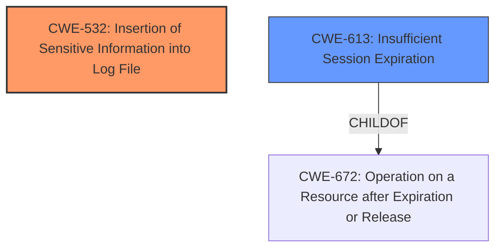

# Enhanced Analysis for CVE-2025-22960

# Summary
| CWE ID | CWE Name | Confidence | CWE Abstraction Level | CWE Vulnerability Mapping Label | CWE-Vulnerability Mapping Notes |
|---|---|---|---|---|---|
| CWE-532 | Insertion of Sensitive Information into Log File | 0.9 | Base | Allowed | Primary CWE. The vulnerability lies in the logging of sensitive session information. |
| CWE-613 | Insufficient Session Expiration | 0.7 | Base | Allowed | Secondary Candidate. This is a possible weakness that could be related, but not the primary issue. |

## Evidence and Confidence

*   **Confidence Score:** 0.8
*   **Evidence Strength:** MEDIUM

## Relationship Analysis
The primary CWE is CWE-532, which is a Base level CWE. CWE-613 (Insufficient Session Expiration) is a secondary consideration, as the logged session information could be exploited if sessions do not expire appropriately. There are no direct parent-child relationships that significantly influence the choice.



## Vulnerability Chain
The vulnerability chain starts with the **insertion of sensitive information into log files** (CWE-532). This leads to potential exposure of session IDs and authentication tokens. If these tokens are valid for an extended period (potentially due to **insufficient session expiration**, CWE-613), an attacker could hijack active sessions and gain unauthorized access.

## Summary of Analysis
The primary vulnerability is the logging of sensitive session information, which directly corresponds to CWE-532. The vulnerability description explicitly mentions the exposure of session IDs and authentication tokens in log files. While session hijacking is the impact, the root cause is the exposure of the session information, making CWE-532 the most appropriate primary CWE.

CWE-613 was considered as a secondary factor because the duration of the session validity influences the window of opportunity for session hijacking. However, the primary issue remains the logging of sensitive data.

The selection of CWE-532 is based on the explicit description of sensitive information being logged. It's a base-level CWE, which is the preferred level of abstraction.

Relevant CWE Information:

# Enhanced Context (25 CWEs)
The following CWEs were identified as potentially relevant to this vulnerability:

## CWE-532: Insertion of Sensitive Information into Log File
**Abstraction Level**: Base
**Similarity Score**: 0.298
**Source**: sparse

**Description**:
The product logs sensitive information in a log file, which could expose the information to unauthorized actors.

**Mapping Guidance**:
- Usage: Allowed
- Rationale: This CWE entry is at the Base level of abstraction, which is a preferred level of abstraction for mapping to the root causes of vulnerabilities.

## CWE-613: Insufficient Session Expiration
**Abstraction Level**: base
**Similarity Score**: 0.277
**Source**: sparse

**Description**:
CWE-613: Insufficient Session Expiration

**Mapping Guidance**:
- Usage: Allowed
- Rationale: This CWE entry is at the Base level of abstraction, which is a preferred level of abstraction for mapping to the root causes of vulnerabilities.

**Relationships**:
- REQUIREDBY -> CWE-352
- CANPRECEDE -> CWE-287
- CHILDOF -> CWE-672
- CHILDOF -> CWE-672
- PARENTOF -> CWE-613
CWEs considered but not used as primary:

*   CWE-287 (Improper Authentication), CWE-290 (Authentication Bypass by Spoofing), CWE-306 (Missing Authentication for Critical Function), CWE-1390 (Weak Authentication): These relate to authentication issues. The vulnerability description states that **unauthenticated attackers** can access the log files. However, the core issue isn't a broken authentication mechanism but the logging of sensitive data. If authentication were properly implemented, the log files would not be accessible to unauthenticated users, and the vulnerability would not exist. Therefore these are incorrect.
*   CWE-330 (Use of Insufficiently Random Values), CWE-804 (Guessable CAPTCHA): These are related to randomness and CAPTCHA, which are not mentioned in the description.
*   CWE-384 (Session Fixation): This is a compound CWE that involves multiple weaknesses, but the primary root cause in this case is the logging of session information.
*   CWE-425 (Direct Request ('Forced Browsing')): While related to direct access, this does not describe the root cause.


## CWE Relationship Analysis

Current CWEs represent these abstraction levels: .


### Vulnerability Chain Analysis

**Chain starting from CWE-672:**
- 672 (Operation on a Resource after Expiration or Release) - ROOT


**Chain starting from CWE-1390:**
- 1390 (Weak Authentication) - ROOT


### CWE Relationship Diagram

```mermaid
graph TD
    classDef primary fill:#f96,stroke:#333,stroke-width:2px
    classDef secondary fill:#69f,stroke:#333
    classDef tertiary fill:#9e9,stroke:#333
```