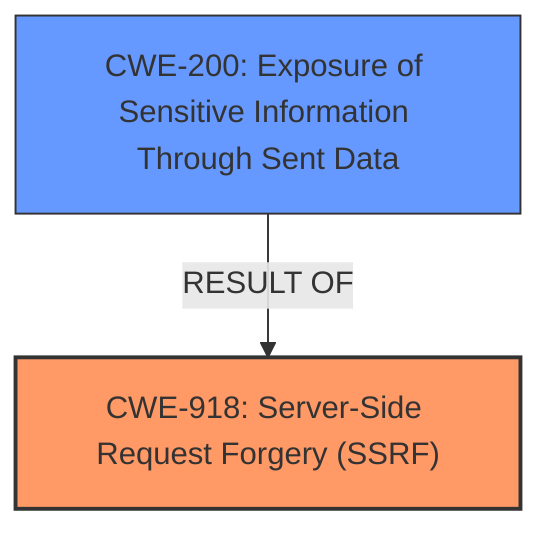

# Analysis for CVE-2025-22973

# Summary
| CWE ID | CWE Name | Confidence | CWE Abstraction Level | CWE Vulnerability Mapping Label | CWE-Vulnerability Mapping Notes |
|---|---|---|---|---|---|
| CWE-918 | Server-Side Request Forgery (SSRF) | 0.9 | Base | Allowed | Primary CWE. The `http_curl()` function directly retrieves the URL request response content without sufficient validation. |
| CWE-200 | Exposure of Sensitive Information Through Sent Data | 0.6 | Class | Allowed-with-Review | Secondary Candidate. The vulnerability results in sensitive information being obtained. |

## Evidence and Confidence

*   **Confidence Score:** 0.75
*   **Evidence Strength:** MEDIUM

## Relationship Analysis
The primary relationship that impacted my decision was the parent-child relationship of CWE-918 and CWE-200. CWE-918 is the root cause, leading to the impact of CWE-200. CWE-918 describes the **improper** handling of URL requests, while CWE-200 describes the resulting exposure of sensitive information. The base level of CWE-918 is appropriate as it directly reflects the **root cause** of the vulnerability.

## Vulnerability Chain
The vulnerability chain starts with the `http_curl()` function that is used to retrieve the content from a URL without proper validation (CWE-918). This leads to the exposure of sensitive information (CWE-200).
- **Root Cause:** CWE-918: Server-Side Request Forgery (SSRF) - The `http_curl()` function is used to retrieve URL content without proper validation.
- **Impact:** CWE-200: Exposure of Sensitive Information Through Sent Data - Retrieving arbitrary URLs can expose sensitive information.

## Summary of Analysis
The initial analysis identified CWE-918 as the primary weakness because the core issue is the **improper** handling of URL requests. The `http_curl()` function retrieves the content of any URL provided to it. The resulting conclusion is that CWE-918 is the correct primary CWE, as it represents the **root cause** of the vulnerability, where as CWE-200 is the impact of the vulnerability.

The evidence from the vulnerability description is: "an issue in QiboSoft QiboCMS X1.0 allows a remote attacker to obtain sensitive information via the http_curl() function in the /application/common. php file that directly retrieves the URL request response content."

The graph relationships influenced the final selection by illustrating how the Server-Side Request Forgery (SSRF) leads to information exposure.

CWE-918 is at the optimal level of specificity as it accurately captures the **root cause** of the vulnerability, which is the lack of validation when retrieving content from a URL.

**CWEs Considered But Not Used:**

*   **CWE-79 Improper Neutralization of Input During Web Page Generation ('Cross-site Scripting'):** This was considered because it involves improper neutralization, but the vulnerability is not directly related to web page generation or cross-site scripting.
*   **CWE-209 Generation of Error Message Containing Sensitive Information:** This was considered because sensitive information is obtained, but the vulnerability is not directly related to the generation of error messages.
*   **CWE-425 Direct Request ('Forced Browsing'):** This was considered because the application is making a direct request, but the main issue is the lack of validation of the request, not simply the direct request itself.
*   **CWE-89 Improper Neutralization of Special Elements used in an SQL Command ('SQL Injection'):** This was considered because it involves improper neutralization, but the vulnerability is not directly related to SQL commands or SQL injection.
*   **CWE-23 Relative Path Traversal:** This was not selected as it is about file paths, and not URL requests.
*   **CWE-639 Authorization Bypass Through User-Controlled Key:** This was not selected as it is related to authorization and keys and not URL requests.
*   **CWE-598 Use of GET Request Method With Sensitive Query Strings:** The description does not specifically discuss query strings.
*   **CWE-94 Improper Control of Generation of Code ('Code Injection'):** This was not selected as it is about code injection, and not URL requests.