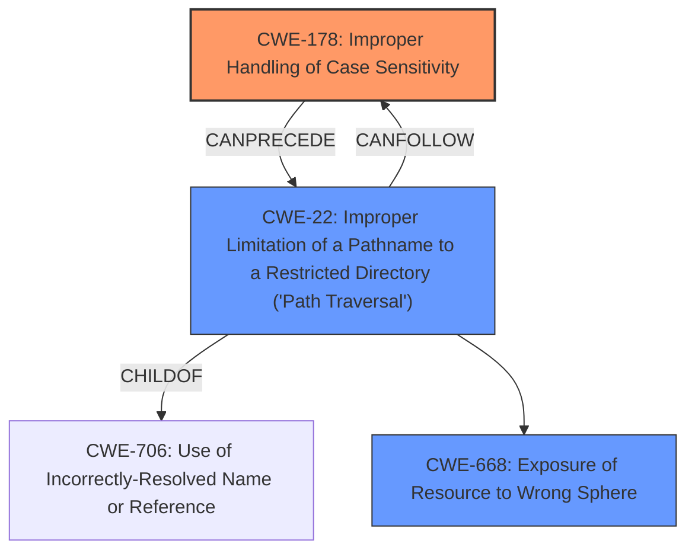

# Raw Analyzer Response for CVE-2025-23042

# Summary
| CWE ID | CWE Name | Confidence | CWE Abstraction Level | CWE Vulnerability Mapping Label | CWE-Vulnerability Mapping Notes |
|---|---|---|---|---|---|
| CWE-178 | Improper Handling of Case Sensitivity | 0.9 | Base | Allowed | Primary CWE. The **root cause** is the **lack of case normalization** in the file path validation logic. |
| CWE-22 | Improper Limitation of a Pathname to a Restricted Directory ('Path Traversal') | 0.6 | Base | Allowed | Secondary candidate. This is a potential impact due to the **lack of case normalization**. |
| CWE-668 | Exposure of Resource to Wrong Sphere | 0.5 | Class | Discouraged | Secondary candidate. The case insensitivity leads to exposure. |

## Evidence and Confidence

*   **Confidence Score:** 0.8
*   **Evidence Strength:** HIGH

## Relationship Analysis
The primary weakness is CWE-178, Improper Handling of Case Sensitivity. This can lead to CWE-22, Improper Limitation of a Pathname to a Restricted Directory ('Path Traversal'), because the **lack of case normalization** allows an attacker to bypass intended restrictions on file paths. CWE-668, Exposure of Resource to Wrong Sphere, is a broader category that could apply, but CWE-22 is more specific to the path traversal aspect of the vulnerability, making it a better fit as a secondary CWE.

## Vulnerability Chain
The vulnerability chain starts with CWE-178, Improper Handling of Case Sensitivity, as the **root cause**. This **lack of case normalization** leads to CWE-22, Improper Limitation of a Pathname to a Restricted Directory ('Path Traversal'), as attackers can use case variations to bypass path restrictions. This can ultimately result in CWE-668, Exposure of Resource to Wrong Sphere, where sensitive resources are exposed to unauthorized users.

## Summary of Analysis
The analysis is primarily based on the provided evidence, particularly the "Vulnerability Description Key Phrases" and the "CVE Reference Links Content Summary," which explicitly mention the **lack of case normalization** as the **root cause** of the vulnerability.

The graph relationships highlight how CWE-178 can directly lead to CWE-22. The selection of CWE-178 as the primary CWE is justified because it represents the most fundamental flaw: the **failure to handle case sensitivity properly**. CWE-22 is a natural consequence of this flaw, as it allows attackers to bypass path restrictions. The level of specificity is optimal because CWE-178 directly addresses the **root cause**, while CWE-22 describes the immediate impact of that flaw.

Relevant CWE Information:

# Enhanced Context (25 CWEs)
The following CWEs were identified as potentially relevant to this vulnerability:

## CWE-178: Improper Handling of Case Sensitivity
**Abstraction Level**: Base
**Similarity Score**: 0.74
**Source**: dense

**Description**:
The product does not properly account for differences in case sensitivity when accessing or determining the properties of a resource, leading to inconsistent results.

**Mapping Guidance**:
- Usage: Allowed
- Rationale: This CWE entry is at the Base level of abstraction, which is a preferred level of abstraction for mapping to the root causes of vulnerabilities.

**Why it was selected:** This CWE perfectly matches the **root cause** of the vulnerability, which is the **lack of case normalization** in the file path validation logic.

## CWE-22: Improper Limitation of a Pathname to a Restricted Directory ('Path Traversal')
**Abstraction Level**: Base
**Similarity Score**: 1812.97
**Source**: sparse

**Description**:
The product uses external input to construct a pathname that is intended to identify a file or directory that is located underneath a restricted parent directory, but the product does not properly neutralize special elements within the pathname that can cause the pathname to resolve to a location that is outside of the restricted directory.

**Mapping Guidance**:
- Usage: Allowed
- Rationale: This CWE entry is at the Base level of abstraction, which is a preferred level of abstraction for mapping to the root causes of vulnerabilities.

**Why it was selected:** Because it is the most direct result of the **lack of case normalization**

## CWE-668: Exposure of Resource to Wrong Sphere
**Abstraction Level**: Class
**Similarity Score**: 0.73
**Source**: dense

**Description**:
The product exposes a resource to the wrong control sphere, providing unintended actors with inappropriate access to the resource.

**Mapping Guidance**:
- Usage: Discouraged
- Rationale: CWE-668 is high-level and is often misused as a catch-all when lower-level CWE IDs might be applicable. It is sometimes used for low-information vulnerability reports [REF-1287]. It is a level-1 Class (i.e., a child of a Pillar). It is not useful for trend analysis.

**Why it was considered but not used as the primary CWE:** While the vulnerability does lead to the exposure of resources to the wrong sphere, CWE-178 and CWE-22 are more specific and directly related to the **root cause** and immediate impact.