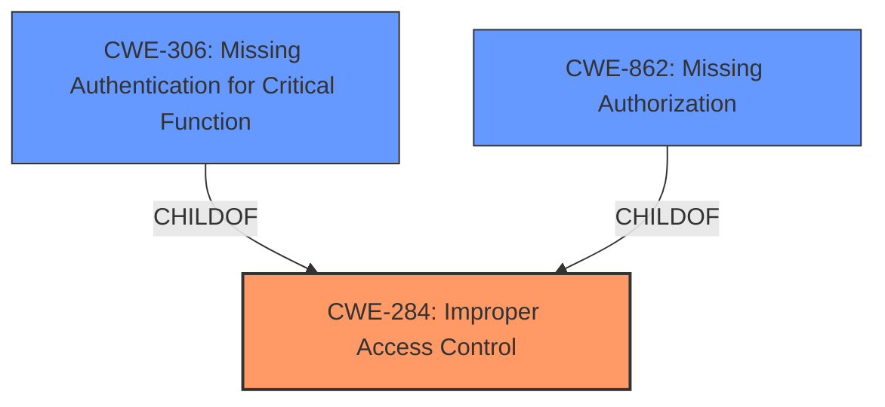

# Raw Analyzer Response for CVE-2025-2306

# Summary
| CWE ID  | CWE Name                                                                                                                                                                                                                           | Confidence | CWE Abstraction Level | CWE Vulnerability Mapping Label | CWE-Vulnerability Mapping Notes |
| :-------- | :----------------------------------------------------------------------------------------------------------------------------------------------------------------------------------------------------------------------------------- | :--------- | :---------------------- | :------------------------------ | :------------------------------ |
| CWE-284   | Improper Access Control [https://cwe.mitre.org/data/definitions/284.html](https://cwe.mitre.org/data/definitions/284.html)                                                                                                       | 0.7        | Class                   | Allowed                       | Primary CWE                   |
| CWE-306   | Missing Authentication for Critical Function [https://cwe.mitre.org/data/definitions/306.html](https://cwe.mitre.org/data/definitions/306.html)                                                                                | 0.6        | Base                    | Allowed                       | Secondary Candidate            |
| CWE-862   | Missing Authorization [https://cwe.mitre.org/data/definitions/862.html](https://cwe.mitre.org/data/definitions/862.html)                                                                                                           | 0.5        | Base                    | Allowed                       | Secondary Candidate            |

## Evidence and Confidence

*   **Confidence Score:** 0.7
*   **Evidence Strength:** MEDIUM

## Relationship Analysis
The primary relationship influencing the CWE selection is the parent-child relationship between CWE-284 (Improper Access Control) and potential child CWEs like CWE-306 (Missing Authentication for Critical Function) and CWE-862 (Missing Authorization). The decision leaned towards CWE-284 due to the high-level description of **improper access control** without specific details pointing definitively towards missing authentication or authorization. If more information was available, a more specific child CWE could have been chosen.

## Vulnerability Chain
The vulnerability chain starts with the **improper access control**, leading to the ability to download sensitive documents without authentication. The chain can be described as:

1.  **Improper Access Control** (**CWE-284**) - The root cause is a general **lack of access control** on the file download functionality.
2.  Missing Authentication/Authorization - This could manifest as either (**CWE-306**) where no authentication is required at all, or (**CWE-862**) where authorization checks are missing after authentication.
3.  Impact - Sensitive documents are downloaded without proper checks.

## Summary of Analysis
The initial assessment identified **Improper Access Control** as the root cause based on the vulnerability description and CVE details. The selection of CWE-284 is based on the high-level description of the vulnerability. The evidence from the "Vulnerability Description Key Phrases" section, specifically the phrase "**Improper Access Control**" supports this selection.

The retriever results suggested CWE-306 (Missing Authentication for Critical Function) and CWE-862 (Missing Authorization) which are both closely related to access control issues. These were considered as potential candidates.

Given the available information, CWE-284 is the most appropriate choice because it directly reflects the stated **improper access control** issue. If there was clearer evidence pointing towards missing authentication or missing authorization, the assessment would have shifted to CWE-306 or CWE-862 respectively. The final selection of CWE-284 represents the optimal level of specificity based on the provided evidence.

Relevant CWE Information:

# Enhanced Context (25 CWEs)
The following CWEs were identified as potentially relevant to this vulnerability:

## CWE-41: Improper Resolution of Path Equivalence
**Abstraction Level**: Base
**Similarity Score**: 0.76
**Source**: dense

**Description**:
The product is vulnerable to file system contents disclosure through path equivalence. Path equivalence involves the use of special characters in file and directory names. The associated manipulations are intended to generate multiple names for the same object.

**Mapping Guidance**:
- Usage: Allowed
- Rationale: This CWE entry is at the Base level of abstraction, which is a preferred level of abstraction for mapping to the root causes of vulnerabilities.

## CWE-552: Files or Directories Accessible to External Parties
**Abstraction Level**: Base
**Similarity Score**: 0.76
**Source**: dense

**Description**:
The product makes files or directories accessible to unauthorized actors, even though they should not be.

**Mapping Guidance**:
- Usage: Allowed
- Rationale: This CWE entry is at the Base level of abstraction, which is a preferred level of abstraction for mapping to the root causes of vulnerabilities.

## CWE-212: Improper Removal of Sensitive Information Before Storage or Transfer
**Abstraction Level**: Base
**Similarity Score**: 0.76
**Source**: dense

**Description**:
The product stores, transfers, or shares a resource that contains sensitive information, but it does not properly remove that information before the product makes the resource available to unauthorized actors.

**Mapping Guidance**:
- Usage: Allowed
- Rationale: This CWE entry is at the Base level of abstraction, which is a preferred level of abstraction for mapping to the root causes of vulnerabilities.

## CWE-668: Exposure of Resource to Wrong Sphere
**Abstraction Level**: Class
**Similarity Score**: 0.75
**Source**: dense

**Description**:
The product exposes a resource to the wrong control sphere, providing unintended actors with inappropriate access to the resource.

**Mapping Guidance**:
- Usage: Discouraged
- Rationale: CWE-668 is high-level and is often misused as a catch-all when lower-level CWE IDs might be applicable. It is sometimes used for low-information vulnerability reports [REF-1287]. It is a level-1 Class (i.e., a child of a Pillar). It is not useful for trend analysis.

## CWE-425: Direct Request ('Forced Browsing')
**Abstraction Level**: Base
**Similarity Score**: 0.75
**Source**: dense

**Description**:
The web application does not adequately enforce appropriate authorization on all restricted URLs, scripts, or files.

**Mapping Guidance**:
- Usage: Allowed
- Rationale: This CWE entry is at the Base level of abstraction, which is a preferred level of abstraction for mapping to the root causes of vulnerabilities.

## CWE-23: Relative Path Traversal
**Abstraction Level**: Base
**Similarity Score**: 0.75
**Source**: dense

**Description**:
The product uses external input to construct a pathname that should be within a restricted directory, but it does not properly neutralize sequences such as ".." that can resolve to a location that is outside of that directory.

**Mapping Guidance**:
- Usage: Allowed
- Rationale: This CWE entry is at the Base level of abstraction, which is a preferred level of abstraction for mapping to the root causes of vulnerabilities.

## CWE-345: Insufficient Verification of Data Authenticity
**Abstraction Level**: Class
**Similarity Score**: 0.75
**Source**: dense

**Description**:
The product does not sufficiently verify the origin or authenticity of data, in a way that causes it to accept invalid data.

**Mapping Guidance**:
- Usage: Discouraged
- Rationale: This CWE entry is a level-1 Class (i.e., a child of a Pillar). It might have lower-level children that would be more appropriate

## CWE-610: Externally Controlled Reference to a Resource in Another Sphere
**Abstraction Level**: Class
**Similarity Score**: 0.75
**Source**: dense

**Description**:
The product uses an externally controlled name or reference that resolves to a resource that is outside of the intended control sphere.

**Mapping Guidance**:
- Usage: Discouraged
- Rationale: This CWE entry is a level-1 Class (i.e., a child of a Pillar). It might have lower-level children that would be more appropriate

## CWE-497: Exposure of Sensitive System Information to an Unauthorized Control Sphere
**Abstraction Level**: Base
**Similarity Score**: 0.75
**Source**: dense

**Description**:
The product does not properly prevent sensitive system-level information from being accessed by unauthorized actors who do not have the same level of access to the underlying system as the product does.

**Mapping Guidance**:
- Usage: Allowed
- Rationale: This CWE entry is at the Base level of abstraction, which is a preferred level of abstraction for mapping to the root causes of vulnerabilities.