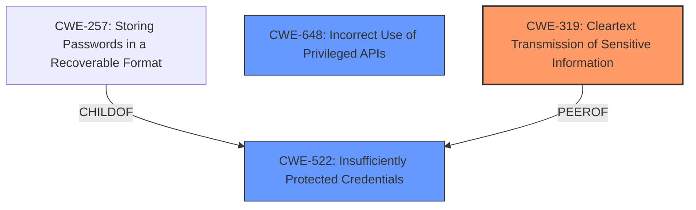

# Analysis for CVE-2025-2311

# Summary
| CWE ID  | CWE Name                                                                              | Confidence | CWE Abstraction Level | CWE Vulnerability Mapping Label | CWE-Vulnerability Mapping Notes |
| :-------- | :------------------------------------------------------------------------------------ | :--------- | :---------------------- | :------------------------------ | :------------------------------ |
| CWE-319 | Cleartext Transmission of Sensitive Information                                       | 0.9        | Base                    | Primary                         | Allowed                       |
| CWE-522 | Insufficiently Protected Credentials                                                | 0.8        | Class                   | Secondary                       | Allowed-with-Review           |
| CWE-648 | Incorrect Use of Privileged APIs                                                      | 0.6       | Base                    | Secondary                       | Allowed                      |

## Evidence and Confidence

*   **Confidence Score:** 0.8
*   **Evidence Strength:** MEDIUM

## Relationship Analysis

The primary CWE is CWE-319 which is a Base level CWE. CWE-522 is a Class level CWE, it is a parent of CWE-257 (Storing Passwords in a Recoverable Format) and peer of CWE-319. The relationships indicate that the credentials are not only transmitted in cleartext but also might be stored insecurely. CWE-648 is a base level CWE that indicates that the privileged APIs are not being used correctly, potentially leading to privilege escalation.

## Vulnerability Chain

The vulnerability chain starts with the **Cleartext Transmission of Sensitive Information** (CWE-319), combined with **Insufficiently Protected Credentials** (CWE-522) and **Incorrect Use of Privileged APIs** (CWE-648), leading to potential **Authentication Bypass**, **Interface Manipulation**, **Authentication Abuse**, and **Harvesting Information**.

## Summary of Analysis

The primary weakness is the **Cleartext Transmission of Sensitive Information** (CWE-319) which is supported by the vulnerability description key phrase. "This issue affects SecHard before 3.3.0.20220411." The **Insufficiently Protected Credentials** (CWE-522) is secondary because the credentials are not protected during transmission. The **Incorrect Use of Privileged APIs** (CWE-648) is also a secondary issue, as the API usage is not conforming to the requirements, potentially exacerbating the security risks.

The relationships between CWEs influenced the selection, with CWE-319 as the root cause and CWE-522 and CWE-648 contributing to the overall vulnerability. These CWEs are selected at the optimal level of specificity, with CWE-319 at the Base level and CWE-522 and CWE-648 at the Base level.

CWE-311 (Missing Encryption of Sensitive Data) was considered but not selected as the primary weakness, as the vulnerability description specifically mentions **Cleartext Transmission**, which is a more specific scenario than simply missing encryption.

CWE-306 (Missing Authentication for Critical Function) was considered, but it was not selected as it seems the authentication exists, but the credentials are being transmitted in cleartext.

CWE-798 (Use of Hard-coded Credentials) was considered but not selected as the description does not explicitly say that the credentials are hardcoded.

CWE-287 (Improper Authentication) was considered but not selected, as the main problem is not the authentication process itself, but rather how the credentials are being transmitted.