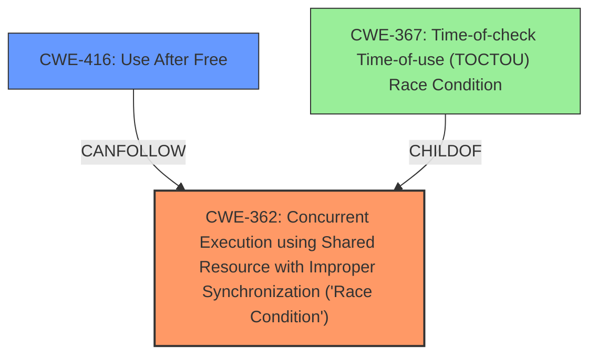

# Analysis for CVE-2025-23142

# Summary
| CWE ID | CWE Name | Confidence | CWE Abstraction Level | CWE Vulnerability Mapping Label | CWE-Vulnerability Mapping Notes |
|---|---|---|---|---|---|
| CWE-362 | Concurrent Execution using Shared Resource with Improper Synchronization ('Race Condition') | 0.9 | Class | Allowed-with-Review | Primary CWE. The **race condition** is the root cause. |
| CWE-416 | Use After Free | 0.8 | Variant | Allowed | Secondary CWE. The **use-after-free read** is a direct consequence of the race condition. |

## Evidence and Confidence

*   **Confidence Score:** 0.85
*   **Evidence Strength:** MEDIUM

## Relationship Analysis
The primary relationship is that the **race condition** (CWE-362) leads to the **use-after-free** (CWE-416). CWE-362 is a Class, while CWE-416 is a Variant, which is the preferred level of abstraction. CWE-362 has a child CWE, CWE-367: Time-of-check Time-of-use (TOCTOU) Race Condition, but the description doesn't specify a TOCTOU condition.

## Vulnerability Chain
The vulnerability chain starts with a **race condition** (CWE-362) where a transport is freed by one thread while another thread is still using it, leading to a **use-after-free read** (CWE-416).

## Summary of Analysis
The vulnerability description clearly indicates a **race condition** as the root cause, which results in a **use-after-free read**. The evidence lies in the description: "Theres a possible **race condition** if another thread triggers the removal of that selected transport... This causes the access to the transport data... to result in a **use-after-free read**."

CWE-362 (Concurrent Execution using Shared Resource with Improper Synchronization ('Race Condition')) is chosen as the primary CWE because it represents the root cause of the vulnerability. The **race condition** allows a resource to be freed prematurely.

CWE-416 (Use After Free) is selected as a secondary CWE because it is the direct result of the **race condition**. The thread attempts to access the freed transport, leading to the **use-after-free**.

Other CWEs considered but not used:

*   CWE-367 (Time-of-check Time-of-use (TOCTOU) Race Condition): While related to **race conditions**, the description doesn't explicitly mention a check-then-use scenario.
*   CWE-667 (Improper Locking): Locking is mentioned as part of the mitigation, but the core issue is the **race condition**, not the locking mechanism itself.
* CWE-366 (Race Condition within a Thread): This is a more specific version of CWE-362, but the description doesn't provide enough information to limit the race condition to within a single thread.