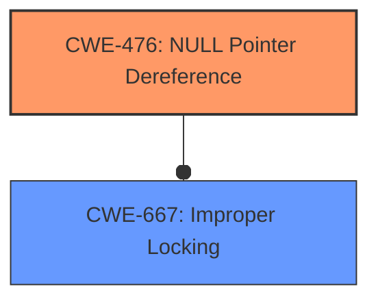

# Analysis Report for CVE-2025-23143

# Vulnerability Analysis Report: CVE-2025-23143

## Description

In the Linux kernel, the following vulnerability has been resolved net Fix **null-ptr-deref** by sock_lock_init_class_and_name() and rmmod. When I ran the repro [0] and waited a few seconds, I observed two LOCKDEP splats a warning immediately followed by a **null-ptr-deref**. [1] Reproduction Steps 1) Mount CIFS 2) Add an iptables rule to drop incoming FIN packets for CIFS 3) Unmount CIFS 4) Unload the CIFS module 5) Remove the iptables rule At step 3), the CIFS module calls sock_release() for the underlying TCP socket, and it returns quickly. However, the socket remains in FIN_WAIT_1 because incoming FIN packets are dropped. At this point, the modules refcnt is 0 while the socket is still alive, so the following rmmod command succeeds. # ss -tan State Recv-Q Send-Q Local AddressPort Peer AddressPort FIN-WAIT-1 0 477 10.0.2.1551062 10.0.0.137445 # lsmod | grep cifs cifs 1159168 0 This highlights a discrepancy between the lifetime of the CIFS module and the underlying TCP socket. Even after CIFS calls sock_release() and it returns, the TCP socket does not die immediately in order to close the connection gracefully. While this is generally fine, it causes an issue with LOCKDEP because CIFS assigns a different lock class to the TCP sockets sk->sk_lock using sock_lock_init_class_and_name(). Once an incoming packet is processed for the socket or a timer fires, sk->sk_lock is acquired. Then, LOCKDEP checks the lock context in check_wait_context(), where hlock_class() is called to retrieve the lock class. However, since the module has already been unloaded, hlock_class() logs a warning and returns NULL, triggering the **null-ptr-deref**. If LOCKDEP is enabled, we must ensure that a module calling sock_lock_init_class_and_name() (CIFS, NFS, etc) cannot be unloaded while such a socket is still alive to prevent this issue. Lets hold the module reference in sock_lock_init_class_and_name() and release it when the socket is freed in sk_prot_free(). Note that sock_lock_init() clears sk->sk_owner for svc_create_socket() that calls sock_lock_init_class_and_name() for a listening socket, which clones a socket by sk_clone_lock() without GFP_ZERO. [0] CIFS_SERVER=10.0.0.137 CIFS_PATH=//${CIFS_SERVER}/Users/Administrator/Desktop/CIFS_TEST DEV=enp0s3 CRED=/root/WindowsCredential.txt MNT=$(mktemp -d /tmp/XXXXXX) mount -t cifs ${CIFS_PATH} ${MNT} -o vers=3.0,credentials=${CRED},cache=none,echo_interval=1 iptables -A INPUT -s ${CIFS_SERVER} -j DROP for i in $(seq 10) do umount ${MNT} rmmod cifs sleep 1 done rm -r ${MNT} iptables -D INPUT -s ${CIFS_SERVER} -j DROP [1] DEBUG_LOCKS_WARN_ON(1) WARNING CPU 10 PID 0 at kernel/locking/lockdep.c234 hlock_class (kernel/locking/lockdep.c234 kernel/locking/lockdep.c223) Modules linked in cifs_arc4 nls_ucs2_utils cifs_md4 [last unloaded cifs] CPU 10 UID 0 PID 0 Comm swapper/10 Not tainted 6.14.0 #36 Hardware name QEMU Standard PC (i440FX + PIIX, 1996), BIOS rel-1.16.0-0-gd239552ce722-prebuilt.qemu.org 04/01/2014 RIP 0010hlock_class (kernel/locking/lockdep.c234 kernel/locking/lockdep.c223) ... Call Trace __lock_acquire (kernel/locking/lockdep.c4853 kernel/locking/lockdep.c5178) lock_acquire (kernel/locking/lockdep.c469 kernel/locking/lockdep.c5853 kernel/locking/lockdep.c5816) _raw_spin_lock_nested (kernel/locking/spinlock.c379) tcp_v4_rcv (./include/linux/skbuff.h1678 ./include/net/tcp.h2547 net/ipv4/tcp_ipv4.c2350) ...

## Vulnerability Description Key Phrases

- **Rootcause:** null-ptr-deref
- **Product:** Linux kernel

## Analysis (with Relationship Data)

# Summary

| CWE ID  | CWE Name                                                                                                             | Confidence | CWE Abstraction Level | CWE Vulnerability Mapping Label | CWE-Vulnerability Mapping Notes |
| :------- | :------------------------------------------------------------------------------------------------------------------- | :--------- | :---------------------- | :------------------------------ | :------------------------------ |
| CWE-476 | NULL Pointer Dereference                                                                                             | 1.0        | Base                    | Primary                         | Allowed                         |
| CWE-667 | Improper Locking                                                                                                   | 0.7        | Class                   | Secondary                       | Allowed-with-Review           |

## Evidence and Confidence

*   **Confidence Score:** 0.85
*   **Evidence Strength:** HIGH

## Relationship Analysis

The primary weakness is a **NULL Pointer Dereference (CWE-476)**, which occurs because `hlock_class()` returns NULL, and the code attempts to dereference it. The **Improper Locking (CWE-667)** is a secondary weakness, since the module is unloaded while the socket is still alive and the lock is still being acquired.



## Vulnerability Chain

The vulnerability chain starts with the improper handling of the socket lifecycle, leading to a state where the CIFS module is unloaded while the associated TCP socket is still alive. This results in `hlock_class()` returning NULL when the socket lock is acquired, which then leads to the **NULL Pointer Dereference (CWE-476)**.
- The unloading of the module while the socket is still alive creates a condition for improper locking and resource management.
- When the socket attempts to acquire the lock, `hlock_class()` returns NULL because the module has been unloaded.
- The code then attempts to dereference this NULL pointer, triggering a **NULL Pointer Dereference (CWE-476)**.

## Summary of Analysis

The vulnerability is primarily a **NULL Pointer Dereference (CWE-476)**. The provided evidence clearly states that the `hlock_class()` function returns NULL, and the code then attempts to dereference this NULL pointer, leading to the crash. The fact that the module is unloaded while the socket is still alive contributes to this condition, making **Improper Locking (CWE-667)** a secondary weakness.

The key phrase "**null-ptr-deref**" directly supports the selection of CWE-476 as the primary weakness. The retriever results also list CWE-476 with a high similarity score, reinforcing this selection.

The relationship graph highlights the direct association between the **NULL Pointer Dereference (CWE-476)** and the **Improper Locking (CWE-667)**. The chain of events begins with the module being unloaded prematurely, resulting in a NULL pointer being dereferenced later on.

The selected CWEs are at the optimal level of specificity. CWE-476 is a Base-level CWE that directly describes the **null pointer dereference**.

Relevant CWE Information:

# Enhanced Context (25 CWEs)
The following CWEs were identified as potentially relevant to this vulnerability:

## CWE-667: Improper Locking
**Abstraction Level**: Class
**Similarity Score**: 0.80
**Source**: dense

**Description**:
The product does not properly acquire or release a lock on a resource, leading to unexpected resource state changes and behaviors.

**Mapping Guidance**:
- Usage: Allowed-with-Review
- Rationale: This CWE entry is a Class and might have Base-level children that would be more appropriate

## CWE-476: NULL Pointer Dereference
**Abstraction Level**: Base
**Similarity Score**: 0.78
**Source**: dense

**Description**:
The product dereferences a pointer that it expects to be valid but is NULL.

**Mapping Guidance**:
- Usage: Allowed
- Rationale: This CWE entry is at the Base level of abstraction, which is a preferred level of abstraction for mapping to the root causes of vulnerabilities.

## CWE-833: Deadlock
**Abstraction Level**: Base
**Similarity Score**: 0.77
**Source**: dense

**Description**:
The product contains multiple threads or executable segments that are waiting for each other to release a necessary lock, resulting in deadlock.

**Mapping Guidance**:
- Usage: Allowed
- Rationale: This CWE entry is at the Base level of abstraction, which is a preferred level of abstraction for mapping to the root causes of vulnerabilities.

## CWE-404: Improper Resource Shutdown or Release
**Abstraction Level**: Class
**Similarity Score**: 0.76
**Source**: dense

**Description**:
The product does not release or incorrectly releases a resource before it is made available for re-use.

**Mapping Guidance**:
- Usage: Allowed-with-Review
- Rationale: This CWE entry is a Class and might have Base-level children that would be more appropriate

## CWE-824: Access of Uninitialized Pointer
**Abstraction Level**: Base
**Similarity Score**: 0.76
**Source**: dense

**Description**:
The product accesses or uses a pointer that has not been initialized.

**Mapping Guidance**:
- Usage: Allowed
- Rationale: This CWE entry is at the Base level of abstraction, which is a preferred level of abstraction for mapping to the root causes of vulnerabilities.

## CWE-754: Improper Check for Unusual or Exceptional Conditions
**Abstraction Level**: Class
**Similarity Score**: 0.76
**Source**: dense

**Description**:
The product does not check or incorrectly checks for unusual or exceptional conditions that are not expected to occur frequently during day to day operation of the product.

**Mapping Guidance**:
- Usage: Allowed-with-Review
- Rationale: This CWE entry is a Class and might have Base-level children that would be more appropriate

## CWE-665: Improper Initialization
**Abstraction Level**: Class
**Similarity Score**: 0.75
**Source**: dense

**Description**:
The product does not initialize or incorrectly initializes a resource, which might leave the resource in an unexpected state when it is accessed or used.

**Mapping Guidance**:
- Usage: Discouraged
- Rationale: This CWE entry is a level-1 Class (i.e., a child of a Pillar). It might have lower-level children that would be more appropriate

## CWE-362: Concurrent Execution using Shared Resource with Improper Synchronization ('Race Condition')
**Abstraction Level**: Class
**Similarity Score**: 0.75
**Source**: dense

**Description**:
The product contains a concurrent code sequence that requires temporary, exclusive access to a shared resource, but a timing window exists in which the shared resource can be modified by another code sequence operating concurrently.

**Mapping Guidance**:
- Usage: Allowed-with-Review
- Rationale: This CWE entry is a Class and might have Base-level children that would be more appropriate

## CWE-755: Improper Handling of Exceptional Conditions
**Abstraction Level**: Class
**Similarity Score**: 0.75
**Source**: dense

**Description**:
The product does not handle or incorrectly handles an exceptional condition.

**Mapping Guidance**:
- Usage: Discouraged
- Rationale: This CWE entry is a level-1 Class (i.e., a child of a Pillar). It might have lower-level children that would be more appropriate

## CWE-703: Improper Check or Handling of Exceptional Conditions
**Abstraction Level**: Pillar
**Similarity Score**: 0.75
**Source**: dense

**Description**:
The product does not properly anticipate or handle exceptional conditions that rarely occur during normal operation of the product.

**Mapping Guidance**:
- Usage: Discouraged
- Rationale: This CWE entry is extremely high-level, a Pillar.

## CWE-667: Improper Locking
**Abstraction Level**: Class
**Similarity Score**: 988.43
**Source**: sparse

**Description**:
The product does not properly acquire or release a lock on a resource, leading to unexpected resource state changes and behaviors.

**Mapping Guidance**:
- Usage: Allowed-with-Review
- Rationale: This CWE entry is a Class and might have Base-level children that would be more appropriate

## CWE-362: Concurrent Execution using Shared Resource with Improper Synchronization ('Race Condition')
**Abstraction Level**: Class
**Similarity Score**: 903.00
**Source**: sparse

**Description**:
The product contains a concurrent code sequence that requires temporary, exclusive access to a shared resource, but a timing window exists in which the shared resource can be modified by another code sequence operating concurrently.

**Mapping Guidance**:
- Usage: Allowed-with-Review
- Rationale: This CWE entry is a Class and might have Base-level children that would be more appropriate

## CWE-476: NULL Pointer Dereference
**Abstraction Level**: Base
**Similarity Score**: 890.37
**Source**:


## CWE Relationship Analysis

Current CWEs represent these abstraction levels: .


### Vulnerability Chain Analysis

**Chain starting from CWE-665:**
- 665 (Improper Initialization) - ROOT


**Chain starting from CWE-476:**
- 476 (NULL Pointer Dereference) - ROOT


### CWE Relationship Diagram

```mermaid
graph TD
    classDef primary fill:#f96,stroke:#333,stroke-width:2px
    classDef secondary fill:#69f,stroke:#333
    classDef tertiary fill:#9e9,stroke:#333
```


*Report generated on 2025-07-14 11:00:46*
