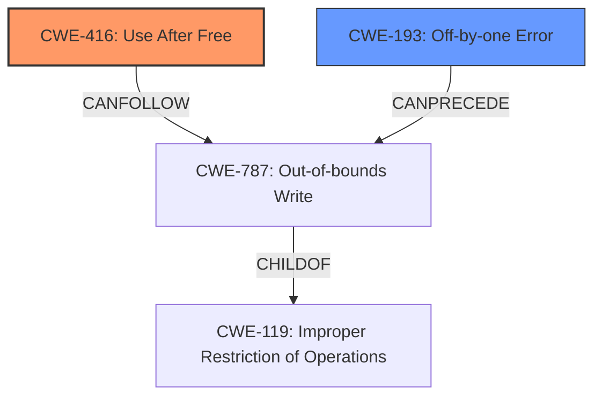

# Analysis Report for CVE-2025-23150

# Vulnerability Analysis Report: CVE-2025-23150

## Description

In the Linux kernel, the following vulnerability has been resolved ext4 fix **off-by-one error in do_split** Syzkaller detected a **use-after-free** issue in ext4_insert_dentry that was caused by out-of-bounds access due to incorrect splitting in do_split. BUG KASAN **use-after-free** in ext4_insert_dentry+0x36a/0x6d0 fs/ext4/namei.c2109 Write of size 251 at addr ffff888074572f14 by task syz-executor335/5847 CPU 0 UID 0 PID 5847 Comm syz-executor335 Not tainted 6.12.0-rc6-syzkaller-00318-ga9cda7c0ffed #0 Hardware name Google Google Compute Engine/Google Compute Engine, BIOS Google 10/30/2024 Call Trace __dump_stack lib/dump_stack.c94 [inline] dump_stack_lvl+0x241/0x360 lib/dump_stack.c120 print_address_description mm/kasan/report.c377 [inline] print_report+0x169/0x550 mm/kasan/report.c488 kasan_report+0x143/0x180 mm/kasan/report.c601 kasan_check_range+0x282/0x290 mm/kasan/generic.c189 __asan_memcpy+0x40/0x70 mm/kasan/shadow.c106 ext4_insert_dentry+0x36a/0x6d0 fs/ext4/namei.c2109 add_dirent_to_buf+0x3d9/0x750 fs/ext4/namei.c2154 make_indexed_dir+0xf98/0x1600 fs/ext4/namei.c2351 ext4_add_entry+0x222a/0x25d0 fs/ext4/namei.c2455 ext4_add_nondir+0x8d/0x290 fs/ext4/namei.c2796 ext4_symlink+0x920/0xb50 fs/ext4/namei.c3431 vfs_symlink+0x137/0x2e0 fs/namei.c4615 do_symlinkat+0x222/0x3a0 fs/namei.c4641 __do_sys_symlink fs/namei.c4662 [inline] __se_sys_symlink fs/namei.c4660 [inline] __x64_sys_symlink+0x7a/0x90 fs/namei.c4660 do_syscall_x64 arch/x86/entry/common.c52 [inline] do_syscall_64+0xf3/0x230 arch/x86/entry/common.c83 entry_SYSCALL_64_after_hwframe+0x77/0x7f The following loop is located right above if statement. for (i = count-1 i >= 0 i--) { /* is more than half of this entry in 2nd half of the block? */ if (size + map[i].size/2 > blocksize/2) break size += map[i].size move++ } i in this case could go down to -1, in which case sum of active entries wouldnt exceed half the block size, but previous behaviour would also do split in half if sum would exceed at the very last block, which in case of having too many long name files in a single block could lead to out-of-bounds access and following **use-after-free**. Found by Linux Verification Center (linuxtesting.org) with Syzkaller.

## Vulnerability Description Key Phrases

- **Rootcause:** off-by-one error in do_split
- **Weakness:** use-after-free
- **Impact:** out-of-bounds access
- **Product:** Linux kernel
- **Version:** 6.12.0-rc6-syzkaller-00318-ga9cda7c0ffed
- **Component:** ext4_insert_dentry

## Analysis (with Relationship Data)

# Summary
| CWE ID  | CWE Name                                                                                    | Confidence | CWE Abstraction Level | CWE Vulnerability Mapping Label | CWE-Vulnerability Mapping Notes |
|---------|---------------------------------------------------------------------------------------------|------------|-----------------------|---------------------------------|---------------------------------|
| CWE-416 | Use After Free                                                                              | 0.9        | Variant               | Primary                           | Allowed                         |
| CWE-193 | Off-by-one Error                                                                             | 0.8        | Base                  | Secondary                         | Allowed                         |

## Evidence and Confidence

*   **Confidence Score:** 0.85
*   **Evidence Strength:** HIGH

## Relationship Analysis

The primary weakness is **CWE-416 (Use After Free)**, which is a variant-level CWE. This aligns with the vulnerability description that clearly states a "use-after-free" issue. The **CWE-193 (Off-by-one Error)** is a base-level CWE and is related to the root cause of the out-of-bounds access that leads to the use-after-free.



## Vulnerability Chain

The vulnerability chain starts with an **off-by-one error** (**CWE-193**), which leads to an out-of-bounds access. This out-of-bounds access causes a memory corruption, which then results in a **use-after-free** condition (**CWE-416**).

## Summary of Analysis

The primary focus is on mapping the root cause and the immediate weakness. The vulnerability description explicitly mentions a "use-after-free" issue, making **CWE-416 (Use After Free)** the most appropriate primary CWE. The description also mentions an **off-by-one error**, which resulted in the use-after-free. Therefore, **CWE-193 (Off-by-one Error)** has been included as a secondary CWE since it caused the memory corruption.

The evidence is strong because the description contains the phrases "**off-by-one error in do_split**" and "**use-after-free**". The graph relationships confirm that an off-by-one error can precede an out-of-bounds write, which in turn can lead to a use-after-free.

The selected CWEs are at the optimal level of specificity because they directly represent the **rootcause** (**off-by-one error**) and the immediate weakness (**use-after-free**).

Relevant CWE Information:

# Enhanced Context (25 CWEs)
The following CWEs were identified as potentially relevant to this vulnerability:

## CWE-667: Improper Locking
**Abstraction Level**: Class
**Similarity Score**: 0.78
**Source**: dense

**Description**:
The product does not properly acquire or release a lock on a resource, leading to unexpected resource state changes and behaviors.

**Mapping Guidance**:
- Usage: Allowed-with-Review
- Rationale: This CWE entry is a Class and might have Base-level children that would be more appropriate

## CWE-193: Off-by-one Error
**Abstraction Level**: Base
**Similarity Score**: 0.77
**Source**: dense

**Description**:
A product calculates or uses an incorrect maximum or minimum value that is 1 more, or 1 less, than the correct value.

**Mapping Guidance**:
- Usage: Allowed
- Rationale: This CWE entry is at the Base level of abstraction, which is a preferred level of abstraction for mapping to the root causes of vulnerabilities.

## CWE-362: Concurrent Execution using Shared Resource with Improper Synchronization ('Race Condition')
**Abstraction Level**: Class
**Similarity Score**: 0.77
**Source**: dense

**Description**:
The product contains a concurrent code sequence that requires temporary, exclusive access to a shared resource, but a timing window exists in which the shared resource can be modified by another code sequence operating concurrently.

**Mapping Guidance**:
- Usage: Allowed-with-Review
- Rationale: This CWE entry is a Class and might have Base-level children that would be more appropriate

## CWE-367: Time-of-check Time-of-use (TOCTOU) Race Condition
**Abstraction Level**: Base
**Similarity Score**: 0.76
**Source**: dense

**Description**:
The product checks the state of a resource before using that resource, but the resource's state can change between the check and the use in a way that invalidates the results of the check. This can cause the product to perform invalid actions when the resource is in an unexpected state.

**Mapping Guidance**:
- Usage: Allowed
- Rationale: This CWE entry is at the Base level of abstraction, which is a preferred level of abstraction for mapping to the root causes of vulnerabilities.

## CWE-125: Out-of-bounds Read
**Abstraction Level**: Base
**Similarity Score**: 0.76
**Source**: dense

**Description**:
The product reads data past the end, or before the beginning, of the intended buffer.

**Mapping Guidance**:
- Usage: Allowed
- Rationale: This CWE entry is at the Base level of abstraction, which is a preferred level of abstraction for mapping to the root causes of vulnerabilities.

## CWE-754: Improper Check for Unusual or Exceptional Conditions
**Abstraction Level**: Class
**Similarity Score**: 0.76
**Source**: dense

**Description**:
The product does not check or incorrectly checks for unusual or exceptional conditions that are not expected to occur frequently during day to day operation of the product.

**Mapping Guidance**:
- Usage: Allowed-with-Review
- Rationale: This CWE entry is a Class and might have Base-level children that would be more appropriate

## CWE-131: Incorrect Calculation of Buffer Size
**Abstraction Level**: Base
**Similarity Score**: 0.76
**Source**: dense

**Description**:
The product does not correctly calculate the size to be used when allocating a buffer, which could lead to a buffer overflow.

**Mapping Guidance**:
- Usage: Allowed
- Rationale: This CWE entry is at the Base level of abstraction, which is a preferred level of abstraction for mapping to the root causes of vulnerabilities.

## CWE-252: Unchecked Return Value
**Abstraction Level**: Base
**Similarity Score**: 0.76
**Source**: dense

**Description**:
The product does not check the return value from a method or function, which can prevent it from detecting unexpected states and conditions.

**Mapping Guidance**:
- Usage: Allowed
- Rationale: This CWE entry is at the Base level of abstraction, which is a preferred level of abstraction for mapping to the root causes of vulnerabilities.

## CWE-703: Improper Check or Handling of Exceptional Conditions
**Abstraction Level**: Pillar
**Similarity Score**: 0.75
**Source**: dense

**Description**:
The product does not properly anticipate or handle exceptional conditions that rarely occur during normal operation of the product.

**Mapping Guidance**:
- Usage: Discouraged
- Rationale: This CWE entry is extremely high-level, a Pillar.

## CWE-824: Access of Uninitialized Pointer
**Abstraction Level**: Base
**Similarity Score**: 0.75
**Source**: dense

**Description**:
The product accesses or uses a pointer that has not been initialized.

**Mapping Guidance**:
- Usage: Allowed
- Rationale: This CWE entry is at the Base level of abstraction, which is a preferred level of abstraction for mapping to the root causes of vulnerabilities.

## CWE-362: Concurrent Execution using Shared Resource with Improper Synchronization ('Race Condition')
**Abstraction Level**: Class
**Similarity Score**: 680.73
**Source**: sparse

**Description**:
The product contains a concurrent code sequence that requires temporary, exclusive access to a shared resource, but a timing window exists in which the shared resource can be modified by another code sequence operating concurrently.

**Mapping Guidance**:
- Usage: Allowed-with-Review
- Rationale: This CWE entry is a Class and might have Base-level children that would be more appropriate

## CWE-367: Time-of-check Time-of-use (TOCTOU) Race Condition
**Abstraction Level**: Base
**Similarity Score**: 674.46
**Source**: sparse

**Description**:
The product checks the state of a resource before using that resource, but


## CWE Relationship Analysis

Current CWEs represent these abstraction levels: .


### Vulnerability Chain Analysis

**Chain starting from CWE-416:**
- 416 (Use After Free) - ROOT


**Chain starting from CWE-125:**
- 125 (Out-of-bounds Read) - ROOT


### CWE Relationship Diagram

```mermaid
graph TD
    classDef primary fill:#f96,stroke:#333,stroke-width:2px
    classDef secondary fill:#69f,stroke:#333
    classDef tertiary fill:#9e9,stroke:#333
```


*Report generated on 2025-07-14 11:02:27*
