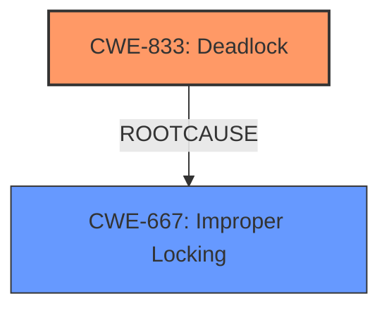

# Analysis Report for CVE-2025-23163

# Vulnerability Analysis Report: CVE-2025-23163

## Description

In the Linux kernel, the following vulnerability has been resolved net vlan dont propagate flags on open With the device instance lock, there is now a possibility of a **deadlock** [ 1.211455] ============================================ [ 1.211571] WARNING possible recursive locking detected [ 1.211687] 6.14.0-rc5-01215-g032756b4ca7a-dirty #5 Not tainted [ 1.211823] -------------------------------------------- [ 1.211936] ip/184 is trying to acquire lock [ 1.212032] ffff8881024a4c30 (&dev->lock){+.+.}-{44}, at dev_set_allmulti+0x4e/0xb0 [ 1.212207] [ 1.212207] but task is already holding lock [ 1.212332] ffff8881024a4c30 (&dev->lock){+.+.}-{44}, at dev_open+0x50/0xb0 [ 1.212487] [ 1.212487] other info that might help us debug this [ 1.212626] Possible unsafe locking scenario [ 1.212626] [ 1.212751] CPU0 [ 1.212815] ---- [ 1.212871] lock(&dev->lock) [ 1.212944] lock(&dev->lock) [ 1.213016] [ 1.213016] *** DEADLOCK *** [ 1.213016] [ 1.213143] May be due to missing lock nesting notation [ 1.213143] [ 1.213294] 3 locks held by ip/184 [ 1.213371] #0 ffffffff838b53e0 (rtnl_mutex){+.+.}-{44}, at rtnl_nets_lock+0x1b/0xa0 [ 1.213543] #1 ffffffff84e5fc70 (&net->rtnl_mutex){+.+.}-{44}, at rtnl_nets_lock+0x37/0xa0 [ 1.213727] #2 ffff8881024a4c30 (&dev->lock){+.+.}-{44}, at dev_open+0x50/0xb0 [ 1.213895] [ 1.213895] stack backtrace [ 1.213991] CPU 0 UID 0 PID 184 Comm ip Not tainted 6.14.0-rc5-01215-g032756b4ca7a-dirty #5 [ 1.213993] Hardware name QEMU Standard PC (i440FX + PIIX, 1996), BIOS Arch Linux 1.16.3-1-1 04/01/2014 [ 1.213994] Call Trace [ 1.213995] [ 1.213996] dump_stack_lvl+0x8e/0xd0 [ 1.214000] print_**deadlock**_bug+0x28b/0x2a0 [ 1.214020] lock_acquire+0xea/0x2a0 [ 1.214027] __mutex_lock+0xbf/0xd40 [ 1.214038] dev_set_allmulti+0x4e/0xb0 # real_dev->flags & IFF_ALLMULTI [ 1.214040] vlan_dev_open+0xa5/0x170 # ndo_open on vlandev [ 1.214042] __dev_open+0x145/0x270 [ 1.214046] __dev_change_flags+0xb0/0x1e0 [ 1.214051] netif_change_flags+0x22/0x60 # IFF_UP vlandev [ 1.214053] dev_change_flags+0x61/0xb0 # for each device in group from dev->vlan_info [ 1.214055] vlan_device_event+0x766/0x7c0 # on netdevsim0 [ 1.214058] notifier_call_chain+0x78/0x120 [ 1.214062] netif_open+0x6d/0x90 [ 1.214064] dev_open+0x5b/0xb0 # locks netdevsim0 [ 1.214066] bond_enslave+0x64c/0x1230 [ 1.214075] do_set_master+0x175/0x1e0 # on netdevsim0 [ 1.214077] do_setlink+0x516/0x13b0 [ 1.214094] rtnl_newlink+0xaba/0xb80 [ 1.214132] rtnetlink_rcv_msg+0x440/0x490 [ 1.214144] netlink_rcv_skb+0xeb/0x120 [ 1.214150] netlink_unicast+0x1f9/0x320 [ 1.214153] netlink_sendmsg+0x346/0x3f0 [ 1.214157] __sock_sendmsg+0x86/0xb0 [ 1.214160] ____sys_sendmsg+0x1c8/0x220 [ 1.214164] ___sys_sendmsg+0x28f/0x2d0 [ 1.214179] __x64_sys_sendmsg+0xef/0x140 [ 1.214184] do_syscall_64+0xec/0x1d0 [ 1.214190] entry_SYSCALL_64_after_hwframe+0x77/0x7f [ 1.214191] RIP 00330x7f2d1b4a7e56 Device setup netdevsim0 (down) ^ ^ bond netdevsim1.100@netdevsim1 allmulticast=on (down) When we enslave the lower device (netdevsim0) which has a vlan, we propagate vlans allmuti/promisc flags during ndo_open. This causes (re)locking on of the real_dev. Propagate allmulti/promisc on flags change, not on the open. There is a slight semantics change that vlans that are down now propagate the flags, but this seems unlikely to result in the real issues. Reproducer echo 0 1 > /sys/bus/netdevsim/new_device dev_path=$(ls -d /sys/bus/netdevsim/devices/netdevsim0/net/*) dev=$(echo $dev_path | rev | cut -d/ -f1 | rev) ip link set dev $dev name netdevsim0 ip link set dev netdevsim0 up ip link add link netdevsim0 name netdevsim0.100 type vlan id 100 ip link set dev netdevsim0.100 allm ---truncated---

## Vulnerability Description Key Phrases

- **Weakness:** deadlock
- **Product:** Linux kernel
- **Version:** 6.14.0-rc5-01215-g032756b4ca7a-dirty
- **Component:** net vlan

## Analysis (with Relationship Data)

# Summary
| CWE ID | CWE Name | Confidence | CWE Abstraction Level | CWE Vulnerability Mapping Label | CWE-Vulnerability Mapping Notes |
|---|---|---|---|---|---|
| CWE-833 | Deadlock | 1.0 | Base | Primary | Allowed |
| CWE-667 | Improper Locking | 0.7 | Class | Secondary | Allowed-with-Review |

## Evidence and Confidence

*   **Confidence Score:** 0.9
*   **Evidence Strength:** HIGH

## Relationship Analysis
The primary weakness is a **deadlock** (CWE-833), which occurs when multiple threads are blocked indefinitely, waiting for each other to release resources. This is often a consequence of **improper locking** (CWE-667) mechanisms. The hierarchical relationship shows that CWE-833 is more specific than CWE-667.



## Vulnerability Chain
The vulnerability chain starts with the **improper locking** (CWE-667) which leads to the final impact of a **deadlock** (CWE-833).

## Summary of Analysis
The vulnerability description clearly indicates a **deadlock** situation within the Linux kernel due to incorrect locking mechanisms.

Evidence:
*   The vulnerability description states: "With the device instance lock, there is now a possibility of a **deadlock**"
*   The description includes a stack trace indicating a **deadlock** scenario.
*   The phrases "recursive locking detected", "task is already holding lock", and "*** DEADLOCK ***" are present, confirming the **deadlock** condition.

CWE Selection Justification:

*   CWE-833 (Deadlock): This is the most accurate representation of the vulnerability, as it directly describes the **deadlock** condition. The evidence from the vulnerability description strongly supports this classification.
*   CWE-667 (Improper Locking): This is a contributing factor to the **deadlock**. It represents the **root cause** of the vulnerability, where locks are not properly acquired or released, leading to the **deadlock**.

CWEs Considered But Not Used:

*   CWE-362 (Concurrent Execution using Shared Resource with Improper Synchronization ('Race Condition')): While concurrency is involved, the specific issue is a **deadlock**, not a race condition. A race condition involves unpredictable outcomes due to timing, while a **deadlock** is a complete standstill.
*   CWE-400 (Uncontrolled Resource Consumption) and CWE-770 (Allocation of Resources Without Limits or Throttling): These CWEs are related to resource management but do not directly describe the **deadlock** issue.
*   CWE-401 (Missing Release of Memory after Effective Lifetime): This CWE is about memory leaks and is not related to the **deadlock** described in the vulnerability.

Relevant CWE Information:

# Enhanced Context (25 CWEs)
The following CWEs were identified as potentially relevant to this vulnerability:

## CWE-667: Improper Locking
**Abstraction Level**: Class
**Similarity Score**: 0.75
**Source**: dense

**Description**:
The product does not properly acquire or release a lock on a resource, leading to unexpected resource state changes and behaviors.

**Mapping Guidance**:
- Usage: Allowed-with-Review
- Rationale: This CWE entry is a Class and might have Base-level children that would be more appropriate


## CWE-833: Deadlock
**Abstraction Level**: Base
**Similarity Score**: 0.75
**Source**: dense

**Description**:
The product contains multiple threads or executable segments that are waiting for each other to release a necessary lock, resulting in **deadlock**.

**Mapping Guidance**:
- Usage: Allowed
- Rationale: This CWE entry is at the Base level of abstraction, which is a preferred level of abstraction for mapping to the **root causes** of vulnerabilities.


## CWE-696: Incorrect Behavior Order
**Abstraction Level**: Class
**Similarity Score**: 0.72
**Source**: dense

**Description**:
The product performs multiple related behaviors, but the behaviors are performed in the wrong order in ways which may produce resultant weaknesses.

**Mapping Guidance**:
- Usage: Allowed-with-Review
- Rationale: This CWE entry is a Class and might have Base-level children that would be more appropriate


## CWE-755: Improper Handling of Exceptional Conditions
**Abstraction Level**: Class
**Similarity Score**: 0.71
**Source**: dense

**Description**:
The product does not handle or incorrectly handles an exceptional condition.

**Mapping Guidance**:
- Usage: Discouraged
- Rationale: This CWE entry is a level-1 Class (i.e., a child of a Pillar). It might have lower-level children that would be more appropriate


## CWE-754: Improper Check for Unusual or Exceptional Conditions
**Abstraction Level**: Class
**Similarity Score**: 0.71
**Source**: dense

**Description**:
The product does not check or incorrectly checks for unusual or exceptional conditions that are not expected to occur frequently during day to day operation of the product.

**Mapping Guidance**:
- Usage: Allowed-with-Review
- Rationale: This CWE entry is a Class and might have Base-level children that would be more appropriate


## CWE-362: Concurrent Execution using Shared Resource with Improper Synchronization ('Race Condition')
**Abstraction Level**: Class
**Similarity Score**: 0.70
**Source**: dense

**Description**:
The product contains a concurrent code sequence that requires temporary, exclusive access to a shared resource, but a timing window exists in which the shared resource can be modified by another code sequence operating concurrently.

**Mapping Guidance**:
- Usage: Allowed-with-Review
- Rationale: This CWE entry is a Class and might have Base-level children that would be more appropriate


## CWE-212: Improper Removal of Sensitive Information Before Storage or Transfer
**Abstraction Level**: Base
**Similarity Score**: 0.70
**Source**: dense

**Description**:
The product stores, transfers, or shares a resource that contains sensitive information, but it does not properly remove that information before the product makes the resource available to unauthorized actors.

**Mapping Guidance**:
- Usage: Allowed
- Rationale: This CWE entry is at the Base level of abstraction, which is a preferred level of abstraction for mapping to the **root causes** of vulnerabilities.


## CWE-401: Missing Release of Memory after Effective Lifetime
**Abstraction Level**: Variant
**Similarity Score**: 0.70
**Source**: dense

**Description**:
The product does not sufficiently track and release allocated memory after it has been used, which slowly consumes remaining memory.

**Mapping Guidance**:
- Usage: Allowed
- Rationale: This CWE entry is at the Variant level of abstraction, which is a preferred level of abstraction for mapping to the **root causes** of vulnerabilities.


## CWE-617: Reachable Assertion
**Abstraction Level**: Base
**Similarity Score**: 0.70
**Source**: dense

**Description**:
The product contains an assert() or similar statement that can be triggered by an attacker, which leads to an application exit or other behavior that is more severe than necessary.

**Mapping Guidance**:
- Usage: Allowed
- Rationale: This CWE entry is at the Base level of abstraction, which is a preferred level of abstraction for mapping to the **root causes** of vulnerabilities.


## CWE-1285: Improper Validation of Specified Index, Position, or Offset in Input
**Abstraction Level**: Base
**Similarity Score**: 0.70
**Source**: dense

**Description**:
The product receives input that is expected to specify an index, position, or offset into an indexable resource such as a buffer or file, but it does not validate or incorrectly validates that the specified index/position/offset has the required properties.

**Mapping Guidance**:
- Usage: Allowed
- Rationale: This CWE entry is at the Base level of abstraction, which is a preferred level of abstraction for mapping to the **root causes** of vulnerabilities.


## CWE-667: Improper Locking
**Abstraction Level**: Class
**Similarity Score**: 769.96
**Source**: sparse

**Description**:
The product does not properly acquire or release a lock on a resource, leading to unexpected resource state changes and behaviors.

**Mapping Guidance**:
- Usage: Allowed-with-Review
- Rationale: This CWE entry is a Class and might have Base-level children that would be more appropriate


## CWE-833: Deadlock
**Abstraction Level**: Base
**Similarity Score**: 635.79
**Source**: sparse

**Description**:
The product contains multiple threads or executable segments that are waiting for each other to release a necessary lock, resulting in **deadlock**.

**Mapping Guidance**:
- Usage: Allowed
- Rationale


## CWE Relationship Analysis

Current CWEs represent these abstraction levels: .


### Vulnerability Chain Analysis

**Chain starting from CWE-400:**
- 400 (Uncontrolled Resource Consumption) - ROOT


**Chain starting from CWE-770:**
- 770 (Allocation of Resources Without Limits or Throttling) - ROOT


### CWE Relationship Diagram

```mermaid
graph TD
    classDef primary fill:#f96,stroke:#333,stroke-width:2px
    classDef secondary fill:#69f,stroke:#333
    classDef tertiary fill:#9e9,stroke:#333
```


*Report generated on 2025-07-14 11:03:06*
