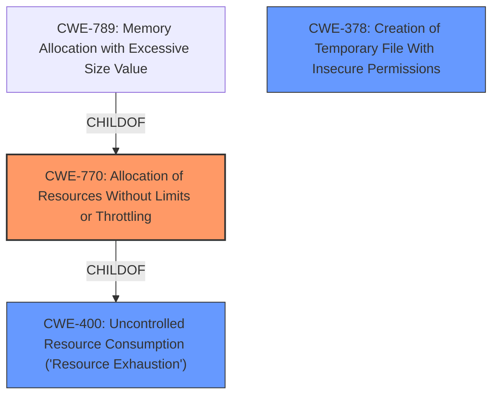

# Analysis for CVE-2025-23184

# Summary

| CWE ID  | CWE Name                                                                   | Confidence | CWE Abstraction Level | CWE Vulnerability Mapping Label | CWE-Vulnerability Mapping Notes |
| :-------- | :------------------------------------------------------------------------- | :--------- | :-------------------- | :------------------------------ | :------------------------------ |
| CWE-770 | CWE-770: Allocation of Resources Without Limits or Throttling             | 0.90      | Base                  | Primary CWE                     | Allowed                        |
| CWE-400 | CWE-400: Uncontrolled Resource Consumption ('Resource Exhaustion') | 0.75      | Base                  | Secondary Candidate              | Allowed-with-Review                   |
| CWE-378 | CWE-378: Creation of Temporary File With Insecure Permissions | 0.50      | Base                  | Secondary Candidate              | Allowed                        |

## Evidence and Confidence

*   **Confidence Score:** 0.80
*   **Evidence Strength:** HIGH

## Relationship Analysis

The primary weakness is the **allocation of resources without limits or throttling** (CWE-770), which directly leads to **uncontrolled resource consumption** (CWE-400). CWE-770 is a parent of CWE-789 (Memory Allocation with Excessive Size Value), but in this case, the resource is disk space via temporary files, not necessarily memory. CWE-770 is also a child of CWE-400, indicating that **allocation of resources without limits** is a common way to achieve resource exhaustion. The creation of temporary files with insecure permissions (CWE-378) is also considered, as insecure permissions on the temporary files could lead to information disclosure but the description focuses on resource exhaustion.

## Vulnerability Chain

The vulnerability chain starts with **CachedOutputStream instances not being closed**. When these instances are backed by temporary files, this leads to **CWE-770: Allocation of Resources Without Limits or Throttling**, specifically the creation of temporary files without proper management. This, in turn, leads to **CWE-400: Uncontrolled Resource Consumption ('Resource Exhaustion')** as the file system fills up, resulting in a denial of service.

## Summary of Analysis

The initial analysis considered several CWEs from the retriever results, including CWE-789, CWE-835, and CWE-410. However, CWE-770 best captures the **root cause** of the vulnerability: the **unrestricted allocation of resources** (in this case, disk space via temporary files). The vulnerability description explicitly states that the **CachedOutputStream instances may not be closed and, if backed by temporary files, may fill up the file system**. This directly aligns with CWE-770's description: **"The product allocates a reusable resource or group of resources on behalf of an actor without imposing any restrictions on the size or number of resources that can be allocated, in violation of the intended security policy for that actor."**

The impact of filling up the file system leads directly to **CWE-400: Uncontrolled Resource Consumption ('Resource Exhaustion')**, which is a natural consequence of the **unlimited allocation**.

CWE-789 (Memory Allocation with Excessive Size Value) was considered because temporary files are allocated. However, the issue is not with the *size* of individual allocations, but the *number* of allocations over time, thus CWE-770 is more appropriate. CWE-835 (Loop with Unreachable Exit Condition) and CWE-410 (Insufficient Resource Pool) do not directly relate to the vulnerability's root cause.

The relationship graph and vulnerability chain illustrate the progression from the **unmanaged resource allocation** (CWE-770) to the **resource exhaustion** (CWE-400), solidifying the selection of CWE-770 as the primary CWE. The evidence from the vulnerability description and CVE details supports this classification. The selection is at the Base level of abstraction, which is the preferred level.

Relevant CWE Information:

# Enhanced Context (25 CWEs)
The following CWEs were identified as potentially relevant to this vulnerability:

## CWE-789: Memory Allocation with Excessive Size Value
**Abstraction Level**: Variant
**Similarity Score**: 0.74
**Source**: dense

**Description**:
The product allocates memory based on an untrusted, large size value, but it does not ensure that the size is within expected limits, allowing arbitrary amounts of memory to be allocated.

**Mapping Guidance**:
- Usage: Allowed
- Rationale: This CWE entry is at the Variant level of abstraction, which is a preferred level of abstraction for mapping to the root causes of vulnerabilities.

## CWE-378: Creation of Temporary File With Insecure Permissions
**Abstraction Level**: Base
**Similarity Score**: 0.73
**Source**: dense

**Description**:
Opening temporary files without appropriate measures or controls can leave the file, its contents and any function that it impacts vulnerable to attack.

**Mapping Guidance**:
- Usage: Allowed
- Rationale: This CWE entry is at the Base level of abstraction, which is a preferred level of abstraction for mapping to the root causes of vulnerabilities.

## CWE-770: Allocation of Resources Without Limits or Throttling
**Abstraction Level**: Base
**Similarity Score**: 0.72
**Source**: dense

**Description**:
The product allocates a reusable resource or group of resources on behalf of an actor without imposing any restrictions on the size or number of resources that can be allocated, in violation of the intended security policy for that actor.

**Mapping Guidance**:
- Usage: Allowed
- Rationale: This CWE entry is at the Base level of abstraction, which is a preferred level of abstraction for mapping to the root causes of vulnerabilities.

## CWE-923: Improper Restriction of Communication Channel to Intended Endpoints
**Abstraction Level**: Class
**Similarity Score**: 0.72
**Source**: dense

**Description**:
The product establishes a communication channel to (or from) an endpoint for privileged or protected operations, but it does not properly ensure that it is communicating with the correct endpoint.

**Mapping Guidance**:
- Usage: Allowed-with-Review
- Rationale: This CWE entry is a Class and might have Base-level children that would be more appropriate

## CWE-41: Improper Resolution of Path Equivalence
**Abstraction Level**: Base
**Similarity Score**: 0.72
**Source**: dense

**Description**:
The product is vulnerable to file system contents disclosure through path equivalence. Path equivalence involves the use of special characters in file and directory names. The associated manipulations are intended to generate multiple names for the same object.

**Mapping Guidance**:
- Usage: Allowed
- Rationale: This CWE entry is at the Base level of abstraction, which is a preferred level of abstraction for mapping to the root causes of vulnerabilities.

## CWE-611: Improper Restriction of XML External Entity Reference
**Abstraction Level**: Base
**Similarity Score**: 0.72
**Source**: dense

**Description**:
The product processes an XML document that can contain XML entities with URIs that resolve to documents outside of the intended sphere of control, causing the product to embed incorrect documents into its output.

**Mapping Guidance**:
- Usage: Allowed
- Rationale: This CWE entry is at the Base level of abstraction, which is a preferred level of abstraction for mapping to the root causes of vulnerabilities.

## CWE-410: Insufficient Resource Pool
**Abstraction Level**: Base
**Similarity Score**: 0.72
**Source**: dense

**Description**:
The product's resource pool is not large enough to handle peak demand, which allows an attacker to prevent others from accessing the resource by using a (relatively) large number of requests for resources.

**Mapping Guidance**:
- Usage: Allowed
- Rationale: This CWE entry is at the Base level of abstraction, which is a preferred level of abstraction for mapping to the root causes of vulnerabilities.

## CWE-755: Improper Handling of Exceptional Conditions
**Abstraction Level**: Class
**Similarity Score**: 0.71
**Source**: dense

**Description**:
The product does not handle or incorrectly handles an exceptional condition.

**Mapping Guidance**:
- Usage: Discouraged
- Rationale: This CWE entry is a level-1 Class (i.e., a child of a Pillar). It might have lower-level children that would be more appropriate

## CWE-617: Reachable Assertion
**Abstraction Level