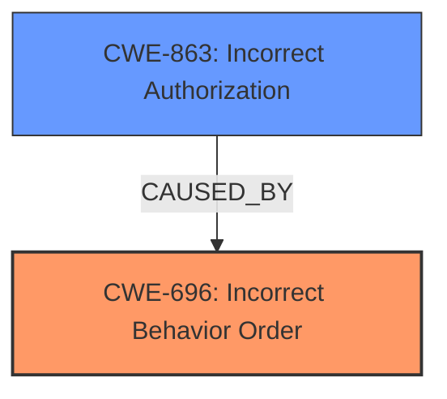

# Analysis Report for CVE-2025-23204

# Vulnerability Analysis Report: CVE-2025-23204

## Description

API Platform Core is a system to create hypermedia-driven REST and GraphQL APIs. Starting in version 3.3.8, a security check that gets called after GraphQl resolvers is always replaced by another one as theres no break in a clause. As this falls back to `security`, the impact is there only when theres only a security after resolver and none inside security. Version 3.3.15 contains a patch for the issue.

## Vulnerability Description Key Phrases

- **Rootcause:** security check gets called after GraphQl resolvers is always replaced
- **Product:** API Platform Core
- **Version:** 3.3.8

## Analysis (with Relationship Data)

# Summary
| CWE ID | CWE Name | Confidence | CWE Abstraction Level | CWE Vulnerability Mapping Label | CWE-Vulnerability Mapping Notes |
|---|---|---|---|---|---|
| CWE-696 | Incorrect Behavior Order | 0.85 | Class | Allowed-with-Review | Primary CWE. The **incorrect order** of security checks leads to the bypass. |
| CWE-863 | Incorrect Authorization | 0.70 | Class | Allowed-with-Review | Secondary. The **incorrect order** of operations results in **incorrect authorization**. |

## Evidence and Confidence

*   **Confidence Score:** 0.80
*   **Evidence Strength:** MEDIUM

## Relationship Analysis
The primary relationship that influenced the selection was that the **incorrect order** of security checks directly leads to an **authorization bypass**. CWE-696 (Incorrect Behavior Order) is the root cause, while CWE-863 (Incorrect Authorization) is a consequence of the misordering. The abstraction level is Class for both, and while a more specific Base CWE could be ideal, the available information strongly supports these Class-level mappings.



## Vulnerability Chain
The vulnerability chain starts with the **incorrect order** of security checks (CWE-696), which then directly leads to **incorrect authorization** (CWE-863), resulting in a potential security bypass.

## Summary of Analysis
The initial assessment focused on identifying the root cause of the vulnerability. The description clearly states that the **security check gets called after GraphQL resolvers is always replaced** due to a missing `break` statement. This points to an **incorrect order** of operations, making CWE-696 (Incorrect Behavior Order) the primary candidate.

CWE-863 (Incorrect Authorization) was considered as a secondary CWE because the **incorrect order** ultimately leads to **incorrect authorization**, which is the end result of the vulnerability.

The evidence provided is sufficient to justify the selection of these CWEs, although more detailed information about the specific code implementation could potentially lead to a more precise Base-level CWE. The graph relationships confirm that the **incorrect order** directly contributes to **incorrect authorization**, reinforcing the chosen classifications.

The selected CWEs are at an appropriate level of specificity given the available information. While more granular CWEs could exist, the current evidence strongly supports these Class-level mappings as the most accurate representation of the vulnerability.

Relevant CWE Information:

# Enhanced Context (25 CWEs)
The following CWEs were identified as potentially relevant to this vulnerability:

## CWE-639: Authorization Bypass Through User-Controlled Key
**Abstraction Level**: Base
**Similarity Score**: 0.75
**Source**: dense

**Description**:
The system's authorization functionality does not prevent one user from gaining access to another user's data or record by modifying the key value identifying the data.

**Mapping Guidance**:
- Usage: Allowed
- Rationale: This CWE entry is at the Base level of abstraction, which is a preferred level of abstraction for mapping to the root causes of vulnerabilities.

*Not selected.* This CWE describes a different kind of authorization bypass. It's about manipulating keys, which is not the case here.

## CWE-303: Incorrect Implementation of Authentication Algorithm
**Abstraction Level**: Base
**Similarity Score**: 0.74
**Source**: dense

**Description**:
The requirements for the product dictate the use of an established authentication algorithm, but the implementation of the algorithm is incorrect.

**Mapping Guidance**:
- Usage: Allowed
- Rationale: This CWE entry is at the Base level of abstraction, which is a preferred level of abstraction for mapping to the root causes of vulnerabilities.

*Not selected.* This CWE is about authentication, whereas the vulnerability is about authorization after authentication.

## CWE-1286: Improper Validation of Syntactic Correctness of Input
**Abstraction Level**: Base
**Similarity Score**: 0.73
**Source**: dense

**Description**:
The product receives input that is expected to be well-formed - i.e., to comply with a certain syntax - but it does not validate or incorrectly validates that the input complies with the syntax.

**Mapping Guidance**:
- Usage: Allowed
- Rationale: This CWE entry is at the Base level of abstraction, which is a preferred level of abstraction for mapping to the root causes of vulnerabilities.

*Not selected.* This CWE is related to input validation, and that is not the root cause of the vulnerability.

## CWE-212: Improper Removal of Sensitive Information Before Storage or Transfer
**Abstraction Level**: Base
**Similarity Score**: 0.73
**Source**: dense

**Description**:
The product stores, transfers, or shares a resource that contains sensitive information, but it does not properly remove that information before the product makes the resource available to unauthorized actors.

**Mapping Guidance**:
- Usage: Allowed
- Rationale: This CWE entry is at the Base level of abstraction, which is a preferred level of abstraction for mapping to the root causes of vulnerabilities.

*Not selected.* This CWE is related to sensitive information handling, and that is not the root cause of the vulnerability.

## CWE-209: Generation of Error Message Containing Sensitive Information
**Abstraction Level**: Base
**Similarity Score**: 0.73
**Source**: dense

**Description**:
The product generates an error message that includes sensitive information about its environment, users, or associated data.

**Mapping Guidance**:
- Usage: Allowed
- Rationale: This CWE entry is at the Base level of abstraction, which is a preferred level of abstraction for mapping to the root causes of vulnerabilities.

*Not selected.* This CWE is related to error message handling, and that is not the root cause of the vulnerability.

## CWE-267: Privilege Defined With Unsafe Actions
**Abstraction Level**: Base
**Similarity Score**: 0.73
**Source**: dense

**Description**:
A particular privilege, role, capability, or right can be used to perform unsafe actions that were not intended, even when it is assigned to the correct entity.

**Mapping Guidance**:
- Usage: Allowed
- Rationale: This CWE entry is at the Base level of abstraction, which is a preferred level of abstraction for mapping to the root causes of vulnerabilities.

*Not selected.* While related to privileges, it is not the **incorrect order** that is the issue here.

## CWE-116: Improper Encoding or Escaping of Output
**Abstraction Level**: Class
**Similarity Score**: 0.73
**Source**: dense

**Description**:
The product prepares a structured message for communication with another component, but encoding or escaping of the data is either missing or done incorrectly. As a result, the intended structure of the message is not preserved.

**Mapping Guidance**:
- Usage: Allowed-with-Review
- Rationale: This CWE entry is a Class and might have Base-level children that would be more appropriate

*Not selected.* The vulnerability is not related to encoding or escaping.

## CWE-346: Origin Validation Error
**Abstraction Level**: Class
**Similarity Score**: 0.73
**Source**: dense

**Description**:
The product does not properly verify that the source of data or communication is valid.

**Mapping Guidance**:
- Usage: Allowed-with-Review
- Rationale: This CWE entry is a Class and might have Base-level children that would be more appropriate

*Not selected.* The vulnerability is not related to origin validation.

## CWE-204: Observable Response Discrepancy
**Abstraction Level**: Base
**Similarity Score**: 0.73
**Source**: dense

**Description**:
The product provides different responses to incoming requests in a way that reveals internal state information to an unauthorized actor outside of the intended control sphere.

**Mapping Guidance**:
- Usage: Allowed
- Rationale: This CWE entry is at the Base level of abstraction, which is a preferred level of abstraction for mapping to the root causes of vulnerabilities.

*Not selected.* The vulnerability is not related to observable response discrepancies.

## CWE-918: Server-Side Request Forgery (SSRF)
**Abstraction Level**: Base
**Similarity Score**: 0.73
**Source**: dense

**Description**:
The web server receives a URL or similar request from an upstream component and retrieves the contents of this URL, but it does not sufficiently ensure that the request is being sent to the expected destination.

**Mapping Guidance**:
- Usage: Allowed
- Rationale: This CWE entry is at the Base level of abstraction, which is a preferred level of abstraction for mapping to the root causes of vulnerabilities.

*Not selected.* The vulnerability is not related to server-side request forgery.

## CWE-863: Incorrect Authorization
**Abstraction Level**: Class
**Similarity Score**: 658.27
**Source**: sparse

**Description**:
The product performs an authorization check when an actor attempts to access a resource or perform an action, but it


## CWE Relationship Analysis

Current CWEs represent these abstraction levels: .


### Vulnerability Chain Analysis

**Chain starting from CWE-863:**
- 863 (Incorrect Authorization) - ROOT


**Chain starting from CWE-116:**
- 116 (Improper Encoding or Escaping of Output) - ROOT


### CWE Relationship Diagram

```mermaid
graph TD
    classDef primary fill:#f96,stroke:#333,stroke-width:2px
    classDef secondary fill:#69f,stroke:#333
    classDef tertiary fill:#9e9,stroke:#333
```


*Report generated on 2025-07-14 11:07:14*
