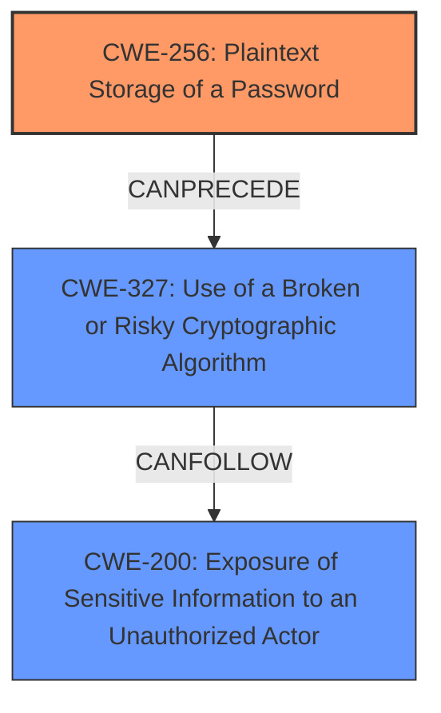

# Raw Analyzer Response for CVE-2025-23215

# Summary
| CWE ID | CWE Name | Confidence | CWE Abstraction Level | CWE Vulnerability Mapping Label | CWE-Vulnerability Mapping Notes |
|---|---|---|---|---|---|
| CWE-256 | Plaintext Storage of a Password | 0.9 | Base | Primary | Allowed |
| CWE-327 | Use of a Broken or Risky Cryptographic Algorithm | 0.7 | Class | Secondary | Allowed-with-Review |
| CWE-200 | Exposure of Sensitive Information to an Unauthorized Actor | 0.6 | Class | Secondary | Allowed |

## Evidence and Confidence

*   **Confidence Score:** 0.8
*   **Evidence Strength:** HIGH

## Relationship Analysis
The primary weakness is **CWE-256 Plaintext Storage of a Password**, a Base level CWE. This relates to how the passphrase was stored, leading to the compromise. **CWE-327 Use of a Broken or Risky Cryptographic Algorithm**, a Class level CWE, is related because the use of a **weak passphrase** weakens the cryptographic protection, but is not the root cause. **CWE-200 Exposure of Sensitive Information to an Unauthorized Actor**, a Class level CWE, is related to the disclosure of the passphrase.

## Vulnerability Chain
The vulnerability chain starts with **CWE-256 Plaintext Storage of a Password**, as the **weak passphrase** was included in a jar. This leads to **CWE-327 Use of a Broken or Risky Cryptographic Algorithm** due to the **weak passphrase** compromising the cryptographic key. Finally, this results in **CWE-200 Exposure of Sensitive Information to an Unauthorized Actor**, as the passphrase was exposed.

## Summary of Analysis
The initial assessment focused on identifying the root cause of the vulnerability. The key evidence is the **rootcause: weak passphrase** in the "Vulnerability Description Key Phrases" and "The passphrase for the PMD and PMD Designer release signing keys are included in jar published to Maven Central" from the vulnerability description. The "CVE Reference Links Content Summary" also indicates "Root cause of vulnerability: The passphrase for a GPG key was included in a JAR file published to Maven Central." These statements point towards **CWE-256 Plaintext Storage of a Password** as the primary weakness.

The retriever results suggested **CWE-327 Use of a Broken or Risky Cryptographic Algorithm** and **CWE-201 Insertion of Sensitive Information Into Sent Data**, but these are consequences of the initial weakness. The relationship graph shows how **CWE-256 Plaintext Storage of a Password** can precede **CWE-327 Use of a Broken or Risky Cryptographic Algorithm** and **CWE-200 Exposure of Sensitive Information to an Unauthorized Actor**, reinforcing the chain of events.

The selected CWEs are at the optimal level of specificity. **CWE-256 Plaintext Storage of a Password** accurately represents the coding error, while **CWE-327 Use of a Broken or Risky Cryptographic Algorithm** and **CWE-200 Exposure of Sensitive Information to an Unauthorized Actor** describes the consequences.

Relevant CWE Information:

# Enhanced Context (25 CWEs)
The following CWEs were identified as potentially relevant to this vulnerability:

## CWE-1391: Use of Weak Credentials
**Abstraction Level**: Class
**Similarity Score**: 0.70
**Source**: dense

**Description**:
The product uses weak credentials (such as a default key or hard-coded password) that can be calculated, derived, reused, or guessed by an attacker.

**Mapping Guidance**:
- Usage: Allowed-with-Review
- Rationale: This CWE entry is a Class and might have Base-level children that would be more appropriate

*   **CWE-1391** was not chosen as it is more generic and the **weak passphrase** was directly included in the jar file.

## CWE-347: Improper Verification of Cryptographic Signature
**Abstraction Level**: Base
**Similarity Score**: 0.70
**Source**: dense

**Description**:
The product does not verify, or incorrectly verifies, the cryptographic signature for data.

**Mapping Guidance**:
- Usage: Allowed
- Rationale: This CWE entry is at the Base level of abstraction, which is a preferred level of abstraction for mapping to the root causes of vulnerabilities.

*   **CWE-347** was not chosen as the description indicates that the signatures were valid.

## CWE-345: Insufficient Verification of Data Authenticity
**Abstraction Level**: Class
**Similarity Score**: 0.69
**Source**: dense

**Description**:
The product does not sufficiently verify the origin or authenticity of data, in a way that causes it to accept invalid data.

**Mapping Guidance**:
- Usage: Discouraged
- Rationale: This CWE entry is a level-1 Class (i.e., a child of a Pillar). It might have lower-level children that would be more appropriate

*   **CWE-345** was not chosen as the signatures themselves were valid.

## CWE-328: Use of Weak Hash
**Abstraction Level**: Base
**Similarity Score**: 0.69
**Source**: dense

**Description**:
The product uses an algorithm that produces a digest (output value) that does not meet security expectations for a hash function that allows an adversary to reasonably determine the original input (preimage attack), find another input that can produce the same hash (2nd preimage attack), or find multiple inputs that evaluate to the same hash (birthday attack).

**Mapping Guidance**:
- Usage: Allowed
- Rationale: This CWE entry is at the Base level of abstraction, which is a preferred level of abstraction for mapping to the root causes of vulnerabilities.

*   **CWE-328** was not chosen as a weak hash was not used.

## CWE-203: Observable Discrepancy
**Abstraction Level**: Base
**Similarity Score**: 0.68
**Source**: dense

**Description**:
The product behaves differently or sends different responses under different circumstances in a way that is observable to an unauthorized actor, which exposes security-relevant information about the state of the product, such as whether a particular operation was successful or not.

**Mapping Guidance**:
- Usage: Allowed
- Rationale: This CWE entry is at the Base level of abstraction, which is a preferred level of abstraction for mapping to the root causes of vulnerabilities.

*   **CWE-203** was not chosen as it is not relevant to the vulnerability.

## CWE-212: Improper Removal of Sensitive Information Before Storage or Transfer
**Abstraction Level**: Base
**Similarity Score**: 0.68
**Source**: dense

**Description**:
The product stores, transfers, or shares a resource that contains sensitive information, but it does not properly remove that information before the product makes the resource available to unauthorized actors.

**Mapping Guidance**:
- Usage: Allowed
- Rationale: This CWE entry is at the Base level of abstraction, which is a preferred level of abstraction for mapping to the root causes of vulnerabilities.

*   **CWE-212** was not chosen because the passphrase was not removed. It was explicitly stored.

## CWE-916: Use of Password Hash With Insufficient Computational Effort
**Abstraction Level**: Base
**Similarity Score**: 0.68
**Source**: dense

**Description**:
The product generates a hash for a password, but it uses a scheme that does not provide a sufficient level of computational effort that would make password cracking attacks infeasible or expensive.

**Mapping Guidance**:
- Usage: Allowed
- Rationale: This CWE entry is at the Base level of abstraction, which is a preferred level of abstraction for mapping to the root causes of vulnerabilities.

*   **CWE-916** was not chosen because the passphrase was not hashed.

## CWE-303: Incorrect Implementation of Authentication Algorithm
**Abstraction Level**: Base
**Similarity Score**: 0.68
**Source**: dense

**Description**:
The requirements for the product dictate the use of an established authentication algorithm, but the implementation of the algorithm is incorrect.

**Mapping Guidance**:
- Usage: Allowed
- Rationale: This CWE entry is at the Base level of abstraction, which is a preferred level of abstraction for mapping to the root causes of vulnerabilities.

*   **CWE-303** was not chosen as the vulnerability isn't about the authentication algorithm, but rather the passphrase for the GPG key.

## CWE-657: