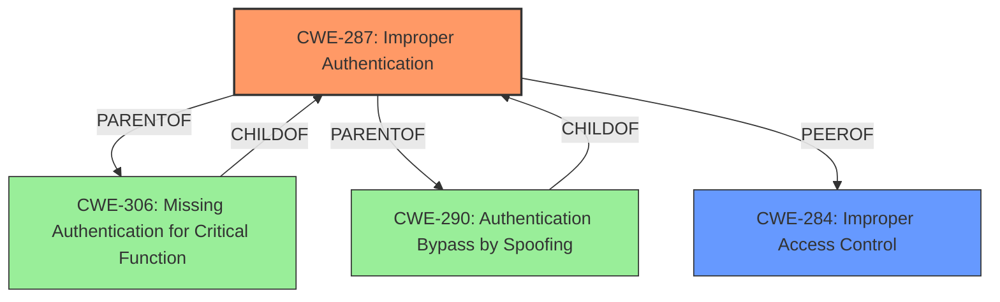

# Raw Analyzer Response for CVE-2025-23389

# Summary
| CWE ID | CWE Name | Confidence | CWE Abstraction Level | CWE Vulnerability Mapping Label | CWE-Vulnerability Mapping Notes |
|---|---|---|---|---|---|
| CWE-287 | Improper Authentication | 0.9 | Class | Primary CWE | Discouraged |
| CWE-284 | Improper Access Control | 0.7 | Pillar | Secondary Candidate | Discouraged |

## Evidence and Confidence

*   **Confidence Score:** 0.8
*   **Evidence Strength:** MEDIUM

## Relationship Analysis
The primary CWE is CWE-287, "Improper Authentication," which is a Class-level CWE. The vulnerability involves a failure to properly validate user identity during SAML authentication, leading to impersonation. CWE-287 is a parent of CWE-306 (Missing Authentication for Critical Function) and CWE-290 (Authentication Bypass by Spoofing), but neither of those are specific enough. CWE-284 "Improper Access Control" is a higher-level abstraction. CWE-287 is related to CWE-613 "Insufficient Session Expiration" by a CANFOLLOW relationship, but that's not directly relevant.

## Vulnerability Chain
The vulnerability chain begins with **improper authentication** using SAML. The **root cause** is that the Rancher server trusts and uses values from SAML assertions that are not properly validated, allowing an attacker to manipulate cookies and impersonate another user. The chain is:

1.  **Improper Authentication (CWE-287)**: The system fails to properly validate the user's identity via SAML.
2.  **Impersonation (Impact)**: A local user can impersonate other identities.

## Summary of Analysis
The primary weakness is **improper authentication** due to the lack of validation of SAML assertions. The evidence from github.com_ca996707_20250624_191027.html states that "Rancher trusts and uses values from SAML assertions that are not properly validated. An attacker can configure cookies to impersonate another user." This clearly points to a problem in the authentication process.

CWE-287, Improper Authentication, is selected as the primary CWE because it represents the **root cause** of the vulnerability: the system's failure to properly validate the user's identity. The MITRE guidance discourages the use of CWE-287, suggesting that lower-level CWEs are likely applicable. However, none of the child CWEs of CWE-287, such as CWE-306 (Missing Authentication for Critical Function) or CWE-290 (Authentication Bypass by Spoofing), are a precise fit. CWE-306 doesn't apply because authentication *is* happening; it's just not being done correctly. CWE-290 doesn't fit perfectly either, as the impersonation isn't necessarily "spoofing," but rather a consequence of trusting unvalidated data. Therefore, despite the discouraged usage, CWE-287 is the most appropriate high-level classification.

CWE-284, Improper Access Control, is considered a secondary candidate because the vulnerability ultimately leads to unauthorized access. However, the **root cause** is the authentication bypass, making CWE-287 the more accurate primary classification.

The selected CWEs are at the optimal level of specificity, given the available information. While a more specific CWE would be ideal, none of the existing options accurately capture the nuance of the vulnerability.
# Enhanced Context (25 CWEs)
The following CWEs were identified as potentially relevant to this vulnerability:

## CWE-267: Privilege Defined With Unsafe Actions
**Abstraction Level**: Base
**Similarity Score**: 0.75
**Source**: dense

**Description**:
A particular privilege, role, capability, or right can be used to perform unsafe actions that were not intended, even when it is assigned to the correct entity.

**Mapping Guidance**:
- Usage: Allowed
- Rationale: This CWE entry is at the Base level of abstraction, which is a preferred level of abstraction for mapping to the root causes of vulnerabilities.

CWE-267 is not applicable because the vulnerability is related to improper authentication not unsafe actions with privileges.

## CWE-303: Incorrect Implementation of Authentication Algorithm
**Abstraction Level**: Base
**Similarity Score**: 0.73
**Source**: dense

**Description**:
The requirements for the product dictate the use of an established authentication algorithm, but the implementation of the algorithm is incorrect.

**Mapping Guidance**:
- Usage: Allowed
- Rationale: This CWE entry is at the Base level of abstraction, which is a preferred level of abstraction for mapping to the root causes of vulnerabilities.

CWE-303 could be applicable, but the information is not specific enough to determine if an authentication algorithm was implemented incorrectly.

## CWE-639: Authorization Bypass Through User-Controlled Key
**Abstraction Level**: Base
**Similarity Score**: 0.73
**Source**: dense

**Description**:
The system's authorization functionality does not prevent one user from gaining access to another user's data or record by modifying the key value identifying the data.

**Mapping Guidance**:
- Usage: Allowed
- Rationale: This CWE entry is at the Base level of abstraction, which is a preferred level of abstraction for mapping to the root causes of vulnerabilities.

CWE-639 is related to Authorization Bypass which is not the root cause.

## CWE-1390: Weak Authentication
**Abstraction Level**: Class
**Similarity Score**: 0.73
**Source**: dense

**Description**:
The product uses an authentication mechanism to restrict access to specific users or identities, but the mechanism does not sufficiently prove that the claimed identity is correct.

**Mapping Guidance**:
- Usage: Allowed-with-Review
- Rationale: This CWE entry is a Class and might have Base-level children that would be more appropriate

CWE-1390 is similar to CWE-287, but is too high level.

## CWE-668: Exposure of Resource to Wrong Sphere
**Abstraction Level**: Class
**Similarity Score**: 0.73
**Source**: dense

**Description**:
The product exposes a resource to the wrong control sphere, providing unintended actors with inappropriate access to the resource.

**Mapping Guidance**:
- Usage: Discouraged
- Rationale: CWE-668 is high-level and is often misused as a catch-all when lower-level CWE IDs might be applicable. It is sometimes used for low-information vulnerability reports [REF-1287]. It is a level-1 Class (i.e., a child of a Pillar). It is not useful for trend analysis.

CWE-668 is not applicable because it is too high level.

## CWE-212: Improper Removal of Sensitive Information Before Storage or Transfer
**Abstraction Level**: Base
**Similarity Score**: 0.73
**Source**: dense

**Description**:
The product stores, transfers, or shares a resource that contains sensitive information, but it does not properly remove that information before the product makes the resource available to unauthorized actors.

**Mapping Guidance**:
- Usage: Allowed
- Rationale: This CWE entry is at the Base level of abstraction, which is a preferred level of abstraction for mapping to the root causes of vulnerabilities.

CWE-212 is not applicable.

## CWE-497: Exposure of Sensitive System Information to an Unauthorized Control Sphere
**Abstraction Level**: Base
**Similarity Score**: 0.73
**Source**: dense

**Description**:
The product does not properly prevent sensitive system-level information from being accessed by unauthorized actors who do not have the same level of access to the underlying system as the product does.

**Mapping Guidance**:
- Usage: Allowed
- Rationale: This CWE entry is at the Base level of abstraction, which is a preferred level of abstraction for mapping to the root causes of vulnerabilities.

CWE-497 is not applicable.

## CWE-345: Insufficient Verification of Data Authenticity
**Abstraction Level**: Class
**Similarity Score**: 0.72
**Source**: dense

**Description**:
The