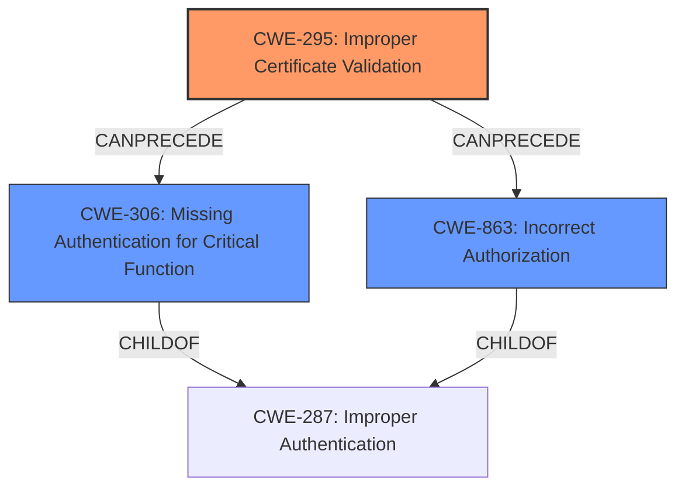

# Enhanced Analysis for CVE-2025-23419

# Summary
| CWE ID | CWE Name | Confidence | CWE Abstraction Level | CWE Vulnerability Mapping Label | CWE-Vulnerability Mapping Notes |
|---|---|---|---|---|---|
| CWE-295 | Improper Certificate Validation | 0.75 | Base | Allowed | Primary CWE |
| CWE-306 | Missing Authentication for Critical Function | 0.6 | Base | Allowed | Secondary Candidate |
| CWE-863 | Incorrect Authorization | 0.5 | Class | Allowed-with-Review | Secondary Candidate |

## Evidence and Confidence

*   **Confidence Score:** 0.7
*   **Evidence Strength:** MEDIUM

## Relationship Analysis
The primary CWE selected is CWE-295, which deals with improper certificate validation. The retriever results also suggest CWE-306 (Missing Authentication) and CWE-863 (Incorrect Authorization) as potential candidates. CWE-295 is chosen because the vulnerability involves bypassing client certificate authentication requirements. It's a base-level CWE, which is preferred. CWE-306 and CWE-863 are considered as contributing factors because the **weakness** allows bypassing authentication, but the root cause is specifically related to certificate validation during session resumption.



## Vulnerability Chain
The vulnerability chain starts with the **improper configuration of SSL session caching in the default server** when client certificate authentication is enabled. This leads to the **bypass of client certificate authentication**. The root cause is the **improper validation of certificates during session resumption**, leading to potential missing or incorrect authorization checks.

## Summary of Analysis
The initial analysis considered multiple CWEs, including authentication bypass and incorrect authorization. However, the key phrase from the vulnerability description, "SSL session cache are used in the default server and the default server is performing client certificate authentication" and the CVE reference summary "Bypass of client certificate authentication" pointed towards a problem with certificate validation. The final selection of CWE-295 is based on the root cause identified in the provided text. This is further supported by the CVE Reference Links Content Summary, which mentions the bypass of client certificate authentication. The selection is at the base level of abstraction, providing sufficient specificity.

Relevant CWE Information:

**CWE-295: Improper Certificate Validation**: The vulnerability directly involves bypassing client certificate authentication, making this CWE a strong match. This is the root cause of the authentication bypass.

**CWE-306: Missing Authentication for Critical Function**: This could be a consequence of the **improper certificate validation**, but the root cause is the validation itself.

**CWE-863: Incorrect Authorization**: Similar to CWE-306, this could be a result of the **improper certificate validation** if the system relies on the certificate for authorization decisions.

The description indicates that the vulnerability occurs when "an attacker can use session resumption to bypass client certificate authentication requirements." This clearly indicates that the certificate validation is not being properly enforced during session resumption, which aligns perfectly with CWE-295.

The selection is based on the available evidence and aims to identify the root cause of the vulnerability.


## CWE Relationship Analysis

Current CWEs represent these abstraction levels: .


### Vulnerability Chain Analysis

**Chain starting from CWE-863:**
- 863 (Incorrect Authorization) - ROOT


**Chain starting from CWE-306:**
- 306 (Missing Authentication for Critical Function) - ROOT


### CWE Relationship Diagram

```mermaid
graph TD
    classDef primary fill:#f96,stroke:#333,stroke-width:2px
    classDef secondary fill:#69f,stroke:#333
    classDef tertiary fill:#9e9,stroke:#333
```