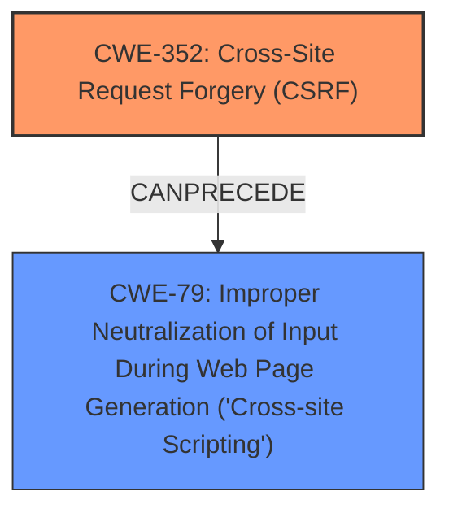

# Enhanced Analysis for CVE-2025-23430

# Summary
| CWE ID | CWE Name | Confidence | CWE Abstraction Level | CWE Vulnerability Mapping Label | CWE-Vulnerability Mapping Notes |
|---|---|---|---|---|---|
| CWE-352 | Cross-Site Request Forgery (CSRF) | 1.0 | Compound | Allowed | Primary CWE. The plugin is vulnerable to CSRF. |
| CWE-79 | Improper Neutralization of Input During Web Page Generation ('Cross-site Scripting') | 1.0 | Base | Allowed | Secondary. The CSRF leads to XSS. |

## Evidence and Confidence

*   **Confidence Score:** 1.0
*   **Evidence Strength:** HIGH

## Relationship Analysis
The primary weakness is CWE-352 **Cross-Site Request Forgery (CSRF)**, which can lead to other vulnerabilities. In this case, the impact of the CSRF vulnerability is **Cross-Site Scripting (XSS)**, represented by CWE-79.



## Vulnerability Chain
The vulnerability chain starts with the **Cross-Site Request Forgery (CSRF)**, CWE-352. The successful exploitation of CSRF then leads to **Improper Neutralization of Input During Web Page Generation ('Cross-site Scripting')**, CWE-79.

## Summary of Analysis
The vulnerability description explicitly states a **Cross-Site Request Forgery (CSRF)** vulnerability which leads to XSS.
The "CVE Reference Links Content Summary" section confirms this and provides more details on the root cause and impact:
- "The vulnerability is a Cross-Site Request Forgery (CSRF) issue"
- "The plugin is susceptible to CSRF attacks, allowing a malicious actor to force authenticated users to perform unwanted actions."
- "A malicious actor could force higher-privileged users to execute unwanted actions under their current authentication."

The Retriever Results also lists CWE-352 as the top candidate CWE. CWE-79 is also a relevant candidate as the successful exploitation of CSRF results in XSS.

CWE-352 is selected as the primary CWE since the plugin is susceptible to CSRF attacks, allowing a malicious actor to force authenticated users to perform unwanted actions.
CWE-79 is selected as the secondary CWE since the CSRF leads to XSS.

Other CWEs considered but not used:
- CWE-89: Improper Neutralization of Special Elements used in an SQL Command ('SQL Injection'): Not applicable as there's no mention of SQL injection.
- CWE-918: Server-Side Request Forgery (SSRF): Not applicable as there's no mention of SSRF.
- CWE-601: URL Redirection to Untrusted Site ('Open Redirect'): Not applicable as there's no mention of URL redirection.
- CWE-113: Improper Neutralization of CRLF Sequences in HTTP Headers ('HTTP Request/Response Splitting'): Not applicable as there's no mention of HTTP Request/Response Splitting.
- CWE-116: Improper Encoding or Escaping of Output: Not applicable as the primary issue is CSRF.
- CWE-1004: Sensitive Cookie Without 'HttpOnly' Flag: Not applicable as there's no mention of cookies.
- CWE-472: External Control of Assumed-Immutable Web Parameter: Not applicable as the primary issue is CSRF.
- CWE-184: Incomplete List of Disallowed Inputs: Not applicable as the primary issue is CSRF.


## CWE Relationship Analysis

Current CWEs represent these abstraction levels: .


### Vulnerability Chain Analysis

**Chain starting from CWE-89:**
- 89 (Improper Neutralization of Special Elements used in an SQL Command ('SQL Injection')) - ROOT


**Chain starting from CWE-116:**
- 116 (Improper Encoding or Escaping of Output) - ROOT


### CWE Relationship Diagram

```mermaid
graph TD
    classDef primary fill:#f96,stroke:#333,stroke-width:2px
    classDef secondary fill:#69f,stroke:#333
    classDef tertiary fill:#9e9,stroke:#333
```