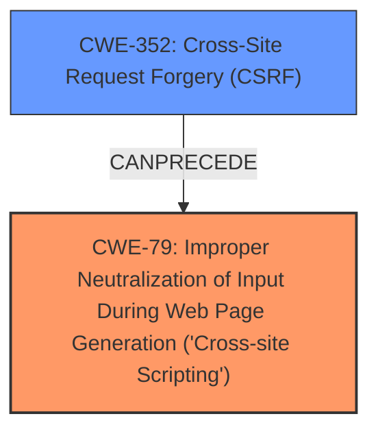

# Enhanced Analysis for CVE-2025-23446

# Summary
| CWE ID | CWE Name | Confidence | CWE Abstraction Level | CWE Vulnerability Mapping Label | CWE-Vulnerability Mapping Notes |
|---|---|---|---|---|---|
| CWE-79 | Improper Neutralization of Input During Web Page Generation ('Cross-site Scripting') | 1.0 | Base | Allowed | Primary CWE: Stored XSS due to **improper neutralization** of input.|
| CWE-352 | Cross-Site Request Forgery (CSRF) | 1.0 | Compound | Allowed | Secondary CWE: **CSRF** allows attacker to inject **XSS** payload. |

## Evidence and Confidence

*   **Confidence Score:** 1.0
*   **Evidence Strength:** HIGH

## Relationship Analysis
The primary weakness is CWE-79, which describes the **improper neutralization** of input leading to Cross-site Scripting. CWE-352 is a related, but distinct, issue that allows an attacker to inject malicious input. CWE-352 can precede CWE-79 when a **CSRF** attack is used to inject the **XSS** payload. The abstraction levels are appropriate, with CWE-79 as a Base weakness and CWE-352 as a Compound weakness that encompasses multiple contributing factors.



## Vulnerability Chain
The vulnerability chain starts with **CWE-352 Cross-Site Request Forgery (CSRF)**, allowing an attacker to inject a malicious payload. This leads to **CWE-79 Improper Neutralization of Input During Web Page Generation ('Cross-site Scripting')**, where the injected payload is not properly sanitized, resulting in Stored **XSS**.

## Summary of Analysis
The analysis indicates a combination of **CSRF** and Stored **XSS**. The vulnerability description clearly states a "Cross-Site Request Forgery (CSRF) vulnerability ... allows Stored **XSS**". The **CSRF** allows the attacker to inject a payload, and the application's **failure to neutralize** this input leads to Stored **XSS**. Therefore, CWE-79 is the primary weakness and CWE-352 is a secondary weakness that enables the primary weakness.

The relationship graph shows how **CSRF** can precede **XSS**, as it provides a vector for injecting the malicious script. The abstraction levels are appropriate: CWE-79 is a Base weakness, representing the **improper neutralization**, and CWE-352 is a Compound weakness, encompassing the broader context of **CSRF**.

Based on the evidence and the relationships, the selected CWEs are at the optimal level of specificity.


## CWE Relationship Analysis

Current CWEs represent these abstraction levels: .


### Vulnerability Chain Analysis

**Chain starting from CWE-352:**
- 352 (Cross-Site Request Forgery (CSRF)) - ROOT


**Chain starting from CWE-79:**
- 79 (Improper Neutralization of Input During Web Page Generation ('Cross-site Scripting')) - ROOT


### CWE Relationship Diagram

```mermaid
graph TD
    classDef primary fill:#f96,stroke:#333,stroke-width:2px
    classDef secondary fill:#69f,stroke:#333
    classDef tertiary fill:#9e9,stroke:#333
```