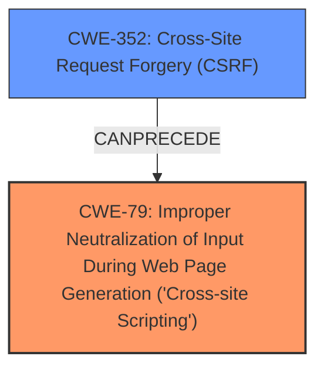

# Enhanced Analysis for CVE-2025-23455

# Summary
| CWE ID  | CWE Name                                                                       | Confidence | CWE Abstraction Level | CWE Vulnerability Mapping Label | CWE-Vulnerability Mapping Notes |
| :-------- | :----------------------------------------------------------------------------- | :--------- | :---------------------- | :------------------------------ | :------------------------------ |
| CWE-79    | Improper Neutralization of Input During Web Page Generation ('Cross-site Scripting') | 1          | Base                    | Primary                         | Allowed                       |
| CWE-352   | Cross-Site Request Forgery (CSRF)                                            | 0.9        | Compound                | Secondary                       | Allowed                       |

## Evidence and Confidence

*   **Confidence Score:** 0.95
*   **Evidence Strength:** HIGH

## Relationship Analysis
The primary weakness is **Cross-Site Scripting (XSS)**, specifically stored XSS. The vulnerability description clearly states this. The root cause enabling this XSS is **Cross-Site Request Forgery (CSRF)**. Thus, a user can be tricked into performing actions that result in stored XSS.

The relationship is that the **CSRF** vulnerability can *precede* the **XSS** vulnerability. CWE-79 is a base CWE and represents the core weakness. CWE-352 is a compound CWE representing the **CSRF** vulnerability which allowed the **XSS** to occur.



## Vulnerability Chain
The vulnerability chain starts with the **Cross-Site Request Forgery (CSRF)** vulnerability, which then allows for **Stored XSS**.

1.  **Root Cause:** **CWE-352** - **Cross-Site Request Forgery (CSRF)**. The application **does not sufficiently verify whether a well-formed, valid, consistent request was intentionally provided by the user who submitted the request**. This allows an attacker to trick a user into performing actions they did not intend to.
2.  **Weakness/Impact:** **CWE-79** - **Improper Neutralization of Input During Web Page Generation ('Cross-site Scripting')**. Because of the **CSRF** vulnerability, an attacker can inject malicious scripts that are then stored and executed in the context of other users.

## Summary of Analysis
The vulnerability is a **Cross-Site Scripting (XSS)** vulnerability that is made possible due to a **Cross-Site Request Forgery (CSRF)** vulnerability. The primary CWE is **CWE-79**, representing the **XSS** issue. The **CSRF** allows a malicious actor to force higher privileged users to execute unwanted actions, which can result in stored **XSS**.

The evidence is clear in the vulnerability description: "**Cross-Site Request Forgery (CSRF)** vulnerability in mastersoftwaresolutions WP VTiger Synchronization allows Stored XSS." and "**weakness:** **Cross-Site Scripting, Stored XSS**". The **CSRF** vulnerability is the **rootcause** while the **XSS** is the **weakness**.

The retriever results also support this assessment, with **CWE-79** having the highest score. While **CWE-352** is also listed, it is secondary to **CWE-79** because the core issue is the **XSS** itself.

The chosen CWEs are at the optimal level of specificity. **CWE-79** is a Base CWE that directly describes the **XSS** vulnerability.

**CWEs Considered But Not Used:**

*   **CWE-89: Improper Neutralization of Special Elements used in an SQL Command ('SQL Injection')** - While SQL injection is a common web vulnerability, there is no evidence in the description to suggest that SQL injection is present in this case.
*   **CWE-434: Unrestricted Upload of File with Dangerous Type** - There is no indication that file uploads are involved in this vulnerability.
*   **CWE-601: URL Redirection to Untrusted Site ('Open Redirect')** - There is no evidence that the application redirects users to untrusted sites.
*   **CWE-918: Server-Side Request Forgery (SSRF)** - The vulnerability description does not indicate any server-side request forgery issues.
*   **CWE-80: Improper Neutralization of Script-Related HTML Tags in a Web Page (Basic XSS)** - **CWE-79** is broader and more appropriate since the **XSS** is stored.
*   **CWE-425: Direct Request ('Forced Browsing')** - There is no indication that authorization checks are missing on restricted URLs.
*   **CWE-184: Incomplete List of Disallowed Inputs** - There is no evidence to suggest that an incomplete list of disallowed inputs is the root cause.


## CWE Relationship Analysis

Current CWEs represent these abstraction levels: .


### Vulnerability Chain Analysis

**Chain starting from CWE-89:**
- 89 (Improper Neutralization of Special Elements used in an SQL Command ('SQL Injection')) - ROOT


**Chain starting from CWE-80:**
- 80 (Improper Neutralization of Script-Related HTML Tags in a Web Page (Basic XSS)) - ROOT


### CWE Relationship Diagram

```mermaid
graph TD
    classDef primary fill:#f96,stroke:#333,stroke-width:2px
    classDef secondary fill:#69f,stroke:#333
    classDef tertiary fill:#9e9,stroke:#333
```