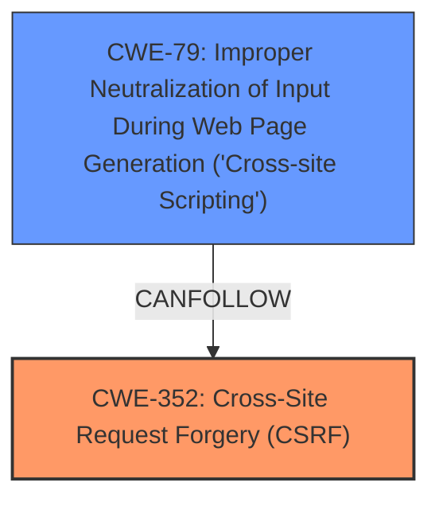

# Analysis Report for CVE-2025-23463

# Vulnerability Analysis Report: CVE-2025-23463

## Description

Cross-Site Request Forgery (CSRF) vulnerability in Mukesh Dak MD Custom content after or before of post allows Stored XSS.This issue affects MD Custom content after or before of post from n/a through 1.0.

## Vulnerability Description Key Phrases

- **Rootcause:** cross-site request forgery
- **Weakness:** stored cross-site scripting, XSS
- **Product:** Mukesh Dak MD Custom content after or before of post
- **Version:** n/a through 1.0

## Analysis (with Relationship Data)

# Summary
| CWE ID | CWE Name | Confidence | CWE Abstraction Level | CWE Vulnerability Mapping Label | CWE-Vulnerability Mapping Notes |
|---|---|---|---|---|---|
| CWE-352 | Cross-Site Request Forgery (CSRF) | 1.0 | Compound | Primary | Allowed |
| CWE-79 | Improper Neutralization of Input During Web Page Generation ('Cross-site Scripting') | 1.0 | Base | Secondary | Allowed |

## Evidence and Confidence

*   **Confidence Score:** 1.0
*   **Evidence Strength:** HIGH

## Relationship Analysis
The primary relationship that influenced the CWE selection is the combination of CWE-352 [CWE-352: Cross-Site Request Forgery (CSRF)] with CWE-79 [CWE-79: Improper Neutralization of Input During Web Page Generation ('Cross-site Scripting')], where the CSRF vulnerability allows for the injection of malicious scripts, leading to stored XSS. CWE-79 is a base level CWE and a common consequence of a successful CSRF attack when input validation is lacking.



## Vulnerability Chain
The vulnerability chain starts with **Cross-Site Request Forgery**, which allows an attacker to inject malicious content due to a lack of CSRF protection. This injected content is then stored and executed in the context of other users, leading to **Stored XSS**.

CWE-352 (Root Cause) -> CWE-79 (Impact)

## Summary of Analysis
The primary vulnerability is **Cross-Site Request Forgery (CSRF)**. The "Vulnerability Description Key Phrases" section indicates that the **rootcause** is **cross-site request forgery** and the **weakness** is **stored cross-site scripting, XSS**. The "CVE Reference Links Content Summary" section confirms this by stating, "The vulnerability is a Cross-Site Request Forgery (CSRF) issue... It allows a malicious actor to force higher privileged users to execute unwanted actions..." and includes a bullet point "Cross-Site Request Forgery (CSRF) - specifically, a lack of CSRF protection." Because of this lack of CSRF protection, an attacker can inject malicious code that is then stored, which leads to the secondary vulnerability, **Cross-site Scripting (XSS)**.

CWE-79 [CWE-79: Improper Neutralization of Input During Web Page Generation ('Cross-site Scripting')] is selected as a secondary CWE because the vulnerability allows for Stored XSS.

CWE-918 [CWE-918: Server-Side Request Forgery (SSRF)], CWE-89 [CWE-89: Improper Neutralization of Special Elements used in an SQL Command ('SQL Injection')], CWE-434 [CWE-434: Unrestricted Upload of File with Dangerous Type], CWE-116 [CWE-116: Improper Encoding or Escaping of Output], CWE-611 [CWE-611: Improper Restriction of XML External Entity Reference], CWE-444 [CWE-444: Inconsistent Interpretation of HTTP Requests ('HTTP Request/Response Smuggling')], CWE-80 [CWE-80: Improper Neutralization of Script-Related HTML Tags in a Web Page (Basic XSS)], and CWE-73 [CWE-73: External Control of File Name or Path] were considered but were rejected because they do not accurately describe the vulnerability.

Relevant CWE Information:


## CWE Relationship Analysis

Current CWEs represent these abstraction levels: .


### Vulnerability Chain Analysis

**Chain starting from CWE-89:**
- 89 (Improper Neutralization of Special Elements used in an SQL Command ('SQL Injection')) - ROOT


**Chain starting from CWE-611:**
- 611 (Improper Restriction of XML External Entity Reference) - ROOT


### CWE Relationship Diagram

```mermaid
graph TD
    classDef primary fill:#f96,stroke:#333,stroke-width:2px
    classDef secondary fill:#69f,stroke:#333
    classDef tertiary fill:#9e9,stroke:#333
```


*Report generated on 2025-07-14 11:22:05*
