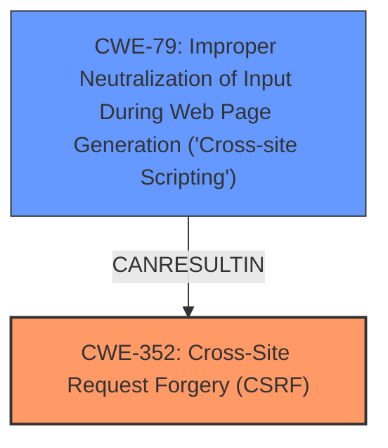

# Raw Analyzer Response for CVE-2025-23476

# Summary
| CWE ID | CWE Name | Confidence | CWE Abstraction Level | CWE Vulnerability Mapping Label | CWE-Vulnerability Mapping Notes |
|---|---|---|---|---|---|
| CWE-352 | Cross-Site Request Forgery (CSRF) | 1.0 | Compound | Allowed | Primary CWE. The **weakness** is **Cross-Site Request Forgery**.|
| CWE-79 | Improper Neutralization of Input During Web Page Generation ('Cross-site Scripting') | 1.0 | Base | Allowed | Secondary CWE. The **weakness** is **Stored XSS**.|

## Evidence and Confidence

*   **Confidence Score:** 1.0
*   **Evidence Strength:** HIGH

## Relationship Analysis
The primary weakness is CWE-352 [Cross-Site Request Forgery (CSRF)], which can lead to other vulnerabilities such as CWE-79 [Improper Neutralization of Input During Web Page Generation ('Cross-site Scripting')]. CWE-352 is a compound weakness. CWE-79 is a base weakness and is listed as a top combined result in the retriever results.

## Vulnerability Chain
The vulnerability chain starts with **Cross-Site Request Forgery (CSRF)**, which allows an attacker to force a user to perform unwanted actions. This can lead to **Stored XSS** (CWE-79) if the attacker uses the CSRF vulnerability to inject malicious scripts into the web application. The root cause is the **Cross-Site Request Forgery (CSRF)** vulnerability.

## Summary of Analysis
The vulnerability description clearly states a **Cross-Site Request Forgery (CSRF)** vulnerability that allows **Stored XSS**. The **Vulnerability Description Key Phrases** section confirms these as the identified **weaknesses**. The CVE reference link content summary also indicates that the root cause is **Cross-Site Request Forgery (CSRF)**.

CWE-352 [Cross-Site Request Forgery (CSRF)] is selected as the primary CWE because it is the root cause vulnerability. The retriever results also list CWE-352 as a potential match. The description of CWE-352 matches the vulnerability description.

CWE-79 [Improper Neutralization of Input During Web Page Generation ('Cross-site Scripting')] is selected as a secondary CWE because the **Cross-Site Request Forgery (CSRF)** leads to **Stored XSS**. The retriever results also list CWE-79 as the top combined result and the description of CWE-79 matches the vulnerability description where user-controllable input is not neutralized before being placed in a web page.

The selected CWEs are at the optimal level of specificity as they are at the Base and Compound level of abstraction.

Other CWEs Considered but Not Used:

*   CWE-918 [Server-Side Request Forgery (SSRF)], CWE-89 [Improper Neutralization of Special Elements used in an SQL Command ('SQL Injection')], CWE-601 [URL Redirection to Untrusted Site ('Open Redirect')], CWE-116 [Improper Encoding or Escaping of Output], CWE-80 [Improper Neutralization of Script-Related HTML Tags in a Web Page (Basic XSS)], CWE-96 [Improper Neutralization of Directives in Statically Saved Code ('Static Code Injection')], CWE-425 [Direct Request ('Forced Browsing')]: These CWEs were considered but not selected as they do not directly relate to the root cause or impact of the vulnerability. They are related to different types of vulnerabilities.