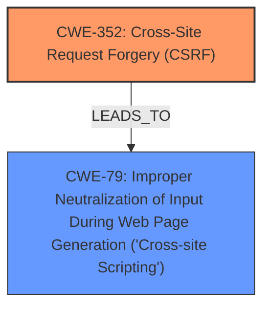

# Analysis Report for CVE-2025-23499

# Vulnerability Analysis Report: CVE-2025-23499

## Description

**Cross-Site Request Forgery** (CSRF) vulnerability in Pascal Casier Board Election allows Stored XSS.This issue affects Board Election from n/a through 1.0.1.

## Vulnerability Description Key Phrases

- **Rootcause:** Cross-Site Request Forgery
- **Weakness:** cross-site scripting
- **Impact:** stored XSS
- **Product:** Pascal Casier Board Election
- **Version:** n/a through 1.0.1

## Analysis (with Relationship Data)

# Summary
| CWE ID | CWE Name | Confidence | CWE Abstraction Level | CWE Vulnerability Mapping Label | CWE-Vulnerability Mapping Notes |
|---|---|---|---|---|---|
| CWE-352 | Cross-Site Request Forgery (CSRF) | 1.0 | Compound | Allowed | Primary CWE: The root cause of the vulnerability is **Cross-Site Request Forgery**. |
| CWE-79 | Improper Neutralization of Input During Web Page Generation ('Cross-site Scripting') | 1.0 | Base | Allowed | Secondary CWE: The impact of the CSRF vulnerability is stored XSS, which is caused by **improper neutralization of input**. |

## Evidence and Confidence

*   **Confidence Score:** 1.0
*   **Evidence Strength:** HIGH

## Relationship Analysis
The primary weakness is CWE-352 [Cross-Site Request Forgery (CSRF)], which allows an attacker to force users to execute unwanted actions. A resulting action, in this case, is stored XSS, represented by CWE-79 [Improper Neutralization of Input During Web Page Generation ('Cross-site Scripting')]. There isn't a direct relationship between CSRF and XSS in the CWE structure, but the vulnerability description clearly indicates that CSRF is the cause, and the stored XSS is the impact.



## Vulnerability Chain
The vulnerability chain starts with CWE-352 [Cross-Site Request Forgery (CSRF)]. Due to the CSRF vulnerability, an attacker can inject malicious scripts into the system, which leads to CWE-79 [Improper Neutralization of Input During Web Page Generation ('Cross-site Scripting')] and results in Stored XSS.

## Summary of Analysis
The vulnerability description clearly states a **Cross-Site Request Forgery** (CSRF) vulnerability leading to stored XSS. The primary root cause is CWE-352 [Cross-Site Request Forgery (CSRF)], as it is the mechanism that allows the attacker to perform unwanted actions. The resulting stored XSS is best represented by CWE-79 [Improper Neutralization of Input During Web Page Generation ('Cross-site Scripting')], as the injected input is not properly neutralized.

The evidence for CWE-352 [Cross-Site Request Forgery (CSRF)] is: "Cross-Site Request Forgery (CSRF) vulnerability in Pascal Casier Board Election allows Stored XSS."

The evidence for CWE-79 [Improper Neutralization of Input During Web Page Generation ('Cross-site Scripting')] is: "This issue affects Board Election from n/a through 1.0.1." and the general knowledge that Stored XSS involves **improper neutralization of input**.

The retriever results also support the selection of CWE-352 and CWE-79, with high scores, indicating relevance to the vulnerability description.

Other CWEs considered but not used:

*   CWE-89 [Improper Neutralization of Special Elements used in an SQL Command ('SQL Injection')], CWE-918 [Server-Side Request Forgery (SSRF)], CWE-601 [URL Redirection to Untrusted Site ('Open Redirect')], CWE-113 [Improper Neutralization of CRLF Sequences in HTTP Headers ('HTTP Request/Response Splitting')], CWE-80 [Improper Neutralization of Script-Related HTML Tags in a Web Page (Basic XSS)], CWE-96 [Improper Neutralization of Directives in Statically Saved Code ('Static Code Injection')], and CWE-472 [External Control of Assumed-Immutable Web Parameter] were considered but are less relevant as they do not directly relate to the root cause (CSRF) or the direct impact (Stored XSS) described in the vulnerability.

Relevant CWE Information:

# Enhanced Context (25 CWEs)
The following CWEs were identified as potentially relevant to this vulnerability:

## CWE-352: Cross-Site Request Forgery (CSRF)
**Abstraction Level**: Compound
**Similarity Score**: 0.73
**Source**: dense

**Description**:
The web application does not, or can not, sufficiently verify whether a well-formed, valid, consistent request was intentionally provided by the user who submitted the request.

**Mapping Guidance**:
- Usage: Allowed
- Rationale: This is a well-known Composite of multiple weaknesses that must all occur simultaneously, although it is attack-oriented in nature.


## CWE-472: External Control of Assumed-Immutable Web Parameter
**Abstraction Level**: Base
**Similarity Score**: 0.72
**Source**: dense

**Description**:
The web application does not sufficiently verify inputs that are assumed to be immutable but are actually externally controllable, such as hidden form fields.

**Mapping Guidance**:
- Usage: Allowed
- Rationale: This CWE entry is at the Base level of abstraction, which is a preferred level of abstraction for mapping to the root causes of vulnerabilities.


## CWE-80: Improper Neutralization of Script-Related HTML Tags in a Web Page (Basic XSS)
**Abstraction Level**: Variant
**Similarity Score**: 0.72
**Source**: dense

**Description**:
The product receives input from an upstream component, but it does not neutralize or incorrectly neutralizes special characters such as "<", ">", and "&" that could be interpreted as web-scripting elements when they are sent to a downstream component that processes web pages.

**Mapping Guidance**:
- Usage: Allowed
- Rationale: This CWE entry is at the Variant level of abstraction, which is a preferred level of abstraction for mapping to the root causes of vulnerabilities.


## CWE-79: Improper Neutralization of Input During Web Page Generation ('Cross-site Scripting')
**Abstraction Level**: Base
**Similarity Score**: 0.71
**Source**: dense

**Description**:
The product does not neutralize or incorrectly neutralizes user-controllable input before it is placed in output that is used as a web page that is served to other users.

**Mapping Guidance**:
- Usage: Allowed
- Rationale: This CWE entry is at the Base level of abstraction, which is a preferred level of abstraction for mapping to the root causes of vulnerabilities.


## CWE-425: Direct Request ('Forced Browsing')
**Abstraction Level**: Base
**Similarity Score**: 0.71
**Source**: dense

**Description**:
The web application does not adequately enforce appropriate authorization on all restricted URLs, scripts, or files.

**Mapping Guidance**:
- Usage: Allowed
- Rationale: This CWE entry is at the Base level of abstraction, which is a preferred level of abstraction for mapping to the root causes of vulnerabilities.


## CWE-918: Server-Side Request Forgery (SSRF)
**Abstraction Level**: Base
**Similarity Score**: 0.70
**Source**: dense

**Description**:
The web server receives a URL or similar request from an upstream component and retrieves the contents of this URL, but it does not sufficiently ensure that the request is being sent to the expected destination.

**Mapping Guidance**:
- Usage: Allowed
- Rationale: This CWE entry is at the Base level of abstraction, which is a preferred level of abstraction for mapping to the root causes of vulnerabilities.


## CWE-96: Improper Neutralization of Directives in Statically Saved Code ('Static Code Injection')
**Abstraction Level**: Base
**Similarity Score**: 0.69
**Source**: dense

**Description**:
The product receives input from an upstream component, but it does not neutralize or incorrectly neutralizes code syntax before inserting the input into an executable resource, such as a library, configuration file, or template.

**Mapping Guidance**:
- Usage: Allowed
- Rationale: This CWE entry is at the Base level of abstraction, which is a preferred level of abstraction for mapping to the root causes of vulnerabilities.


## CWE-178: Improper Handling of Case Sensitivity
**Abstraction Level**: Base
**Similarity Score**: 0.69
**Source**: dense

**Description**:
The product does not properly account for differences in case sensitivity when accessing or determining the properties of a resource, leading to inconsistent results.

**Mapping Guidance**:
- Usage: Allowed
- Rationale: This CWE entry is at the Base level of abstraction, which is a preferred level of abstraction for mapping to the root causes of vulnerabilities.


## CWE-639: Authorization Bypass Through User-Controlled Key
**Abstraction Level**: Base
**Similarity Score**: 0.69
**Source**: dense

**Description**:
The system's authorization functionality does not prevent one user from gaining access to another user's data or record by modifying the key value identifying the data.

**Mapping Guidance**:
- Usage: Allowed
- Rationale: This CWE entry is at the Base level of abstraction, which is a preferred level of abstraction for mapping to the root causes of vulnerabilities.


## CWE-9


## CWE Relationship Analysis

Current CWEs represent these abstraction levels: .


### Vulnerability Chain Analysis

**Chain starting from CWE-89:**
- 89 (Improper Neutralization of Special Elements used in an SQL Command ('SQL Injection')) - ROOT


**Chain starting from CWE-80:**
- 80 (Improper Neutralization of Script-Related HTML Tags in a Web Page (Basic XSS)) - ROOT


### CWE Relationship Diagram

```mermaid
graph TD
    classDef primary fill:#f96,stroke:#333,stroke-width:2px
    classDef secondary fill:#69f,stroke:#333
    classDef tertiary fill:#9e9,stroke:#333
```


*Report generated on 2025-07-14 11:25:17*
