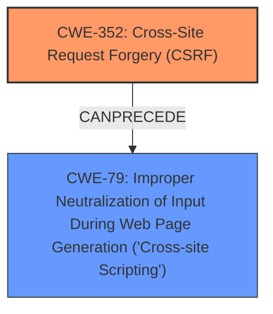

# Analysis Report for CVE-2025-23510

# Vulnerability Analysis Report: CVE-2025-23510

## Description

**Cross-Site Request Forgery** (CSRF) vulnerability in Zaantar WordPress Logging Service allows Stored XSS.This issue affects WordPress Logging Service from n/a through 1.5.4.

## Vulnerability Description Key Phrases

- **Rootcause:** improper CSRF protection
- **Weakness:** Cross-Site Request Forgery
- **Impact:** stored XSS
- **Product:** WordPress Logging Service
- **Version:** through 1.5.4

## Analysis (with Relationship Data)

# Summary
| CWE ID | CWE Name | Confidence | CWE Abstraction Level | CWE Vulnerability Mapping Label | CWE-Vulnerability Mapping Notes |
|---|---|---|---|---|---|
| CWE-352 | Cross-Site Request Forgery (CSRF) | 1.0 | Compound | Primary | Allowed |
| CWE-79 | Improper Neutralization of Input During Web Page Generation ('Cross-site Scripting') | 0.7 | Base | Secondary | Allowed |

## Evidence and Confidence

*   **Confidence Score:** 0.9
*   **Evidence Strength:** HIGH

## Relationship Analysis
The primary relationship is that the **Cross-Site Request Forgery** (**CWE-352**) leads to Stored XSS (**CWE-79**). **CWE-352** is a compound weakness that describes the conditions for CSRF, while **CWE-79** describes the resulting XSS due to the **improper** neutralization of input.



## Vulnerability Chain
The vulnerability chain starts with **improper CSRF protection** (**CWE-352**), which then leads to stored XSS (**CWE-79**). The **Cross-Site Request Forgery** allows an attacker to inject malicious scripts into the web application, which are then stored and executed by other users.

## Summary of Analysis
The vulnerability description explicitly mentions a **Cross-Site Request Forgery** (CSRF) vulnerability leading to Stored XSS in the WordPress Logging Service. The key phrase also mentions **improper CSRF protection**.

The primary CWE is **CWE-352** Cross-Site Request Forgery (CSRF), which is a compound weakness. The vulnerability description and the CVE reference links content summary confirm this. The "Retriever Results" also list **CWE-352** as the top result.

The secondary CWE is **CWE-79** Improper Neutralization of Input During Web Page Generation ('Cross-site Scripting'). The vulnerability description mentions "Stored XSS," which is a direct result of **improper** neutralization of input. The "Retriever Results" also lists **CWE-79** as a possible match.

The other CWEs in the Retriever Results were considered but not selected. **CWE-89** ('SQL Injection'), **CWE-434** (Unrestricted Upload of File with Dangerous Type), and **CWE-918** (Server-Side Request Forgery) were not directly supported by the provided evidence. **CWE-116** (Improper Encoding or Escaping of Output) and **CWE-862** (Missing Authorization) could be related but are less specific than **CWE-352** and **CWE-79**.

Relevant CWE Information:

# Enhanced Context (25 CWEs)
The following CWEs were identified as potentially relevant to this vulnerability:

## CWE-352: Cross-Site Request Forgery (CSRF)
**Abstraction Level**: Compound
**Similarity Score**: 0.78
**Source**: dense

**Description**:
The web application does not, or can not, sufficiently verify whether a well-formed, valid, consistent request was intentionally provided by the user who submitted the request.

**Mapping Guidance**:
- Usage: Allowed
- Rationale: This is a well-known Composite of multiple weaknesses that must all occur simultaneously, although it is attack-oriented in nature.

**Technical Explanation**: The vulnerability description mentions a CSRF vulnerability, which aligns directly with the characteristics of **CWE-352**. The web application **does not sufficiently verify** if the request was intentionally provided by the user.
**Security Implications**: CSRF allows an attacker to perform actions on behalf of a user without their knowledge or consent.
**Relationship Analysis**: N/A
**Mapping Guidance**: The usage is "Allowed," which is consistent with the evidence.

## CWE-79: Improper Neutralization of Input During Web Page Generation ('Cross-site Scripting')
**Abstraction Level**: Base
**Similarity Score**: 0.70
**Source**: dense

**Description**:
The product does not neutralize or incorrectly neutralizes user-controllable input before it is placed in output that is used as a web page that is served to other users.

**Mapping Guidance**:
- Usage: Allowed
- Rationale: This CWE entry is at the Base level of abstraction, which is a preferred level of abstraction for mapping to the root causes of vulnerabilities.

**Technical Explanation**: The vulnerability leads to Stored XSS, which occurs because the application **does not neutralize** user-controllable input.
**Security Implications**: XSS allows an attacker to inject malicious scripts into a web page, which are then executed by other users.
**Relationship Analysis**: N/A
**Mapping Guidance**: The usage is "Allowed," which is consistent with the evidence.


## CWE Relationship Analysis

Current CWEs represent these abstraction levels: .


### Vulnerability Chain Analysis

**Chain starting from CWE-89:**
- 89 (Improper Neutralization of Special Elements used in an SQL Command ('SQL Injection')) - ROOT


**Chain starting from CWE-116:**
- 116 (Improper Encoding or Escaping of Output) - ROOT


### CWE Relationship Diagram

```mermaid
graph TD
    classDef primary fill:#f96,stroke:#333,stroke-width:2px
    classDef secondary fill:#69f,stroke:#333
    classDef tertiary fill:#9e9,stroke:#333
```


*Report generated on 2025-07-14 11:27:20*
