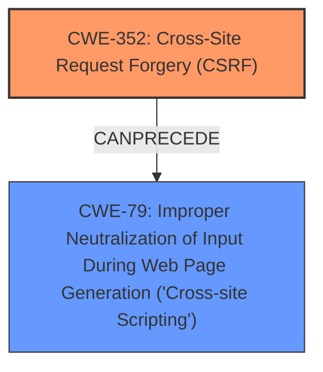

# Enhanced Analysis for CVE-2025-23533

# Summary
| CWE ID | CWE Name | Confidence | CWE Abstraction Level | CWE Vulnerability Mapping Label | CWE-Vulnerability Mapping Notes |
|---|---|---|---|---|---|
| CWE-352 | Cross-Site Request Forgery (CSRF) | 1.0 | Compound | Primary | Allowed |
| CWE-79 | Improper Neutralization of Input During Web Page Generation ('Cross-site Scripting') | 1.0 | Base | Secondary | Allowed |

## Evidence and Confidence

*   **Confidence Score:** 1.0
*   **Evidence Strength:** HIGH

## Relationship Analysis
The primary weakness is CWE-352 [Cross-Site Request Forgery (CSRF)], which allows an attacker to induce a user to perform actions they did not intend. A successful CSRF attack can lead to the injection of malicious scripts, resulting in CWE-79 [Improper Neutralization of Input During Web Page Generation ('Cross-site Scripting')]. CWE-79 is a consequence of the CSRF vulnerability in this case because the injected script is stored and executed in the context of other users. This relationship highlights how access control issues (CSRF) can lead to code injection (XSS).



## Vulnerability Chain
The vulnerability chain begins with **CWE-352 [Cross-Site Request Forgery (CSRF)]**, where a malicious actor can force a higher-privileged user to perform unwanted actions. This leads to the injection of malicious code, which is then **stored** and executed, resulting in **CWE-79 [Improper Neutralization of Input During Web Page Generation ('Cross-site Scripting')]**.

CWE-352 -> CWE-79

## Summary of Analysis
The primary root cause of the vulnerability is **CWE-352 [Cross-Site Request Forgery (CSRF)]**, as stated in the "Vulnerability Description Key Phrases" and "CVE Reference Links Content Summary". The vulnerability description states "Cross-Site Request Forgery (CSRF) vulnerability in Adrian Moreno WP Lyrics allows Stored XSS". The retriever results also list CWE-352 [Cross-Site Request Forgery (CSRF)] as a candidate, but with a lower score than CWE-79 [Improper Neutralization of Input During Web Page Generation ('Cross-site Scripting')]. However, based on the vulnerability description, the CSRF vulnerability allows the **Stored XSS**, which means the CSRF is the root cause, and the XSS is the result. CWE-79 [Improper Neutralization of Input During Web Page Generation ('Cross-site Scripting')] is selected as a secondary CWE because the CSRF leads to stored XSS.

The selection of CWE-352 [Cross-Site Request Forgery (CSRF)] and CWE-79 [Improper Neutralization of Input During Web Page Generation ('Cross-site Scripting')] at their respective abstraction levels (Compound and Base) accurately reflects the vulnerability's nature and impact.

The graph relationships show that CWE-352 [Cross-Site Request Forgery (CSRF)] can precede CWE-79 [Improper Neutralization of Input During Web Page Generation ('Cross-site Scripting')], which aligns with the description of the vulnerability.

I am confident in this assessment based on the clear evidence from the provided description and the supportive relationship between the selected CWEs.


## CWE Relationship Analysis

Current CWEs represent these abstraction levels: .


### Vulnerability Chain Analysis

**Chain starting from CWE-352:**
- 352 (Cross-Site Request Forgery (CSRF)) - ROOT


**Chain starting from CWE-79:**
- 79 (Improper Neutralization of Input During Web Page Generation ('Cross-site Scripting')) - ROOT


### CWE Relationship Diagram

```mermaid
graph TD
    classDef primary fill:#f96,stroke:#333,stroke-width:2px
    classDef secondary fill:#69f,stroke:#333
    classDef tertiary fill:#9e9,stroke:#333
```