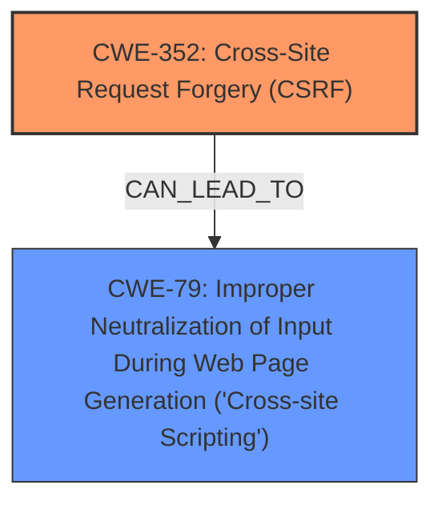

# Analysis for CVE-2025-23557

# Summary
| CWE ID | CWE Name | Confidence | CWE Abstraction Level | CWE Vulnerability Mapping Label | CWE-Vulnerability Mapping Notes |
|---|---|---|---|---|---|
| CWE-352 | Cross-Site Request Forgery (CSRF) | 0.9 | Compound | Primary | Allowed |
| CWE-79 | Improper Neutralization of Input During Web Page Generation ('Cross-site Scripting') | 0.9 | Base | Secondary | Allowed |

## Evidence and Confidence

*   **Confidence Score:** 0.9
*   **Evidence Strength:** HIGH

## Relationship Analysis
The primary weakness is the **lack of CSRF protection** (CWE-352), which allows an attacker to induce a user into performing actions they did not intend to. The secondary weakness stems from **cross-site scripting** (CWE-79), where user-controllable input is not properly neutralized before being used in a web page. CWE-352 can lead to various outcomes depending on the actions the user is tricked into performing, one of which is the injection of malicious scripts, leading to XSS.

## Vulnerability Chain
The vulnerability chain starts with the **lack of CSRF protection** (CWE-352), allowing an attacker to trick a user into submitting a request. If the application doesn't properly neutralize input, this can lead to **Improper Neutralization of Input During Web Page Generation ('Cross-site Scripting')** (CWE-79).

## Summary of Analysis
Based on the vulnerability description, the primary **rootcause** is the **lack of CSRF protection** in the Kathleen Malone Find Your Reps plugin. This allows attackers to perform actions on behalf of authenticated users, leading to Stored XSS. The presence of **cross-site scripting** (CWE-79) is explicitly mentioned in the description and confirmed by the CVE reference. The retriever results also list CWE-352 and CWE-79 as top candidates.

CWE-352 (Cross-Site Request Forgery (CSRF)) is selected as the primary CWE because the **lack of CSRF protection** is the initial **rootcause** that enables the attack. CWE-79 (Improper Neutralization of Input During Web Page Generation ('Cross-site Scripting')) is selected as a secondary CWE because the CSRF attack leads to stored XSS.

Other CWEs were considered, but not selected because they did not directly represent the **rootcause** or immediate consequence of the vulnerability:

*   CWE-80: Improper Neutralization of Script-Related HTML Tags in a Web Page (Basic XSS) - While related to XSS, it is a more specific variant of CWE-79.
*   CWE-434: Unrestricted Upload of File with Dangerous Type - Not relevant as the vulnerability does not involve file uploads.
*   CWE-116: Improper Encoding or Escaping of Output - Could be a contributing factor to XSS, but is not explicitly mentioned.
*   CWE-1004: Sensitive Cookie Without 'HttpOnly' Flag - Not directly related to the described vulnerability.
*   CWE-89: Improper Neutralization of Special Elements used in an SQL Command ('SQL Injection') - Not relevant as the vulnerability does not involve SQL injection.
*   CWE-918: Server-Side Request Forgery (SSRF) - Not relevant as the vulnerability does not involve server-side requests.
*   CWE-359: Exposure of Private Personal Information to an Unauthorized Actor - Not directly relevant to the described vulnerability.
*   CWE-73: External Control of File Name or Path - Not relevant as the vulnerability does not involve file path manipulation.