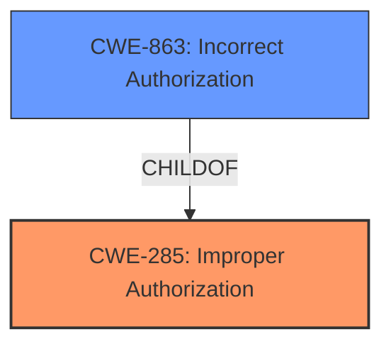

# Analysis for CVE-2025-2359

# Summary
| CWE ID | CWE Name | Confidence | CWE Abstraction Level | CWE Vulnerability Mapping Label | CWE-Vulnerability Mapping Notes |
|---|---|---|---|---|---|
| CWE-285 | Improper Authorization | 0.9 | Class | Primary | Allowed |
| CWE-863 | Incorrect Authorization | 0.7 | Class | Secondary Candidate | Allowed-with-Review |

## Evidence and Confidence

*   **Confidence Score:** 0.9
*   **Evidence Strength:** MEDIUM

## Relationship Analysis
The primary CWE is CWE-285 Improper Authorization, which is a Class-level CWE. While CWE-863 Incorrect Authorization is a more specific Class-level CWE, the provided vulnerability description does not provide enough information to confirm that the authorization check is implemented incorrectly. CWE-285 is a parent of CWE-863, meaning it represents a more general form of the authorization issue.

## Vulnerability Chain
The vulnerability chain starts with the **improper authorization** (CWE-285) in the SetDDNSSettings function, due to manipulation of the SOAPAction argument. The impact is that an attacker can remotely exploit this vulnerability.

## Summary of Analysis
The initial assessment based on the **Vulnerability Description Key Phrases** and the retriever results pointed towards an authorization issue. The key phrase "**improper authorization**" strongly suggests CWE-285.

The retriever results list CWE-285 Improper Authorization as a relevant candidate. While the retriever also lists CWE-863 Incorrect Authorization which is more specific, there isn't enough detail in the vulnerability description to confirm that an authorization check is performed incorrectly, so I selected the more general CWE-285.

The evidence is based on the **Vulnerability Description Key Phrases** rootcause entry.

Relevant CWE Information:

# Enhanced Context (25 CWEs)
The following CWEs were identified as potentially relevant to this vulnerability:

## CWE-285: Improper Authorization
**Abstraction Level**: Class
**Similarity Score**: 1309.19
**Source**: sparse

**Description**:
The product does not perform or incorrectly performs an authorization check when an actor attempts to access a resource or perform an action.

**Mapping Guidance**:
- Usage: Discouraged
- Rationale: CWE-285 is high-level and lower-level CWEs can frequently be used instead. It is a level-1 Class (i.e., a child of a Pillar).

## CWE-863: Incorrect Authorization
**Abstraction Level**: Class
**Similarity Score**: 1298.90
**Source**: sparse

**Description**:
The product performs an authorization check when an actor attempts to access a resource or perform an action, but it does not correctly perform the check.

**Mapping Guidance**:
- Usage: Allowed-with-Review
- Rationale: This CWE entry is a Class and might have Base-level children that would be more appropriate

## CWEs Considered But Not Used:

*   **CWE-284 Improper Access Control**: This is a very general CWE, and since the description specifies "**improper authorization**", CWE-285 is a better fit.
*   **CWE-306 Missing Authentication for Critical Function**: The description focuses on authorization, not authentication, so this is not the correct CWE.
*   **CWE-862 Missing Authorization**: While related, the description uses the phrase "**improper authorization**" which suggests that there might be some authorization logic present, making CWE-285 a slightly better fit.
*   **CWE-79 Improper Neutralization of Input During Web Page Generation ('Cross-site Scripting')**: This CWE relates to Cross-Site Scripting (XSS) vulnerabilities, which is not the case here.
*   **CWE-78 Improper Neutralization of Special Elements used in an OS Command ('OS Command Injection')**: This CWE relates to OS Command Injection vulnerabilities, which is not the case here.
*   **CWE-89 Improper Neutralization of Special Elements used in an SQL Command ('SQL Injection')**: This CWE relates to SQL Injection vulnerabilities, which is not the case here.
*   **CWE-434 Unrestricted Upload of File with Dangerous Type**: This CWE relates to unrestricted file uploads, which is not the case here.
*   **CWE-77 Improper Neutralization of Special Elements used in a Command ('Command Injection')**: This CWE relates to Command Injection vulnerabilities, which is not the case here.
*   **CWE-184 Incomplete List of Disallowed Inputs**: There is no indication of incomplete input validation lists in the description.
*   **CWE-705 Incorrect Control Flow Scoping**: No information is provided to suggest control flow scoping issues.

CWE-285 is selected as the primary CWE because the vulnerability description explicitly mentions "**improper authorization**". This is the most accurate and specific representation of the vulnerability based on the available information.