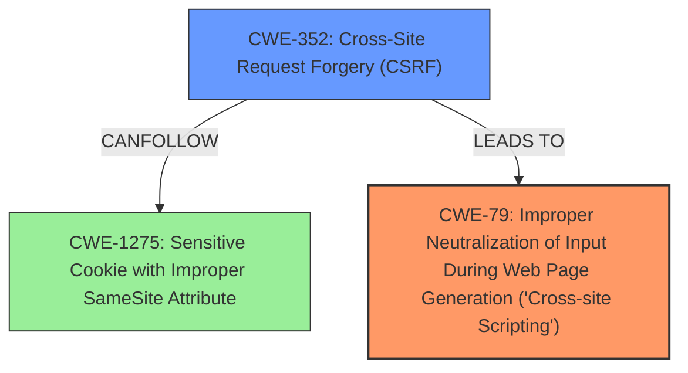

# Analysis for CVE-2025-23627

# Summary
| CWE ID | CWE Name | Confidence | CWE Abstraction Level | CWE Vulnerability Mapping Label | CWE-Vulnerability Mapping Notes |
|---|---|---|---|---|---|
| CWE-79 | Improper Neutralization of Input During Web Page Generation ('Cross-site Scripting') | 1.0 | Base | Primary | Allowed |
| CWE-352 | Cross-Site Request Forgery (CSRF) | 0.7 | Compound | Secondary | Allowed |

## Evidence and Confidence

*   **Confidence Score:** 0.85
*   **Evidence Strength:** MEDIUM

## Relationship Analysis
The primary relationship is that **CWE-352** [Compound] can lead to other weaknesses like **CWE-79** [Base]. **CWE-352** can **CAN FOLLOW** weaknesses like **CWE-1275** [Variant] Sensitive Cookie with Improper SameSite Attribute. However, the vulnerability description explicitly states that the **Cross-Site Request Forgery (CSRF)** vulnerability in Gordon French Comment-Emailer allows **Stored XSS**, making **CWE-79** a more direct and relevant mapping.

## Vulnerability Chain
The vulnerability chain starts with **CWE-352 Cross-Site Request Forgery (CSRF)**, which allows an attacker to force a user to perform actions they did not intend. This then leads to **CWE-79 Improper Neutralization of Input During Web Page Generation ('Cross-site Scripting')**, where the injected input is not properly neutralized, resulting in **Stored XSS**.

## Summary of Analysis
The initial analysis identified both **CWE-352** and **CWE-79** as potential candidates. However, the explicit mention of **Stored XSS** resulting from the **CSRF** vulnerability strongly suggests that **CWE-79** is the primary weakness. **CWE-352** is a contributing factor, but **CWE-79** directly reflects the **weakness** and impact. The retriever results also support this, with **CWE-79** having a higher score (0.800) than **CWE-352** (0.238).

The evidence explicitly states "Cross-Site Request Forgery (CSRF) vulnerability in Gordon French Comment-Emailer allows **Stored XSS**." This clearly indicates that the **CSRF** vulnerability leads to **Stored XSS**, making **CWE-79** the primary concern, as it directly addresses the **improper neutralization** of input.

I considered other CWEs from the Retriever Results, such as **CWE-89** [Base] Improper Neutralization of Special Elements used in an SQL Command ('SQL Injection'), **CWE-918** [Base] Server-Side Request Forgery (SSRF), and **CWE-601** [Base] URL Redirection to Untrusted Site ('Open Redirect'). However, these are not directly relevant to the description of the vulnerability, which clearly points to **XSS**.

The selected CWEs are at the optimal level of specificity because **CWE-79** is a Base level CWE that accurately describes the **improper neutralization** of input leading to **XSS**, and **CWE-352** is a Compound CWE that explains how the **CSRF** vulnerability can enable the **XSS** attack.

Relevant CWE Information:

# Enhanced Context (25 CWEs)
The following CWEs were identified as potentially relevant to this vulnerability:

## CWE-352: Cross-Site Request Forgery (CSRF)
**Abstraction Level**: Compound
**Similarity Score**: 0.72
**Source**: dense

**Description**:
The web application does not, or can not, sufficiently verify whether a well-formed, valid, consistent request was intentionally provided by the user who submitted the request.

**Mapping Guidance**:
- Usage: Allowed
- Rationale: This is a well-known Composite of multiple weaknesses that must all occur simultaneously, although it is attack-oriented in nature.

## CWE-80: Improper Neutralization of Script-Related HTML Tags in a Web Page (Basic XSS)
**Abstraction Level**: Variant
**Similarity Score**: 0.72
**Source**: dense

**Description**:
The product receives input from an upstream component, but it does not neutralize or incorrectly neutralizes special characters such as "<", ">", and "&" that could be interpreted as web-scripting elements when they are sent to a downstream component that processes web pages.

**Mapping Guidance**:
- Usage: Allowed
- Rationale: This CWE entry is at the Variant level of abstraction, which is a preferred level of abstraction for mapping to the root causes of vulnerabilities.

## CWE-116: Improper Encoding or Escaping of Output
**Abstraction Level**: Class
**Similarity Score**: 0.70
**Source**: dense

**Description**:
The product prepares a structured message for communication with another component, but encoding or escaping of the data is either missing or done incorrectly. As a result, the intended structure of the message is not preserved.

**Mapping Guidance**:
- Usage: Allowed-with-Review
- Rationale: This CWE entry is a Class and might have Base-level children that would be more appropriate

## CWE-918: Server-Side Request Forgery (SSRF)
**Abstraction Level**: Base
**Similarity Score**: 0.70
**Source**: dense

**Description**:
The web server receives a URL or similar request from an upstream component and retrieves the contents of this URL, but it does not sufficiently ensure that the request is being sent to the expected destination.

**Mapping Guidance**:
- Usage: Allowed
- Rationale: This CWE entry is at the Base level of abstraction, which is a preferred level of abstraction for mapping to the root causes of vulnerabilities.

## CWE-472: External Control of Assumed-Immutable Web Parameter
**Abstraction Level**: Base
**Similarity Score**: 0.70
**Source**: dense

**Description**:
The web application does not sufficiently verify inputs that are assumed to be immutable but are actually externally controllable, such as hidden form fields.

**Mapping Guidance**:
- Usage: Allowed
- Rationale: This CWE entry is at the Base level of abstraction, which is a preferred level of abstraction for mapping to the root causes of vulnerabilities.

## CWE-79: Improper Neutralization of Input During Web Page Generation ('Cross-site Scripting')
**Abstraction Level**: Base
**Similarity Score**: 0.70
**Source**: dense

**Description**:
The product does not neutralize or incorrectly neutralizes user-controllable input before it is placed in output that is used as a web page that is served to other users.

**Mapping Guidance**:
- Usage: Allowed
- Rationale: This CWE entry is at the Base level of abstraction, which is a preferred level of abstraction for mapping to the root causes of vulnerabilities.

## CWE-425: Direct Request ('Forced Browsing')
**Abstraction Level**: Base
**Similarity Score**: 0.69
**Source**: dense

**Description**:
The web application does not adequately enforce appropriate authorization on all restricted URLs, scripts, or files.

**Mapping Guidance**:
- Usage: Allowed
- Rationale: This CWE entry is at the Base level of abstraction, which is a preferred level of abstraction for mapping to the root causes of vulnerabilities.

## CWE-346: Origin Validation Error
**Abstraction Level**: Class
**Similarity Score**: 0.69
**Source**: dense

**Description**:
The product does not properly verify that the source of data or communication is valid.

**Mapping Guidance**:
- Usage: Allowed-with-Review
- Rationale: This CWE entry is a Class and might have Base-level children that would be more appropriate

## CWE-74: Improper Neutralization of Special Elements in Output Used by a Downstream Component ('Injection')
**Abstraction Level**: Class
**Similarity Score**: 0.68
**Source**: dense

**Description**:
The product constructs all or part of a command, data structure, or record using externally-influenced input from an upstream component, but it does not neutralize or incorrectly neutralizes special elements that could modify how it is parsed or interpreted when it is sent to a downstream component.

**Mapping Guidance**:
- Usage: Discouraged
- Rationale: CWE-74 is high-level and often misused when lower-level weaknesses are more appropriate.

## CWE-93: Improper Neutralization of CRLF