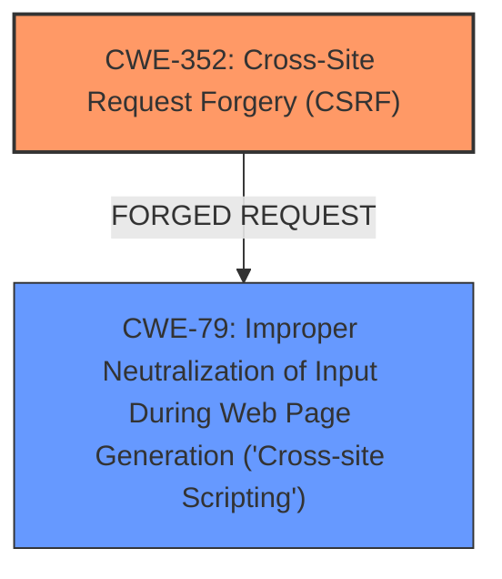

# Analysis Report for CVE-2025-23654

# Vulnerability Analysis Report: CVE-2025-23654

## Description

**Cross-Site Request Forgery** (CSRF) vulnerability in Vincius Krolow Twitter Post allows Stored **XSS**.This issue affects Twitter Post from n/a through 0.1.

## Vulnerability Description Key Phrases

- **Rootcause:** Cross-Site Request Forgery
- **Weakness:** XSS
- **Product:** Vincius Krolow Twitter Post
- **Version:** n/a through 0.1

## Analysis (with Relationship Data)

# Summary
| CWE ID | CWE Name | Confidence | CWE Abstraction Level | CWE Vulnerability Mapping Label | CWE-Vulnerability Mapping Notes |
|---|---|---|---|---|---|
| CWE-352 | Cross-Site Request Forgery (CSRF) | 0.9 | Compound | Allowed | Primary CWE. The vulnerability description and CVE Reference Links Content Summary explicitly mention CSRF as a root cause. |
| CWE-79 | Improper Neutralization of Input During Web Page Generation ('Cross-site Scripting') | 0.8 | Base | Allowed | Secondary CWE. The vulnerability description explicitly mentions XSS as a weakness. |

## Evidence and Confidence

*   **Confidence Score:** 0.85
*   **Evidence Strength:** HIGH

## Relationship Analysis
The vulnerability exhibits a combination of CSRF and XSS. CSRF can sometimes lead to XSS if an attacker can control input through a forged request. Here's how the relationships influenced the selection:

*   **CWE-352 and CWE-79:** While there isn't a direct relationship like "CanPrecede" or "CanFollow" between CSRF and XSS in the CWE database, the vulnerability description suggests that the CSRF vulnerability allows for Stored XSS. This implies that a successful CSRF attack can inject malicious scripts.
*   **Abstraction Levels:** Both CWEs are at appropriate levels of abstraction. CWE-352 is a Compound weakness, representing the combination of conditions required for a CSRF attack. CWE-79 is a Base weakness, which is suitable for describing the XSS vulnerability.



## Vulnerability Chain
The vulnerability chain starts with the **CWE-352 Cross-Site Request Forgery (CSRF)** vulnerability, which is the root cause. This allows an attacker to force a user to make unintended requests, leading to **CWE-79 Improper Neutralization of Input During Web Page Generation ('Cross-site Scripting')**, resulting in stored XSS.

CWE-352 (Root Cause) -> CWE-79 (Impact)

## Summary of Analysis
The analysis is based on the vulnerability description, which clearly states the presence of both CSRF and XSS vulnerabilities in the Vincius Krolow Twitter Post plugin. The CVE Reference Links Content Summary reinforces this by detailing the CSRF vulnerability and its potential impact. The Retriever Results also highlight CWE-79 and CWE-352 as relevant, further supporting the classification.

The relationship graph illustrates how CSRF can lead to XSS in this specific context. The selected CWEs are at the optimal level of specificity, with CWE-352 being a Compound weakness and CWE-79 being a Base weakness.

The evidence provided supports the selection of CWE-352 as the primary root cause and CWE-79 as the secondary weakness resulting from the CSRF vulnerability.

CWEs considered but not used:

*   **CWE-89 Improper Neutralization of Special Elements used in an SQL Command ('SQL Injection')**: While SQL injection is a common web vulnerability, there is no evidence of it in the provided description.
*   **CWE-918 Server-Side Request Forgery (SSRF)**: There is no evidence in the provided description of SSRF.
*   **CWE-601 URL Redirection to Untrusted Site ('Open Redirect')**: There is no evidence in the provided description of Open Redirect.
*   **CWE-472 External Control of Assumed-Immutable Web Parameter**: There is no evidence in the provided description of reliance on externally controlled parameters.
*   **CWE-425 Direct Request ('Forced Browsing')**: The description focuses on CSRF, which involves forcing a user to make a request, rather than directly accessing unauthorized resources.
*   **CWE-434 Unrestricted Upload of File with Dangerous Type**: There is no evidence of file upload functionality in the provided description.
*   **CWE-113 Improper Neutralization of CRLF Sequences in HTTP Headers ('HTTP Request/Response Splitting')**: There is no evidence of HTTP header manipulation in the provided description.
*   **CWE-790 Improper Filtering of Special Elements**: The description focuses on CSRF and XSS, not general filtering issues.


## CWE Relationship Analysis

Current CWEs represent these abstraction levels: .


### Vulnerability Chain Analysis

**Chain starting from CWE-89:**
- 89 (Improper Neutralization of Special Elements used in an SQL Command ('SQL Injection')) - ROOT


**Chain starting from CWE-601:**
- 601 (URL Redirection to Untrusted Site ('Open Redirect')) - ROOT


### CWE Relationship Diagram

```mermaid
graph TD
    classDef primary fill:#f96,stroke:#333,stroke-width:2px
    classDef secondary fill:#69f,stroke:#333
    classDef tertiary fill:#9e9,stroke:#333
```


*Report generated on 2025-07-14 11:37:25*
