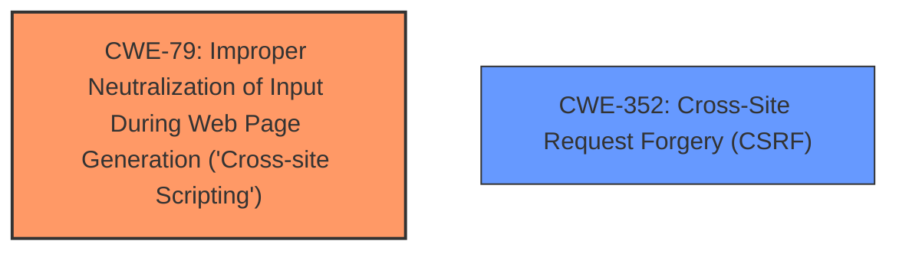

# Analysis Report for CVE-2025-23664

# Vulnerability Analysis Report: CVE-2025-23664

## Description

Cross-Site Request Forgery (CSRF) vulnerability in Real Seguro Viagem Real Seguro Viagem allows Stored XSS.This issue affects Real Seguro Viagem from n/a through 2.0.5.

## Vulnerability Description Key Phrases

- **Weakness:** XSS, cross-site scripting
- **Product:** Real Seguro Viagem
- **Version:** through 2.0.5

## Analysis (with Relationship Data)

# Summary
| CWE ID | CWE Name | Confidence | CWE Abstraction Level | CWE Vulnerability Mapping Label | CWE-Vulnerability Mapping Notes |
|---|---|---|---|---|---|
| CWE-79 | Improper Neutralization of Input During Web Page Generation ('Cross-site Scripting') | 1.0 | Base | Allowed | Primary CWE. The vulnerability is a stored XSS. |
| CWE-352 | Cross-Site Request Forgery (CSRF) | 1.0 | Compound | Allowed | Secondary CWE. The vulnerability is also caused by CSRF. |

## Evidence and Confidence

*   **Confidence Score:** 1.0
*   **Evidence Strength:** HIGH

## Relationship Analysis
The primary weakness is CWE-79, which is a Base level CWE. CWE-352 is a compound weakness, which is a composite of multiple weaknesses that must all occur simultaneously. CWE-79 and CWE-352 are independent weaknesses that can both lead to vulnerabilities.



## Vulnerability Chain
The vulnerability chain starts with the **weakness** that the product does not neutralize input. This leads to a stored XSS vulnerability (CWE-79) and a Cross-Site Request Forgery vulnerability (CWE-352), which allows a malicious actor to force higher privileged users to execute unwanted actions.

## Summary of Analysis
The vulnerability description clearly states the presence of Cross-Site Request Forgery (CSRF) and Stored XSS in Real Seguro Viagem versions through 2.0.5. The CVE Reference Links Content Summary confirms that the WordPress Real Seguro Viagem Plugin versions <= 2.0.5 are vulnerable to Cross Site Request Forgery (CSRF) and that this allows a malicious actor to force higher privileged users to execute unwanted actions.

I am selecting CWE-79 (Improper Neutralization of Input During Web Page Generation ('Cross-site Scripting')) as the primary CWE because the vulnerability description mentions XSS, and the retriever results confirm this as the top CWE. I am also selecting CWE-352 (Cross-Site Request Forgery (CSRF)) as a secondary CWE because the vulnerability description mentions CSRF.

These selected CWEs are at the optimal level of specificity because they are both at the Base and Compound level of abstraction, which are preferred levels of abstraction for mapping to the root causes of vulnerabilities.

The other CWEs listed in the Retriever Results were considered, but not selected because they were not as directly relevant to the vulnerability description as CWE-79 and CWE-352.


## CWE Relationship Analysis

Current CWEs represent these abstraction levels: .


### Vulnerability Chain Analysis

**Chain starting from CWE-352:**
- 352 (Cross-Site Request Forgery (CSRF)) - ROOT


**Chain starting from CWE-79:**
- 79 (Improper Neutralization of Input During Web Page Generation ('Cross-site Scripting')) - ROOT


### CWE Relationship Diagram

```mermaid
graph TD
    classDef primary fill:#f96,stroke:#333,stroke-width:2px
    classDef secondary fill:#69f,stroke:#333
    classDef tertiary fill:#9e9,stroke:#333
```


*Report generated on 2025-07-14 11:39:27*
