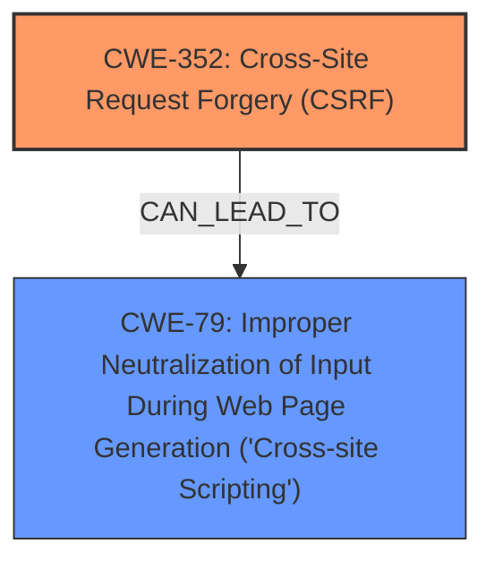

# Analysis Report for CVE-2025-23673

# Vulnerability Analysis Report: CVE-2025-23673

## Description

**Cross-Site Request Forgery (CSRF)** vulnerability in Don Kukral Email on Publish allows Stored XSS.This issue affects Email on Publish from n/a through 1.5.

## Vulnerability Description Key Phrases

- **Rootcause:** Cross-Site Request Forgery (CSRF)
- **Weakness:** XSS, weakness
- **Product:** Don Kukral Email on Publish
- **Impact:** Stored XSS
- **Version:** n/a through 1.5

## Analysis (with Relationship Data)

# Summary
| CWE ID | CWE Name | Confidence | CWE Abstraction Level | CWE Vulnerability Mapping Label | CWE-Vulnerability Mapping Notes |
|---|---|---|---|---|---|
| CWE-352 | Cross-Site Request Forgery (CSRF) | 0.9 | Compound | Primary | Allowed |
| CWE-79 | Improper Neutralization of Input During Web Page Generation ('Cross-site Scripting') | 0.8 | Base | Secondary | Allowed |

## Evidence and Confidence

*   **Confidence Score:** 0.85
*   **Evidence Strength:** MEDIUM

## Relationship Analysis
The primary weakness is **CWE-352** Cross-Site Request Forgery (CSRF), which allows an attacker to induce users to perform actions they did not intend to. A successful CSRF attack can lead to the injection of malicious scripts into the application (**CWE-79**), resulting in Stored XSS. While **CWE-352** is a Compound weakness, it accurately describes the **rootcause** of the vulnerability, making it the primary CWE. **CWE-79** is a Base level weakness and represents the impact of the **CWE-352** vulnerability.



## Vulnerability Chain
The vulnerability chain begins with **CWE-352** Cross-Site Request Forgery (CSRF), allowing an attacker to inject malicious scripts. This leads to **CWE-79** Improper Neutralization of Input During Web Page Generation ('Cross-site Scripting'), resulting in Stored XSS.

CWE-352 (Root Cause) -> CWE-79 (Impact)

## Summary of Analysis
The initial assessment identified **CWE-352** as the primary **rootcause**, as the **Cross-Site Request Forgery (CSRF)** vulnerability allows the injection of malicious scripts. The resulting Stored XSS is a consequence of the **CSRF** vulnerability, making **CWE-79** a secondary weakness. This assessment is primarily based on the provided evidence, which clearly indicates that the **CSRF** vulnerability is the **rootcause**, leading to the **XSS** vulnerability. The graph relationships support this assessment, as **CWE-352** can lead to **CWE-79**. The selected CWEs are at the optimal level of specificity, with **CWE-352** being a Compound weakness that accurately describes the **rootcause**, and **CWE-79** being a Base weakness that accurately describes the resulting **XSS** vulnerability.

Relevant CWE Information:

# Enhanced Context (25 CWEs)
The following CWEs were identified as potentially relevant to this vulnerability:

## CWE-352: Cross-Site Request Forgery (CSRF)
**Abstraction Level**: Compound
**Similarity Score**: 0.76
**Source**: dense

**Description**:
The web application does not, or can not, sufficiently verify whether a well-formed, valid, consistent request was intentionally provided by the user who submitted the request.

**Mapping Guidance**:
- Usage: Allowed
- Rationale: This is a well-known Composite of multiple weaknesses that must all occur simultaneously, although it is attack-oriented in nature.

**Justification:** This CWE directly aligns with the vulnerability description's mention of **Cross-Site Request Forgery (CSRF)**. The description states a **CSRF** vulnerability exists, which allows malicious actors to force higher privileged users to execute unwanted actions. The CWE description matches this behavior.

## CWE-80: Improper Neutralization of Script-Related HTML Tags in a Web Page (Basic XSS)
**Abstraction Level**: Variant
**Similarity Score**: 0.72
**Source**: dense

**Description**:
The product receives input from an upstream component, but it does not neutralize or incorrectly neutralizes special characters such as "<", ">", and "&" that could be interpreted as web-scripting elements when they are sent to a downstream component that processes web pages.

**Mapping Guidance**:
- Usage: Allowed
- Rationale: This CWE entry is at the Variant level of abstraction, which is a preferred level of abstraction for mapping to the root causes of vulnerabilities.

**Justification:** This is a more specific form of XSS than CWE-79. While XSS is the impact, **CWE-80** is not the **rootcause** here.

## CWE-472: External Control of Assumed-Immutable Web Parameter
**Abstraction Level**: Base
**Similarity Score**: 0.71
**Source**: dense

**Description**:
The web application does not sufficiently verify inputs that are assumed to be immutable but are actually externally controllable, such as hidden form fields.

**Mapping Guidance**:
- Usage: Allowed
- Rationale: This CWE entry is at the Base level of abstraction, which is a preferred level of abstraction for mapping to the root causes of vulnerabilities.

**Justification:** This CWE is not directly related, as it focuses on the lack of input validation for assumed-immutable parameters. While a CSRF attack might involve manipulating such parameters, it is not the defining characteristic of the vulnerability.

## CWE-434: Unrestricted Upload of File with Dangerous Type
**Abstraction Level**: Base
**Similarity Score**: 0.71
**Source**: dense

**Description**:
The product allows the upload or transfer of dangerous file types that are automatically processed within its environment.

**Mapping Guidance**:
- Usage: Allowed
- Rationale: This CWE entry is at the Base level of abstraction, which is a preferred level of abstraction for mapping to the root causes of vulnerabilities.

**Justification:** This CWE is not related to the vulnerability, which involves **CSRF** leading to Stored **XSS**, rather than unrestricted file uploads.

## CWE-116: Improper Encoding or Escaping of Output
**Abstraction Level**: Class
**Similarity Score**: 0.71
**Source**: dense

**Description**:
The product prepares a structured message for communication with another component, but encoding or escaping of the data is either missing or done incorrectly. As a result, the intended structure of the message is not preserved.

**Mapping Guidance**:
- Usage: Allowed-with-Review
- Rationale: This CWE entry is a Class and might have Base-level children that would be more appropriate

**Justification:** While **CWE-116** is related to **XSS**, it is a more general case of output encoding issues. In this case, the **XSS** arises from a **CSRF** vulnerability, making it a secondary concern.

## CWE-79: Improper Neutralization of Input During Web Page Generation ('Cross-site Scripting')
**Abstraction Level**: Base
**Similarity Score**: 0.71
**Source**: dense

**Description**:
The product does not neutralize or incorrectly neutralizes user-controllable input before it is placed in output that is used as a web page that is served to other users.

**Mapping Guidance**:
- Usage: Allowed
- Rationale: This CWE entry is at the Base level of abstraction, which is a preferred level of abstraction for mapping to the root causes of vulnerabilities.

**Justification:** This CWE is a direct result of the **CSRF** vulnerability. The vulnerability description mentions Stored **XSS**, which aligns with **CWE-79**. The **CSRF** allows an attacker to inject malicious scripts, which are then stored and executed in the web page.

## CWE-425: Direct Request ('Forced Browsing')
**Abstraction Level**: Base
**Similarity Score**: 0.70
**Source**: dense

**Description**:
The web application does not adequately enforce appropriate authorization on all restricted URLs, scripts, or files.

**Mapping Guidance**:
- Usage: Allowed
- Rationale: This CWE entry is at the Base level of abstraction, which is a preferred level of abstraction for mapping to the root causes of vulnerabilities.

**Justification:** This CWE does not directly apply, as the vulnerability is not about directly accessing restricted resources without authorization. It's about inducing a user to perform actions they didn't intend through **CSRF**.

## CWE-918: Server-Side Request Forgery (SSRF)
**Abstraction Level**: Base
**Similarity Score**: 0.70
**Source**: dense

**Description**:
The web server receives a URL or similar request from an upstream component and retrieves the contents of this URL, but it does not sufficiently ensure that the request is being sent to the expected destination.

**Mapping Guidance**:
- Usage: Allowed
- Rationale: This CWE entry is at the Base level of abstraction, which is a preferred level of abstraction for mapping to the root causes of vulnerabilities.

**Justification:** This CWE is not related, as the vulnerability does not involve the server making requests to unintended destinations. It's about **CSRF** leading to


## CWE Relationship Analysis

Current CWEs represent these abstraction levels: .


### Vulnerability Chain Analysis

**Chain starting from CWE-116:**
- 116 (Improper Encoding or Escaping of Output) - ROOT


**Chain starting from CWE-80:**
- 80 (Improper Neutralization of Script-Related HTML Tags in a Web Page (Basic XSS)) - ROOT


### CWE Relationship Diagram

```mermaid
graph TD
    classDef primary fill:#f96,stroke:#333,stroke-width:2px
    classDef secondary fill:#69f,stroke:#333
    classDef tertiary fill:#9e9,stroke:#333
```


*Report generated on 2025-07-14 11:40:33*
