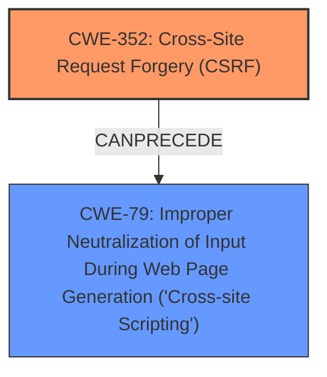

# Enhanced Analysis for CVE-2025-23692

# Summary
| CWE ID | CWE Name | Confidence | CWE Abstraction Level | CWE Vulnerability Mapping Label | CWE-Vulnerability Mapping Notes |
|---|---|---|---|---|---|
| CWE-352 | Cross-Site Request Forgery (CSRF) | 0.9 | Compound | Primary | Allowed |
| CWE-79 | Improper Neutralization of Input During Web Page Generation ('Cross-site Scripting') | 0.8 | Base | Secondary | Allowed |

## Evidence and Confidence

*   **Confidence Score:** 0.85
*   **Evidence Strength:** HIGH

## Relationship Analysis
The primary weakness is CWE-352 [Cross-Site Request Forgery (CSRF)], which can lead to other vulnerabilities. In this case, a **lack of CSRF protection** allows for Stored **XSS** (CWE-79 [Improper Neutralization of Input During Web Page Generation ('Cross-site Scripting')]). The CSRF vulnerability enables an attacker to force a user to perform actions that inject malicious scripts, resulting in the XSS vulnerability.



## Vulnerability Chain
The vulnerability chain starts with a **lack of CSRF protection** (CWE-352 [Cross-Site Request Forgery (CSRF)]). This allows an attacker to force a user to make a request that injects malicious scripts into the system, leading to Stored **XSS** (CWE-79 [Improper Neutralization of Input During Web Page Generation ('Cross-site Scripting')]).
  - Root Cause: CWE-352 [Cross-Site Request Forgery (CSRF)]
  - Weakness: CWE-79 [Improper Neutralization of Input During Web Page Generation ('Cross-site Scripting')]

## Summary of Analysis
The primary vulnerability is the **lack of CSRF protection** (CWE-352 [Cross-Site Request Forgery (CSRF)]), which allows for Stored **XSS** (CWE-79 [Improper Neutralization of Input During Web Page Generation ('Cross-site Scripting')]).
The evidence supports this:
- The Vulnerability Description Key Phrases identify "rootcause: **lack of CSRF protection**" and "weakness: **XSS**"
- The CVE Reference Links Content Summary confirms the root cause is Cross Site Request Forgery (CSRF)

CWE-352 [Cross-Site Request Forgery (CSRF)] is the root cause, as it enables the attacker to inject the malicious script. The **XSS** vulnerability (CWE-79 [Improper Neutralization of Input During Web Page Generation ('Cross-site Scripting')]) is a consequence of the **lack of CSRF protection**.

Other CWEs Considered:
- CWE-425 [Direct Request ('Forced Browsing')] was considered but not selected because CWE-352 [Cross-Site Request Forgery (CSRF)] more accurately describes the vulnerability.
- CWE-89 [Improper Neutralization of Special Elements used in an SQL Command ('SQL Injection')] was considered but not selected because the vulnerability involves Cross-Site Request Forgery leading to Cross-Site Scripting, not SQL Injection.
- CWE-434 [Unrestricted Upload of File with Dangerous Type] was considered but not selected because the vulnerability doesn't involve file uploads.


## CWE Relationship Analysis

Current CWEs represent these abstraction levels: .


### Vulnerability Chain Analysis

**Chain starting from CWE-89:**
- 89 (Improper Neutralization of Special Elements used in an SQL Command ('SQL Injection')) - ROOT


**Chain starting from CWE-79:**
- 79 (Improper Neutralization of Input During Web Page Generation ('Cross-site Scripting')) - ROOT


### CWE Relationship Diagram

```mermaid
graph TD
    classDef primary fill:#f96,stroke:#333,stroke-width:2px
    classDef secondary fill:#69f,stroke:#333
    classDef tertiary fill:#9e9,stroke:#333
```