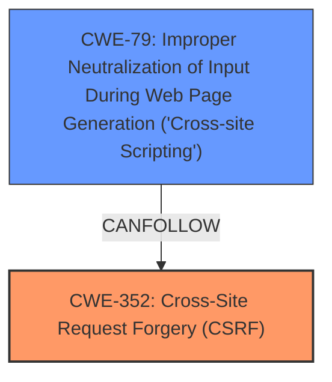

# Raw Analyzer Response for CVE-2025-23694

# Summary
| CWE ID  | CWE Name                                                                                                                                     | Confidence | CWE Abstraction Level | CWE Vulnerability Mapping Label | CWE-Vulnerability Mapping Notes |
| :-------- | :------------------------------------------------------------------------------------------------------------------------------------------- | :---------- | :---------------------- | :------------------------------ | :------------------------------ |
| CWE-352   | Cross-Site Request Forgery (CSRF)                                                                                                          | 1.0         | Compound                | Primary CWE                     | Allowed                       |
| CWE-79    | Improper Neutralization of Input During Web Page Generation ('Cross-site Scripting')                                                        | 1.0         | Base                    | Secondary Candidate              | Allowed                       |

## Evidence and Confidence

*   **Confidence Score:** 1.0
*   **Evidence Strength:** HIGH

## Relationship Analysis
The primary weakness is CWE-352 [Cross-Site Request Forgery (CSRF)]. The vulnerability description indicates that a malicious actor can force higher privileged users to execute unwanted actions. This aligns directly with the description of CSRF. CWE-79 [Improper Neutralization of Input During Web Page Generation ('Cross-site Scripting')] is a secondary weakness because the CSRF vulnerability is exploited to inject a Stored XSS. The CSRF attack allows an attacker to inject malicious scripts that are then stored and executed when other users view the affected content.

## Vulnerability Chain
The vulnerability chain starts with **CWE-352 [Cross-Site Request Forgery (CSRF)]**, which allows an attacker to force a user to perform unwanted actions. This leads to **CWE-79 [Improper Neutralization of Input During Web Page Generation ('Cross-site Scripting')]** because the attacker uses the CSRF vulnerability to inject malicious scripts that are not properly neutralized, resulting in stored XSS.

## Summary of Analysis
The analysis is based on the provided evidence. The **Vulnerability Description** states "Cross-Site Request Forgery (CSRF) vulnerability in Shabbos Commerce Shabbos and Yom Tov allows Stored XSS". The **CVE Reference Links Content Summary** confirms that the root cause is a CSRF vulnerability. The description aligns with the definition of CWE-352 [Cross-Site Request Forgery (CSRF)], which involves forcing a user to execute unwanted actions. In this specific case, the action is the injection of malicious code, which leads to CWE-79 [Improper Neutralization of Input During Web Page Generation ('Cross-site Scripting')]. The selected CWEs are at the optimal level of specificity. CWE-352 [Cross-Site Request Forgery (CSRF)] is a Compound weakness, representing the broader category of the attack, while CWE-79 [Improper Neutralization of Input During Web Page Generation ('Cross-site Scripting')] is a Base weakness, representing the specific coding error that allows the XSS to occur.

Relevant CWE Information:
- CWE-352 [Cross-Site Request Forgery (CSRF)]: The web application does not sufficiently verify whether a well-formed request was intentionally provided by the user.
- CWE-79 [Improper Neutralization of Input During Web Page Generation ('Cross-site Scripting')]: The product does not neutralize user-controllable input before it is placed in output that is used as a web page.

CWEs Considered but Not Used:

*   CWE-89 [Improper Neutralization of Special Elements used in an SQL Command ('SQL Injection')]: This was considered due to the possibility of injecting SQL code through the CSRF vulnerability, but the description specifically mentions XSS, not SQL injection.
*   CWE-434 [Unrestricted Upload of File with Dangerous Type]: This was considered because the CSRF could potentially be used to upload malicious files, but the description focuses on XSS.
*   CWE-425 [Direct Request ('Forced Browsing')]: This was considered because CSRF involves making requests, but the key aspect of CSRF is the forced action by a user, which is not the primary characteristic of CWE-425 [Direct Request ('Forced Browsing')].
*   CWE-918 [Server-Side Request Forgery (SSRF)]: This was considered because the CSRF could potentially be used to make server-side requests, but there's no direct evidence of this.
*   CWE-116 [Improper Encoding or Escaping of Output]: This was considered as it relates to outputting data, but CWE-79 [Improper Neutralization of Input During Web Page Generation ('Cross-site Scripting')] is a better fit for XSS.
*   CWE-80 [Improper Neutralization of Script-Related HTML Tags in a Web Page (Basic XSS)]: While related to XSS, CWE-79 [Improper Neutralization of Input During Web Page Generation ('Cross-site Scripting')] is more general and fits the description better.
*   CWE-184 [Incomplete List of Disallowed Inputs]: This was considered but it is not specific enough, as the core issue is the CSRF leading to XSS.
*   CWE-472 [External Control of Assumed-Immutable Web Parameter]: This was considered because CSRF attacks involve manipulating parameters, but the core issue is the lack of CSRF protection, not the immutability of parameters.
*   CWE-639 [Authorization Bypass Through User-Controlled Key]: This was considered because CSRF attacks can bypass authorization, but CSRF is the primary issue, not the user-controlled key.
*   CWE-201 [Insertion of Sensitive Information Into Sent Data]: This was not considered as there is no evidence to suggest that any sensitive information is being inserted into data that is being sent.
*   CWE-183 [Permissive List of Allowed Inputs]: This was considered but it is not specific enough, as the core issue is the CSRF leading to XSS.
*   CWE-494 [Download of Code Without Integrity Check]: This was not considered as there is no evidence to suggest that code is being downloaded without integrity check.
*   CWE-78 [Improper Neutralization of Special Elements used in an OS Command ('OS Command Injection')]: This was not considered as there is no evidence to suggest that OS commands are being injected.
*   CWE-73 [External Control of File Name or Path]: This was not considered as there is no evidence to suggest that file names or paths are being controlled externally.
*   CWE-471 [Modification of Assumed-Immutable Data (MAID)]: This was not considered as there is no evidence to suggest that data is being modified.