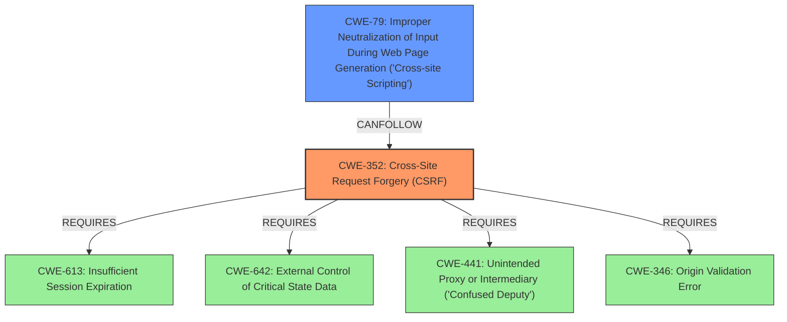

# Enhanced Analysis for CVE-2025-23720

# Summary
| CWE ID | CWE Name | Confidence | CWE Abstraction Level | CWE Vulnerability Mapping Label | CWE-Vulnerability Mapping Notes |
|---|---|---|---|---|---|
| CWE-352 | Cross-Site Request Forgery (CSRF) | 1.0 | Compound | Primary | Allowed |
| CWE-79 | Improper Neutralization of Input During Web Page Generation ('Cross-site Scripting') | 1.0 | Base | Secondary | Allowed |

## Evidence and Confidence

*   **Confidence Score:** 1.0
*   **Evidence Strength:** HIGH

## Relationship Analysis
The primary weakness is identified as CWE-352 [Cross-Site Request Forgery (CSRF)], a compound weakness where the application does not sufficiently verify the request's origin. The secondary weakness is CWE-79 [Improper Neutralization of Input During Web Page Generation ('Cross-site Scripting')], caused due to the **missing CSRF protection**, leading to stored XSS.



## Vulnerability Chain
The vulnerability chain starts with the **missing CSRF protection** (CWE-352), which allows an attacker to inject malicious scripts. This leads to the **XSS** vulnerability (CWE-79) because the application **does not properly neutralize** user-controllable input.

## Summary of Analysis
The primary issue is the **missing CSRF protection**, which is explicitly stated in the "Vulnerability Description Key Phrases" section. The presence of the CSRF vulnerability allows for XSS.

The evidence is:
*   **rootcause:** **missing CSRF protection**
*   **weakness:** **XSS, cross-site scripting**
*   **CVE Reference Links Content Summary**: Root cause of vulnerability: Cross Site Request Forgery (CSRF) vulnerability.

CWE-352 [Cross-Site Request Forgery (CSRF)] is the best fit for the **root cause** and is a Compound type.

CWE-79 [Improper Neutralization of Input During Web Page Generation ('Cross-site Scripting')] accurately describes the resulting **XSS** vulnerability, due to the **missing CSRF protection**.

Other CWEs Considered:

*   CWE-80 [Improper Neutralization of Script-Related HTML Tags in a Web Page (Basic XSS)]: While related to XSS, CWE-79 is more general and appropriate as it covers the broad issue of improper neutralization.
*   CWE-116 [Improper Encoding or Escaping of Output]: This is related to output encoding but doesn't capture the **root cause** of the CSRF vulnerability.
*   CWE-918 [Server-Side Request Forgery (SSRF)]: Not relevant as the vulnerability is client-side.
*   CWE-434 [Unrestricted Upload of File with Dangerous Type]: Not relevant as the vulnerability is not related to file uploads.
*   CWE-1385 [Missing Origin Validation in WebSockets]: Not relevant as the vulnerability is not specific to WebSockets.
*   CWE-494 [Download of Code Without Integrity Check]: Not relevant as the vulnerability is not related to code downloads.
*   CWE-89 [Improper Neutralization of Special Elements used in an SQL Command ('SQL Injection')]: Not relevant as there's no indication of SQL injection.

The final selection of CWE-352 and CWE-79 provides the most accurate and specific classification of the vulnerability, addressing both the root cause (CSRF) and the resulting weakness (XSS).


## CWE Relationship Analysis

Current CWEs represent these abstraction levels: .


### Vulnerability Chain Analysis

**Chain starting from CWE-89:**
- 89 (Improper Neutralization of Special Elements used in an SQL Command ('SQL Injection')) - ROOT


**Chain starting from CWE-116:**
- 116 (Improper Encoding or Escaping of Output) - ROOT


### CWE Relationship Diagram

```mermaid
graph TD
    classDef primary fill:#f96,stroke:#333,stroke-width:2px
    classDef secondary fill:#69f,stroke:#333
    classDef tertiary fill:#9e9,stroke:#333
```