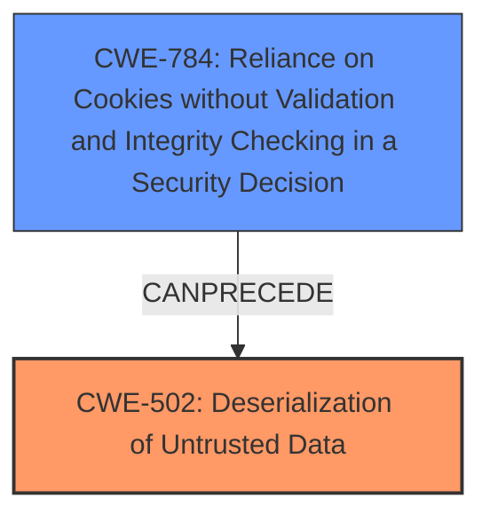

# Analysis for CVE-2025-2376

# Summary
| CWE ID | CWE Name | Confidence | CWE Abstraction Level | CWE Vulnerability Mapping Label | CWE-Vulnerability Mapping Notes |
|---|---|---|---|---|---|
| CWE-502 | Deserialization of Untrusted Data | 1.0 | Base | Primary | Allowed |
| CWE-784 | Reliance on Cookies without Validation and Integrity Checking in a Security Decision | 0.7 | Variant | Secondary | Allowed |

## Evidence and Confidence

*   **Confidence Score:** 0.9
*   **Evidence Strength:** HIGH

## Relationship Analysis
The primary relationship is that CWE-502 [Deserialization of Untrusted Data] is the root cause of the vulnerability, as untrusted data is being deserialized without proper validation. CWE-784 [Reliance on Cookies without Validation and Integrity Checking in a Security Decision] is related because the vulnerability occurs due to the system relying on a cookie without proper validation, which provides the untrusted data for deserialization. CWE-784 is a variant-level CWE, making it more specific, but it is a secondary concern to the core issue of deserialization.

## Vulnerability Chain
The vulnerability chain starts with the **reliance on a cookie without proper validation** (CWE-784). This leads to the **deserialization of untrusted data** (CWE-502), which can then lead to remote code execution or arbitrary file writes. The **deserialization** is the direct root cause as it's the unsafe operation being performed on the untrusted data.

## Summary of Analysis
The analysis indicates a vulnerability due to insecure deserialization. The primary CWE, CWE-502 [Deserialization of Untrusted Data], accurately reflects the root cause as the system **deserializes untrusted data** without proper validation. The vulnerability description explicitly mentions "**deserialization**" as the root cause. The CVE Reference Links Content Summary confirms this, stating that the vulnerability arises from the deserialization of untrusted data. The suggested mitigation also points to deserialization issues, such as using `allowed_classes` with `unserialize()` or replacing serialization with `json_encode` and `json_decode`.

CWE-784 [Reliance on Cookies without Validation and Integrity Checking in a Security Decision] is a secondary CWE because the application relies on the contents of a cookie (the data being deserialized) without properly validating it. This is the mechanism that provides the untrusted data. The vulnerability description indicates that the manipulation of the `cookieName` argument leads to deserialization.

The retriever results also support the selection of CWE-502 [Deserialization of Untrusted Data], which has a high relevance score.

The selected CWEs are at the optimal level of specificity. CWE-502 [Deserialization of Untrusted Data] is a base-level CWE that accurately describes the root cause. CWE-784 [Reliance on Cookies without Validation and Integrity Checking in a Security Decision] is a variant-level CWE which accurately describes how the untrusted data is passed to the application.

Other CWEs Considered and Rejected:

*   CWE-79 [Improper Neutralization of Input During Web Page Generation ('Cross-site Scripting')] and CWE-89 [Improper Neutralization of Special Elements used in an SQL Command ('SQL Injection')] were considered due to their high retriever scores. However, they are not relevant as the vulnerability is related to deserialization, not input neutralization.
*   CWE-434 [Unrestricted Upload of File with Dangerous Type] was considered, but it is not relevant because the vulnerability does not involve file uploads.
*   CWE-1336 [Improper Neutralization of Special Elements Used in a Template Engine] was also considered, but it's not applicable since the vulnerability isn't related to template engines.