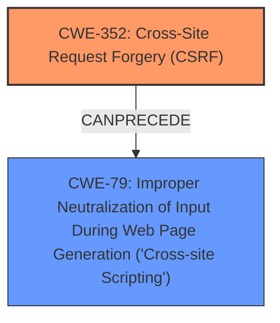

# Raw Analyzer Response for CVE-2025-23793

# Summary
| CWE ID | CWE Name | Confidence | CWE Abstraction Level | CWE Vulnerability Mapping Label | CWE-Vulnerability Mapping Notes |
|---|---|---|---|---|---|
| CWE-352 | Cross-Site Request Forgery (CSRF) | 1.0 | Compound | Primary | Allowed |
| CWE-79 | Improper Neutralization of Input During Web Page Generation ('Cross-site Scripting') | 1.0 | Base | Secondary | Allowed |

## Evidence and Confidence

*   **Confidence Score:** 1.0
*   **Evidence Strength:** HIGH

## Relationship Analysis
The primary weakness is CWE-352 [Cross-Site Request Forgery (CSRF)], a compound weakness that can lead to other vulnerabilities. In this case, the CSRF vulnerability allows for Stored XSS (CWE-79 [Improper Neutralization of Input During Web Page Generation ('Cross-site Scripting')]). CWE-79 is a base CWE. CWE-352 can precede CWE-79 in a vulnerability chain. Both are at preferred levels of abstraction.

## Vulnerability Chain
The vulnerability chain starts with CWE-352 [Cross-Site Request Forgery (CSRF)]. Due to the **lack of CSRF protection**, an attacker can force a user to perform actions that inject malicious scripts into the system. These scripts are then stored, leading to CWE-79 [Improper Neutralization of Input During Web Page Generation ('Cross-site Scripting')], resulting in Stored XSS.

CWE-352 (Root Cause) -> CWE-79 (Impact)

## Summary of Analysis
The initial assessment identified CWE-352 [Cross-Site Request Forgery (CSRF)] as the primary vulnerability due to the **lack of CSRF protection**, which aligns with the provided evidence from the vulnerability description and CVE reference links. The description explicitly mentions a "Cross-Site Request Forgery (CSRF) vulnerability". The CVE reference states, "*Root cause of vulnerability: The vulnerability is a Cross-Site Request Forgery (CSRF) issue*."

The resulting impact of the CSRF is Stored XSS, which is best represented by CWE-79 [Improper Neutralization of Input During Web Page Generation ('Cross-site Scripting')]. The vulnerability description key phrases contains "*Stored XSS*" and the CVE reference mentions "*A malicious actor could force higher privileged users to execute unwanted actions under their current authentication.*"

Both CWEs are at appropriate levels of specificity (Compound and Base, respectively). The relationship analysis confirms that CSRF can lead to XSS, solidifying the chosen chain.

CWEs Considered but Not Used:

*   CWE-89 [Improper Neutralization of Special Elements used in an SQL Command ('SQL Injection')], CWE-918 [Server-Side Request Forgery (SSRF)], CWE-601 [URL Redirection to Untrusted Site ('Open Redirect')], CWE-1004 [Sensitive Cookie Without 'HttpOnly' Flag], CWE-80 [Improper Neutralization of Script-Related HTML Tags in a Web Page (Basic XSS)], CWE-1275 [Sensitive Cookie with Improper SameSite Attribute], CWE-425 [Direct Request ('Forced Browsing')], CWE-494 [Download of Code Without Integrity Check]: These CWEs were considered based on the retriever results but were deemed less relevant as the primary issue is CSRF leading to XSS. They do not directly address the root cause or the immediate impact.