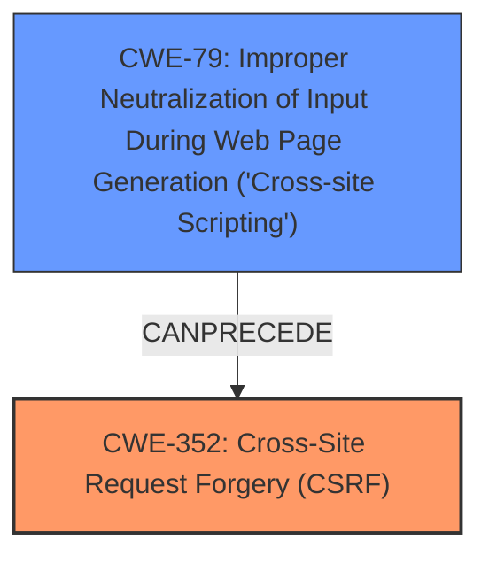

# Analysis Report for CVE-2025-23817

# Vulnerability Analysis Report: CVE-2025-23817

## Description

Cross-Site Request Forgery (CSRF) vulnerability in Mahadir Ahmad MHR-Custom-Anti-Copy allows Stored **XSS**.This issue affects MHR-Custom-Anti-Copy from n/a through 2.0.

## Vulnerability Description Key Phrases

- **Rootcause:** cross-site request forgery
- **Weakness:** ['stored cross-site scripting', 'XSS']
- **Product:** Mahadir Ahmad MHR-Custom-Anti-Copy
- **Version:** n/a through 2

## Analysis (with Relationship Data)

# Summary
| CWE ID | CWE Name | Confidence | CWE Abstraction Level | CWE Vulnerability Mapping Label | CWE-Vulnerability Mapping Notes |
|---|---|---|---|---|---|
| CWE-352 | Cross-Site Request Forgery (CSRF) | 0.9 | Compound | Primary | Allowed |
| CWE-79 | Improper Neutralization of Input During Web Page Generation ('Cross-site Scripting') | 0.9 | Base | Secondary | Allowed |

## Evidence and Confidence

*   **Confidence Score:** 0.9
*   **Evidence Strength:** HIGH

## Relationship Analysis
The primary weakness is identified as CWE-352 [Cross-Site Request Forgery (CSRF)], a compound weakness, indicating a failure to adequately verify the origin of requests. This can lead to an attacker forcing a user to perform actions without their consent. The secondary weakness is CWE-79 [Improper Neutralization of Input During Web Page Generation ('Cross-site Scripting')], a base weakness, arises from the application's failure to neutralize user-controllable input before embedding it in web pages, leading to **XSS** vulnerabilities. CWE-79 is a prerequisite for Stored **XSS**, which is mentioned in the description.



## Vulnerability Chain
The vulnerability chain starts with the **ROOTCAUSE** of CWE-352 [Cross-Site Request Forgery (CSRF)], where the application fails to properly validate the origin of requests. This allows an attacker to potentially inject malicious input. Subsequently, the **WEAKNESS** of CWE-79 [Improper Neutralization of Input During Web Page Generation ('Cross-site Scripting')] leads to stored **XSS**, because the injected input is not properly neutralized before being rendered in a web page.

## Summary of Analysis
The analysis identifies two primary weaknesses: CWE-352 [Cross-Site Request Forgery (CSRF)] and CWE-79 [Improper Neutralization of Input During Web Page Generation ('Cross-site Scripting')]. The vulnerability description clearly states that there is a Cross-Site Request Forgery (CSRF) vulnerability, which maps directly to CWE-352. The presence of stored **XSS** indicates that user input is not being properly neutralized, which maps to CWE-79. Both of these weaknesses are supported by the vulnerability description. The retriever results also indicate the high relevance of these CWEs to the vulnerability. The selection of CWE-352 and CWE-79 is at the optimal level of specificity because they represent the **ROOTCAUSE** and the resulting **WEAKNESS** that leads to the **XSS** vulnerability.

Relevant CWE Information:

# Enhanced Context (25 CWEs)
The following CWEs were identified as potentially relevant to this vulnerability:

## CWE-41: Improper Resolution of Path Equivalence
**Abstraction Level**: Base
**Similarity Score**: 0.75
**Source**: dense

**Description**:
The product is vulnerable to file system contents disclosure through path equivalence. Path equivalence involves the use of special characters in file and directory names. The associated manipulations are intended to generate multiple names for the same object.

**Mapping Guidance**:
- Usage: Allowed
- Rationale: This CWE entry is at the Base level of abstraction, which is a preferred level of abstraction for mapping to the root causes of vulnerabilities.

*Not Selected*: This CWE is not selected because it doesn't relate to the **ROOTCAUSE** or **WEAKNESS** being a CSRF vulnerability leading to stored **XSS**.

## CWE-74: Improper Neutralization of Special Elements in Output Used by a Downstream Component ('Injection')
**Abstraction Level**: Class
**Similarity Score**: 0.74
**Source**: dense

**Description**:
The product constructs all or part of a command, data structure, or record using externally-influenced input from an upstream component, but it does not neutralize or incorrectly neutralizes special elements that could modify how it is parsed or interpreted when it is sent to a downstream component.

**Mapping Guidance**:
- Usage: Discouraged
- Rationale: CWE-74 is high-level and often misused when lower-level weaknesses are more appropriate.

*Not Selected*: This CWE is too generic, CWE-79 is more specific and applicable.

## CWE-1391: Use of Weak Credentials
**Abstraction Level**: Class
**Similarity Score**: 0.74
**Source**: dense

**Description**:
The product uses weak credentials (such as a default key or hard-coded password) that can be calculated, derived, reused, or guessed by an attacker.

**Mapping Guidance**:
- Usage: Allowed-with-Review
- Rationale: This CWE entry is a Class and might have Base-level children that would be more appropriate

*Not Selected*: This CWE is not selected because it doesn't relate to the **ROOTCAUSE** or **WEAKNESS** being a CSRF vulnerability leading to stored **XSS**.

## CWE-472: External Control of Assumed-Immutable Web Parameter
**Abstraction Level**: Base
**Similarity Score**: 0.74
**Source**: dense

**Description**:
The web application does not sufficiently verify inputs that are assumed to be immutable but are actually externally controllable, such as hidden form fields.

**Mapping Guidance**:
- Usage: Allowed
- Rationale: This CWE entry is at the Base level of abstraction, which is a preferred level of abstraction for mapping to the root causes of vulnerabilities.

*Not Selected*: This CWE is not selected because it doesn't relate to the **ROOTCAUSE** or **WEAKNESS** being a CSRF vulnerability leading to stored **XSS**.

## CWE-212: Improper Removal of Sensitive Information Before Storage or Transfer
**Abstraction Level**: Base
**Similarity Score**: 0.74
**Source**: dense

**Description**:
The product stores, transfers, or shares a resource that contains sensitive information, but it does not properly remove that information before the product makes the resource available to unauthorized actors.

**Mapping Guidance**:
- Usage: Allowed
- Rationale: This CWE entry is at the Base level of abstraction, which is a preferred level of abstraction for mapping to the root causes of vulnerabilities.

*Not Selected*: This CWE is not selected because it doesn't relate to the **ROOTCAUSE** or **WEAKNESS** being a CSRF vulnerability leading to stored **XSS**.

## CWE-425: Direct Request ('Forced Browsing')
**Abstraction Level**: Base
**Similarity Score**: 0.74
**Source**: dense

**Description**:
The web application does not adequately enforce appropriate authorization on all restricted URLs, scripts, or files.

**Mapping Guidance**:
- Usage: Allowed
- Rationale: This CWE entry is at the Base level of abstraction, which is a preferred level of abstraction for mapping to the root causes of vulnerabilities.

*Not Selected*: This CWE is not selected because it doesn't relate to the **ROOTCAUSE** or **WEAKNESS** being a CSRF vulnerability leading to stored **XSS**.

## CWE-668: Exposure of Resource to Wrong Sphere
**Abstraction Level**: Class
**Similarity Score**: 0.74
**Source**: dense

**Description**:
The product exposes a resource to the wrong control sphere, providing unintended actors with inappropriate access to the resource.

**Mapping Guidance**:
- Usage: Discouraged
- Rationale: CWE-668 is high-level and is often misused as a catch-all when lower-level CWE IDs might be applicable. It is sometimes used for low-information vulnerability reports [REF-1287]. It is a level-1 Class (i.e., a child of a Pillar). It is not useful for trend analysis.

*Not Selected*: This CWE is not selected because it doesn't relate to the **ROOTCAUSE** or **WEAKNESS** being a CSRF vulnerability leading to stored **XSS**.

## CWE-80: Improper Neutralization of Script-Related HTML Tags in a Web Page (Basic XSS)
**Abstraction Level**: Variant
**Similarity Score**: 0.74
**Source**: dense

**Description**:
The product receives input from an upstream component, but it does not neutralize or incorrectly neutralizes special characters such as "<", ">", and "&" that could be interpreted as web-scripting elements when they are sent to a downstream component that processes web pages.

**Mapping Guidance**:
- Usage: Allowed
- Rationale: This CWE entry is at the Variant level of abstraction, which is a preferred level of abstraction for mapping to the root causes of vulnerabilities.

*Not Selected*: CWE-79 [Improper Neutralization of Input During Web Page Generation ('Cross-site Scripting')] is a better fit because it is more generic.

## CWE-303: Incorrect Implementation of Authentication Algorithm
**Abstraction Level**: Base
**


## CWE Relationship Analysis

Current CWEs represent these abstraction levels: .


### Vulnerability Chain Analysis

**Chain starting from CWE-80:**
- 80 (Improper Neutralization of Script-Related HTML Tags in a Web Page (Basic XSS)) - ROOT


**Chain starting from CWE-79:**
- 79 (Improper Neutralization of Input During Web Page Generation ('Cross-site Scripting')) - ROOT


### CWE Relationship Diagram

```mermaid
graph TD
    classDef primary fill:#f96,stroke:#333,stroke-width:2px
    classDef secondary fill:#69f,stroke:#333
    classDef tertiary fill:#9e9,stroke:#333
```


*Report generated on 2025-07-14 11:54:24*
