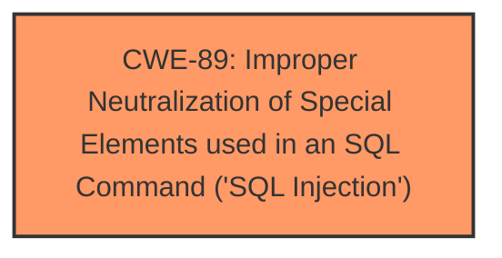

# Enhanced Analysis for CVE-2025-2382

# Summary
| CWE ID | CWE Name | Confidence | CWE Abstraction Level | CWE Vulnerability Mapping Label | CWE-Vulnerability Mapping Notes |
|---|---|---|---|---|---|
| CWE-89 | Improper Neutralization of Special Elements used in an SQL Command ('SQL Injection') | 1.0 | Base | Allowed | Primary CWE |

## Evidence and Confidence

*   **Confidence Score:** 1.0
*   **Evidence Strength:** HIGH

## Relationship Analysis
The primary relationship identified is that CWE-89 is a Base level CWE, which is the preferred level of abstraction. There are no child or parent relationships directly impacting this decision given the explicit nature of the vulnerability being SQL Injection.



## Vulnerability Chain
The vulnerability chain consists of a single step: **improper neutralization** of special elements in an SQL command leading directly to **SQL injection**. There are no preceding or following steps identified in the provided description. The root cause is the **improper neutralization**, and the impact is **SQL injection**.

## Summary of Analysis
The vulnerability description clearly states that the manipulation of the `searchdata` argument in `/admin/booking-search.php` leads to **sql injection**. This aligns directly with CWE-89, "Improper Neutralization of Special Elements used in an SQL Command ('SQL Injection')". The description provides sufficient evidence to confidently assign CWE-89 as the primary weakness.

The retriever results also list CWE-89 as the top candidate with a score of 1.0, reinforcing the decision. The description explicitly mentions **SQL injection**, making CWE-89 the most specific and accurate representation of the vulnerability.

Other CWEs were considered but deemed less relevant:

*   CWE-79 (Cross-Site Scripting): While input is being manipulated, the vulnerability is specifically **SQL injection**, not XSS.
*   CWE-434 (Unrestricted Upload of File with Dangerous Type): This is unrelated to the described vulnerability.
*   CWE-1336 (Improper Neutralization of Special Elements Used in a Template Engine): This is unrelated to the described vulnerability.
*   CWE-93 (Improper Neutralization of CRLF Sequences ('CRLF Injection')): This is unrelated to the described vulnerability.
*   CWE-352 (Cross-Site Request Forgery (CSRF)): This is unrelated to the described vulnerability.
*   CWE-117 (Improper Output Neutralization for Logs): This is unrelated to the described vulnerability.

The selection of CWE-89 is at the optimal level of specificity, as it directly addresses the identified **SQL injection** vulnerability.


## CWE Relationship Analysis

Current CWEs represent these abstraction levels: .


### Vulnerability Chain Analysis

**Chain starting from CWE-89:**
- 89 (Improper Neutralization of Special Elements used in an SQL Command ('SQL Injection')) - ROOT


**Chain starting from CWE-93:**
- 93 (Improper Neutralization of CRLF Sequences ('CRLF Injection')) - ROOT


### CWE Relationship Diagram

```mermaid
graph TD
    classDef primary fill:#f96,stroke:#333,stroke-width:2px
    classDef secondary fill:#69f,stroke:#333
    classDef tertiary fill:#9e9,stroke:#333
```