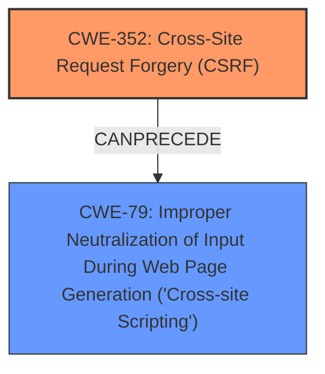

# Analysis Report for CVE-2025-23872

# Vulnerability Analysis Report: CVE-2025-23872

## Description

**Cross-Site Request Forgery** (CSRF) vulnerability in PayForm PayForm allows Stored XSS.This issue affects PayForm from n/a through 2.0.

## Vulnerability Description Key Phrases

- **Rootcause:** Cross-Site Request Forgery
- **Weakness:** Stored XSS, weakness
- **Product:** PayForm PayForm
- **Version:** n/a through 2.0

## Analysis (with Relationship Data)

# Summary

| CWE ID  | CWE Name                                                                     | Confidence | CWE Abstraction Level | CWE Vulnerability Mapping Label | CWE-Vulnerability Mapping Notes |
| :------- | :--------------------------------------------------------------------------- | :--------- | :---------------------- | :------------------------------ | :------------------------------ |
| CWE-352 | Cross-Site Request Forgery (CSRF)                                          | 0.9        | Compound                | Primary                         | Allowed                       |
| CWE-79  | Improper Neutralization of Input During Web Page Generation ('Cross-site Scripting') | 0.8        | Base                    | Secondary                       | Allowed                       |

## Evidence and Confidence

*   **Confidence Score:** 0.85
*   **Evidence Strength:** MEDIUM

## Relationship Analysis

The primary weakness identified is CWE-352 **Cross-Site Request Forgery (CSRF)**, which allows for the secondary weakness, CWE-79 **Improper Neutralization of Input During Web Page Generation ('Cross-site Scripting')**, leading to Stored XSS. CWE-352 is a compound weakness and can lead to other weaknesses if exploited. CWE-79 is a base weakness. The relationship is that a successful CSRF attack can then be used to inject malicious scripts that are then stored and executed, leading to XSS.



## Vulnerability Chain

The vulnerability chain begins with the **Cross-Site Request Forgery** (**CSRF**) vulnerability (CWE-352). The lack of CSRF protection allows an attacker to force a user into performing actions they did not intend. This, in turn, enables the attacker to inject malicious input, which is then improperly neutralized, leading to Stored XSS (CWE-79).

CWE-352 (Root Cause) -> CWE-79 (Impact)

## Summary of Analysis

The vulnerability description clearly states that a **Cross-Site Request Forgery** (**CSRF**) vulnerability exists, leading to Stored XSS. The evidence for this is found in the "Vulnerability Description Key Phrases" which states "**rootcause:** **Cross-Site Request Forgery**" and "**weakness:** **Stored XSS, weakness**". The "CVE Reference Links Content Summary" also states the "**Root cause of vulnerability:** Cross Site Request Forgery (CSRF) vulnerability." This makes CWE-352 the primary root cause. The Retriever Results also identify CWE-79 as a high scoring candidate.

CWE-352 is chosen as the primary CWE because the vulnerability description explicitly mentions it as the root cause. CWE-79 is identified as a secondary CWE because the CSRF vulnerability allows for Stored XSS. This matches the description of CWE-79, as the product does not neutralize user-controllable input before placing it in a web page served to other users.

The abstraction levels are appropriate, with CWE-352 being a compound weakness and CWE-79 being a base weakness.

Relevant CWE Information:

# Enhanced Context (25 CWEs)

## CWE-352: Cross-Site Request Forgery (CSRF)
**Abstraction Level**: Compound
**Similarity Score**: 0.73
**Source**: dense

**Description**:
The web application does not, or can not, sufficiently verify whether a well-formed, valid, consistent request was intentionally provided by the user who submitted the request.

**Mapping Guidance**:
- Usage: Allowed
- Rationale: This is a well-known Composite of multiple weaknesses that must all occur simultaneously, although it is attack-oriented in nature.

## CWE-79: Improper Neutralization of Input During Web Page Generation ('Cross-site Scripting')
**Abstraction Level**: Base
**Similarity Score**: 0.69
**Source**: dense

**Description**:
The product does not neutralize or incorrectly neutralizes user-controllable input before it is placed in output that is used as a web page that is served to other users.

**Mapping Guidance**:
- Usage: Allowed
- Rationale: This CWE entry is at the Base level of abstraction, which is a preferred level of abstraction for mapping to the root causes of vulnerabilities.

## CWE-80: Improper Neutralization of Script-Related HTML Tags in a Web Page (Basic XSS)
**Abstraction Level**: Variant
**Similarity Score**: 0.73
**Source**: dense

**Description**:
The product receives input from an upstream component, but it does not neutralize or incorrectly neutralizes special characters such as "<", ">", and "&" that could be interpreted as web-scripting elements when they are sent to a downstream component that processes web pages.

**Mapping Guidance**:
- Usage: Allowed
- Rationale: This CWE entry is at the Variant level of abstraction, which is a preferred level of abstraction for mapping to the root causes of vulnerabilities.

I considered CWE-80, but CWE-79 is a better fit because the description states Stored XSS, which implies the input is not neutralized before being stored and displayed as part of a web page. CWE-80 focuses more on the initial reception and handling of the input.


## CWE Relationship Analysis

Current CWEs represent these abstraction levels: .


### Vulnerability Chain Analysis

**Chain starting from CWE-352:**
- 352 (Cross-Site Request Forgery (CSRF)) - ROOT


**Chain starting from CWE-79:**
- 79 (Improper Neutralization of Input During Web Page Generation ('Cross-site Scripting')) - ROOT


### CWE Relationship Diagram

```mermaid
graph TD
    classDef primary fill:#f96,stroke:#333,stroke-width:2px
    classDef secondary fill:#69f,stroke:#333
    classDef tertiary fill:#9e9,stroke:#333
```


*Report generated on 2025-07-14 11:58:54*
