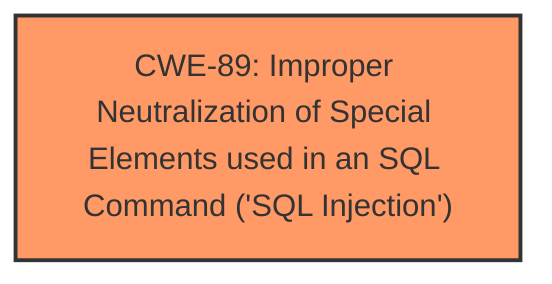

# Raw Analyzer Response for CVE-2025-2389

# Summary
| CWE ID | CWE Name | Confidence | CWE Abstraction Level | CWE Vulnerability Mapping Label | CWE-Vulnerability Mapping Notes |
|---|---|---|---|---|---|
| CWE-89 | Improper Neutralization of Special Elements used in an SQL Command ('SQL Injection') | 1.0 | Base | Allowed | Primary CWE |

## Evidence and Confidence

*   **Confidence Score:** 1.0
*   **Evidence Strength:** HIGH

## Relationship Analysis
The primary relationship that influenced the selection was the direct match of the vulnerability description to the definition of CWE-89, which is a Base level CWE. There were no child CWEs that were a better fit.

## Vulnerability Chain
The vulnerability chain consists of a single step:
1.  **Root Cause:** **CWE-89** - Improper Neutralization of Special Elements used in an SQL Command ('SQL Injection') - The application **fails to properly neutralize** special elements in user-supplied input before using it in an SQL query.

## Summary of Analysis
The analysis is based on the provided vulnerability description, which explicitly states that the vulnerability is due to **SQL injection**. The description indicates that the manipulation of the `/admin/add_city.php` file leads to **SQL injection**. This directly aligns with CWE-89, which describes scenarios where an application constructs an SQL command using externally influenced input without proper neutralization of special elements.

The retriever results also strongly suggest CWE-89 as the primary candidate, with a score of 1.0.

The selection of CWE-89 is at the optimal level of specificity because it directly addresses the root cause of the vulnerability, which is the **improper neutralization** of special elements in SQL commands. Other CWEs were considered but deemed less relevant because they represent broader categories (e.g., CWE-74, CWE-94) or different types of vulnerabilities (e.g., CWE-79, CWE-434).