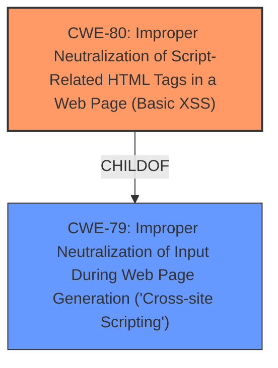

# Analysis for CVE-2025-23919

# Summary
| CWE ID | CWE Name | Confidence | CWE Abstraction Level | CWE Vulnerability Mapping Label | CWE-Vulnerability Mapping Notes |
|---|---|---|---|---|---|
| CWE-80 | Improper Neutralization of Script-Related HTML Tags in a Web Page (Basic XSS) | 1.0 | Variant |  | Allowed |
| CWE-79 | Improper Neutralization of Input During Web Page Generation ('Cross-site Scripting') | 0.7 | Base |  | Allowed |

## Evidence and Confidence

*   **Confidence Score:** 0.85
*   **Evidence Strength:** HIGH

## Relationship Analysis
The primary CWE is CWE-80, a Variant of CWE-79. CWE-80 is more specific, focusing on script-related HTML tags. The retriever results also support this. CWE-79 is a more general case of improper neutralization. The relationship influenced the decision to select CWE-80 as the primary due to its higher specificity, with CWE-79 as a supporting CWE due to its broader scope.

## Vulnerability Chain
The vulnerability chain starts with the **Improper Neutralization of Script-Related HTML Tags** (CWE-80), which leads to **Basic XSS** and ultimately to Code Injection. The root cause is the **improper neutralization**, and the impact is Code Injection.

## Summary of Analysis
The initial assessment focused on identifying the most specific CWE based on the vulnerability description, which clearly indicates **Improper Neutralization of Script-Related HTML Tags**. The retriever results and relationship analysis supported this decision, leading to the selection of CWE-80 as the primary CWE.

The decision is heavily based on the provided evidence, particularly the "Vulnerability Description Key Phrases" which include "**Improper Neutralization of Script-Related HTML Tags**" and "**Basic XSS**." The CVE Reference Links Content Summary further reinforces this by classifying the issue as a Content Injection vulnerability.

The graph relationship, showing CWE-80 as a child of CWE-79, influenced the decision to include both CWEs, with CWE-80 being the primary due to its higher specificity.

The selected CWEs are at the optimal level of specificity, with CWE-80 providing a precise description of the weakness and CWE-79 offering a broader context.

Relevant CWE Information:

# Enhanced Context (25 CWEs)
The following CWEs were identified as potentially relevant to this vulnerability:

## CWE-80: Improper Neutralization of Script-Related HTML Tags in a Web Page (Basic XSS)
**Abstraction Level**: Variant
**Similarity Score**: 0.83
**Source**: dense

**Description**:
The product receives input from an upstream component, but it does not neutralize or incorrectly neutralizes special characters such as "<", ">", and "&" that could be interpreted as web-scripting elements when they are sent to a downstream component that processes web pages.

**Mapping Guidance**:
- Usage: Allowed
- Rationale: This CWE entry is at the Variant level of abstraction, which is a preferred level of abstraction for mapping to the root causes of vulnerabilities.

## CWE-79: Improper Neutralization of Input During Web Page Generation ('Cross-site Scripting')
**Abstraction Level**: Base
**Similarity Score**: 0.74
**Source**: dense

**Description**:
The product does not neutralize or incorrectly neutralizes user-controllable input before it is placed in output that is used as a web page that is served to other users.

**Mapping Guidance**:
- Usage: Allowed
- Rationale: This CWE entry is at the Base level of abstraction, which is a preferred level of abstraction for mapping to the root causes of vulnerabilities.

### CWE Considerations:
*   CWE-74: Improper Neutralization of Special Elements in Output Used by a Downstream Component ('Injection') - While the vulnerability does involve injection, CWE-74 is too broad and discouraged.
*   CWE-116: Improper Encoding or Escaping of Output - This is a related weakness, but the description specifically mentions neutralization of script-related HTML tags, making CWE-80 a more accurate fit.
* CWE-94: Improper Control of Generation of Code ('Code Injection') - Not used because the root cause is not the generation of code, but the improper neutralization of HTML tags.