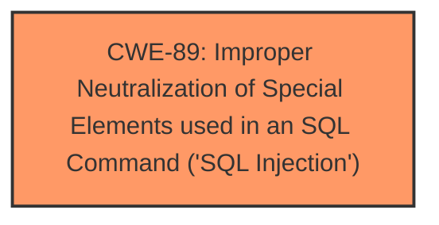

# Analysis for CVE-2025-2393

# Summary
| CWE ID | CWE Name | Confidence | CWE Abstraction Level | CWE Vulnerability Mapping Label | CWE-Vulnerability Mapping Notes |
|---|---|---|---|---|---|
| CWE-89 | Improper Neutralization of Special Elements used in an SQL Command ('SQL Injection') | 1.0 | Base | Primary | Allowed |

## Evidence and Confidence

*   **Confidence Score:** 1.0
*   **Evidence Strength:** HIGH

## Relationship Analysis
The primary relationship that influenced the decision was the direct match of the vulnerability description to the definition of CWE-89. There were no parent-child or chain relationships considered, as the information provided directly pointed to SQL Injection.

## Vulnerability Chain
The vulnerability chain consists of a single step:

1.  **Root Cause:** CWE-89 - Improper Neutralization of Special Elements used in an SQL Command ('SQL Injection')

## Summary of Analysis
The vulnerability description clearly states that the manipulation of the 'id' argument in the `/pages/salut_del.php` file leads to **sql injection**. This directly corresponds to CWE-89, which describes a scenario where a product constructs an SQL command using externally-influenced input without proper neutralization of special elements.

The evidence is the vulnerability description itself: "The manipulation of the argument id leads to **sql injection**."

The retriever results also strongly support this, with CWE-89 having the highest score.

The analysis is based on the provided evidence, and the selected CWE is at the optimal level of specificity (Base).