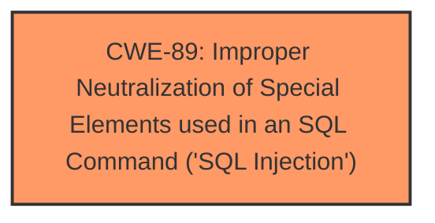

# Analysis Report for CVE-2025-2393

# Vulnerability Analysis Report: CVE-2025-2393

## Description

A vulnerability, which was classified as critical, was found in code-projects Online Class and Exam Scheduling System 1.0. Affected is an unknown function of the file /pages/salut_del.php. The manipulation of the argument id leads to **sql injection**. It is possible to launch the attack remotely. The exploit has been disclosed to the public and may be used.

## Vulnerability Description Key Phrases

- **Weakness:** sql injection
- **Product:** Online Class and Exam Scheduling System
- **Version:** 1.0
- **Component:** /pages/salut_del.php

## Analysis (with Relationship Data)

# Summary
| CWE ID | CWE Name | Confidence | CWE Abstraction Level | CWE Vulnerability Mapping Label | CWE-Vulnerability Mapping Notes |
|---|---|---|---|---|---|
| CWE-89 | Improper Neutralization of Special Elements used in an SQL Command ('SQL Injection') | 1.0 | Base | Primary | Allowed |

## Evidence and Confidence

*   **Confidence Score:** 1.0
*   **Evidence Strength:** HIGH

## Relationship Analysis
The primary relationship that influenced the decision was the direct match of the vulnerability description to the definition of CWE-89. There were no parent-child or chain relationships considered, as the information provided directly pointed to SQL Injection.



## Vulnerability Chain
The vulnerability chain consists of a single step:

1.  **Root Cause:** CWE-89 - Improper Neutralization of Special Elements used in an SQL Command ('SQL Injection')

## Summary of Analysis
The vulnerability description clearly states that the manipulation of the 'id' argument in the `/pages/salut_del.php` file leads to **sql injection**. This directly corresponds to CWE-89, which describes a scenario where a product constructs an SQL command using externally-influenced input without proper neutralization of special elements.

The evidence is the vulnerability description itself: "The manipulation of the argument id leads to **sql injection**."

The retriever results also strongly support this, with CWE-89 having the highest score.

The analysis is based on the provided evidence, and the selected CWE is at the optimal level of specificity (Base).


## CWE Relationship Analysis

Current CWEs represent these abstraction levels: .


### Vulnerability Chain Analysis

**Chain starting from CWE-89:**
- 89 (Improper Neutralization of Special Elements used in an SQL Command ('SQL Injection')) - ROOT


### CWE Relationship Diagram

```mermaid
graph TD
    classDef primary fill:#f96,stroke:#333,stroke-width:2px
    classDef secondary fill:#69f,stroke:#333
    classDef tertiary fill:#9e9,stroke:#333
```


*Report generated on 2025-07-14 12:02:34*
