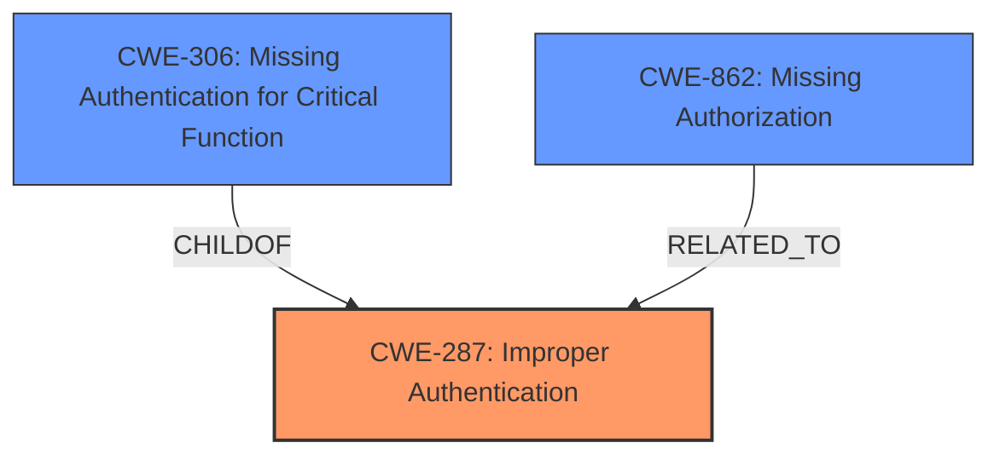

# Analysis Report for CVE-2025-2395

# Vulnerability Analysis Report: CVE-2025-2395

## Description

The U-Office Force from e-Excellence has an ****Improper Authentication** vulnerability**, allowing unauthenticated remote attackers to use a particular API and alter cookies to log in as an administrator.

## Vulnerability Description Key Phrases

- **Rootcause:** Improper Authentication vulnerability
- **Weakness:** Improper Authentication
- **Impact:** use a particular API and alter cookies to log in as an administrator
- **Attacker:** unauthenticated remote attackers
- **Product:** U-Office Force

## Analysis (with Relationship Data)

# Summary
| CWE ID | CWE Name | Confidence | CWE Abstraction Level | CWE Vulnerability Mapping Label | CWE-Vulnerability Mapping Notes |
|---|---|---|---|---|---|
| CWE-287 | Improper Authentication | 0.9 | Class | Primary | Allowed-with-Review |
| CWE-306 | Missing Authentication for Critical Function | 0.7 | Base | Secondary | Allowed |
| CWE-862 | Missing Authorization | 0.5 | Base | Secondary | Allowed |

## Evidence and Confidence

*   **Confidence Score:** 0.8
*   **Evidence Strength:** MEDIUM

## Relationship Analysis
The primary CWE is CWE-287, Improper Authentication, which is a class-level CWE. CWE-306, Missing Authentication for Critical Function, and CWE-862, Missing Authorization are base-level CWEs that are more specific. The vulnerability description indicates an **Improper Authentication vulnerability**, suggesting the authentication process is flawed. While the description does not explicitly state whether authentication is completely missing (CWE-306) or if there are authorization issues (CWE-862), the phrase "alter cookies to log in as an administrator" suggests a weakness beyond simply missing authentication. The choice of CWE-287 reflects the initial authentication failure, with potential implications for authorization.



## Vulnerability Chain
The vulnerability chain starts with **Improper Authentication** (CWE-287), potentially leading to a state where an unauthenticated attacker can bypass security measures. This may then allow the attacker to **alter cookies** to gain administrator privileges, which is a form of **Missing Authorization** (CWE-862). A potential weaker first step could be **Missing Authentication** (CWE-306) if the API endpoint does not require any form of authentication at all.

## Summary of Analysis
The initial assessment focused on the **Improper Authentication vulnerability**. The retriever results and guidance point to CWE-287, CWE-306, and CWE-862 as relevant CWEs. The final decision emphasizes CWE-287 as the primary weakness because the vulnerability description explicitly mentions **Improper Authentication**. The phrase "alter cookies to log in as an administrator" suggests that there is an authentication process, but it is flawed, which is why CWE-287 is the most appropriate.

The evidence supporting this assessment comes directly from the vulnerability description, specifically the phrase "**Improper Authentication vulnerability**". While CWE-306 (Missing Authentication for Critical Function) could also be considered if there were no authentication, the presence of cookies suggests an attempt at authentication, albeit flawed. CWE-862 (Missing Authorization) is a possible consequence of the **Improper Authentication**, but it's secondary to the initial **Improper Authentication** flaw.

The selection of CWE-287 is at the class level. A more specific Base CWE could be selected if there was sufficient evidence in the vulnerability description.

Relevant CWE Information:


## CWE Relationship Analysis

Current CWEs represent these abstraction levels: .


### Vulnerability Chain Analysis

**Chain starting from CWE-306:**
- 306 (Missing Authentication for Critical Function) - ROOT


**Chain starting from CWE-287:**
- 287 (Improper Authentication) - ROOT


### CWE Relationship Diagram

```mermaid
graph TD
    classDef primary fill:#f96,stroke:#333,stroke-width:2px
    classDef secondary fill:#69f,stroke:#333
    classDef tertiary fill:#9e9,stroke:#333
```


*Report generated on 2025-07-14 12:02:52*
