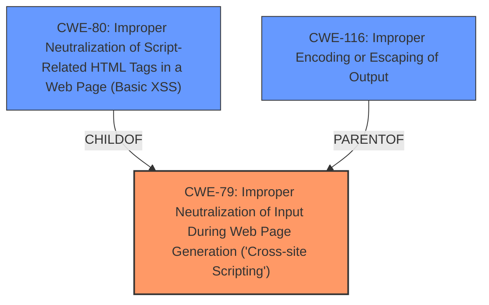

# Analysis Report for CVE-2025-24025

# Vulnerability Analysis Report: CVE-2025-24025

## Description

Coolify is an open-source and self-hostable tool for managing servers, applications, and databases. Prior to version 4.0.0-beta.380, the tags page allows users to search for tags. If the search does not return any results, the query gets reflected on the error modal, which leads to **cross-site scripting**. Version 4.0.0-beta.380 fixes the issue.

## Vulnerability Description Key Phrases

- **Weakness:** cross-site scripting
- **Product:** Coolify
- **Version:** prior to 4.0.0-beta.380
- **Component:** tags page

## Analysis (with Relationship Data)

# Summary
| CWE ID | CWE Name | Confidence | CWE Abstraction Level | CWE Vulnerability Mapping Label | CWE-Vulnerability Mapping Notes |
|---|---|---|---|---|---|
| CWE-79 | Improper Neutralization of Input During Web Page Generation ('Cross-site Scripting') | 1.0 | Base | Allowed | Primary CWE: This is the root cause of the vulnerability, as user-controllable input is not neutralized before being used in a web page. |

## Evidence and Confidence

*   **Confidence Score:** 1.0
*   **Evidence Strength:** HIGH

## Relationship Analysis
The primary relationship is that CWE-79 is a Base level CWE, which is a preferred level of abstraction. Many other CWEs are related, but less specific. For example:
  - CWE-80 is a Variant of CWE-79 and more specific, but does not fit as well
  - CWE-116 is a Class of CWE-79 and less specific.



## Vulnerability Chain
The vulnerability chain starts with the **improper neutralization** of user input on the tags page. When a search query returns no results, this un-neutralized input is reflected in an error message, leading to **Cross-Site Scripting (XSS)**.
  - Root Cause: **Improper Neutralization of Input**
  - Weakness: Reflected XSS

## Summary of Analysis
The vulnerability description clearly states that the tags page reflects the search query in an error modal when no results are found, leading to XSS. The key phrase is "**cross-site scripting**". The CVE Reference Links Content Summary explicitly mentions "Reflected Cross-Site Scripting (XSS) - CWE-116".

The Retriever Results identify CWE-79, CWE-116, and CWE-80 as top candidates.

CWE-79, "Improper Neutralization of Input During Web Page Generation ('Cross-site Scripting')", is the most appropriate because it directly addresses the root cause: the product does not neutralize user-controllable input before placing it in a web page. It is a Base level CWE, which is preferred.

CWE-80, "Improper Neutralization of Script-Related HTML Tags in a Web Page (Basic XSS)", is a Variant of CWE-79, but is too specific. The description focuses on script-related HTML tags, but the vulnerability description doesn't specify that the XSS is limited to script-related tags only.

CWE-116, "Improper Encoding or Escaping of Output", is a Class level CWE and less specific than CWE-79. While encoding/escaping is a common mitigation for XSS, the core issue is the lack of neutralization of input.

Therefore, CWE-79 is the most accurate and specific CWE for this vulnerability.


## CWE Relationship Analysis

Current CWEs represent these abstraction levels: .


### Vulnerability Chain Analysis

**Chain starting from CWE-79:**
- 79 (Improper Neutralization of Input During Web Page Generation ('Cross-site Scripting')) - ROOT


**Chain starting from CWE-116:**
- 116 (Improper Encoding or Escaping of Output) - ROOT


### CWE Relationship Diagram

```mermaid
graph TD
    classDef primary fill:#f96,stroke:#333,stroke-width:2px
    classDef secondary fill:#69f,stroke:#333
    classDef tertiary fill:#9e9,stroke:#333
```


*Report generated on 2025-07-14 12:06:16*
