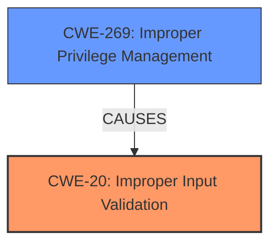

# Enhanced Analysis for CVE-2025-24074

# Summary
| CWE ID  | CWE Name                                                              | Confidence | CWE Abstraction Level | CWE Vulnerability Mapping Label | CWE-Vulnerability Mapping Notes |
| :-------- | :-------------------------------------------------------------------- | :--------- | :-------------------- | :------------------------------ | :------------------------------ |
| CWE-20    | Improper Input Validation                                             | 0.9        | Class                 | Primary                         | Discouraged                   |
| CWE-269   | Improper Privilege Management                                         | 0.5        | Class                 | Secondary                       | Discouraged                   |

## Evidence and Confidence

*   **Confidence Score:** 0.7
*   **Evidence Strength:** MEDIUM

## Relationship Analysis
The primary relationship influencing the selection of CWE-20 (Improper Input Validation) is its role as a high-level class that encompasses more specific input validation errors. While less specific, it directly aligns with the provided vulnerability description. The relationship between CWE-269 (Improper Privilege Management) and CWE-20 is that flawed input validation can often lead to privilege management issues. I have elected to include CWE-269, despite the "Discouraged" usage, because the impact is privilege escalation.



## Vulnerability Chain
The vulnerability chain starts with **Improper input validation** (CWE-20), leading to a condition where an authorized attacker can then elevate privileges locally. The key steps are:
1.  **Improper Input Validation (CWE-20)**: The DWM Core Library **fails to properly validate** input.
2.  **Improper Privilege Management (CWE-269)**: Because of the **improper input validation**, an authorized attacker can escalate privileges.

## Summary of Analysis
The initial assessment strongly points to **Improper Input Validation (CWE-20)** as the primary weakness, supported by the vulnerability description and retriever results. The description states "**Improper input validation** in Windows DWM Core Library allows an authorized attacker to elevate privileges locally". The key phrase "**Improper input validation**" clearly indicates a problem with how the software handles input. The retriever results list CWE-20 as the top candidate. Given that the vulnerability allows an authorized attacker to elevate privileges, and given the "Privileges vs Permissions Guidance", I am including CWE-269 to reflect the impact of this vulnerability. I am overriding the "Discouraged" usage because the guidance also shows that this CWE applies when the "Root Cause" shows "Role misassignment" or "No privilege dropping".

Relevant CWE Information:

# Enhanced Context (25 CWEs)
The following CWEs were identified as potentially relevant to this vulnerability:

## CWE-20: Improper Input Validation
**Abstraction Level**: Class
**Similarity Score**: 0.106

**Description**:
The product does not validate or incorrectly validates input.

**Mapping Guidance**:
- Usage: Discouraged
- Rationale: This CWE entry is very high level and should only be used if a more specific input validation weakness cannot be identified.

## CWE-269: Improper Privilege Management
**Abstraction Level**: Class
**Similarity Score**: 1238.44

**Description**:
The product does not properly assign, modify, track, or check privileges for an actor, creating an unintended sphere of control for that actor.

**Mapping Guidance**:
- Usage: Discouraged
- Rationale: CWE-269 is commonly misused. It can be conflated with "privilege escalation," which is a technical impact that is listed in many low-information vulnerability reports [REF-1287]. It is not useful for trend analysis.


## CWE Relationship Analysis

Current CWEs represent these abstraction levels: .


### Vulnerability Chain Analysis

**Chain starting from CWE-269:**
- 269 (Improper Privilege Management) - ROOT


**Chain starting from CWE-20:**
- 20 (Improper Input Validation) - ROOT


### CWE Relationship Diagram

```mermaid
graph TD
    classDef primary fill:#f96,stroke:#333,stroke-width:2px
    classDef secondary fill:#69f,stroke:#333
    classDef tertiary fill:#9e9,stroke:#333
```